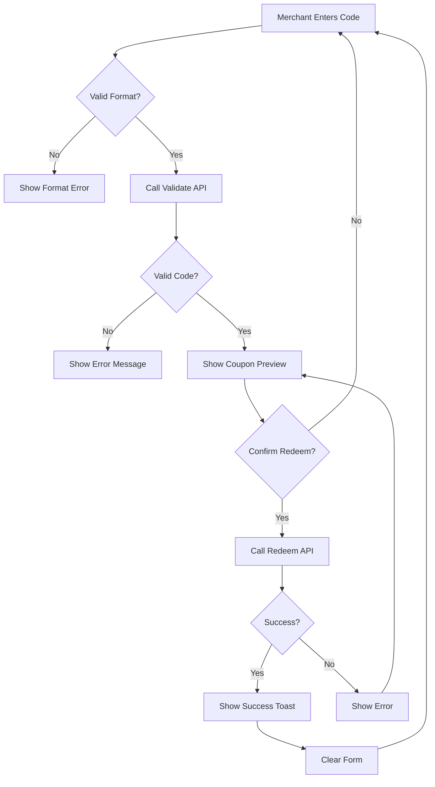

# Story 4B.1: Merchant Coupon Redemption Interface

**Epic:** 4B - Missing Business Owner Features  
**Priority:** 🔴 P0 - BLOCKER  
**Effort:** 5 days  
**Status:** 📝 PLANNED  
**Owner:** TBD

---

## 📋 Overview

**Problem:** Merchants cannot validate or redeem customer coupons in their physical stores. The `coupon_redemptions` table exists but has no UI, making the entire coupon system non-functional for offline redemption.

**Solution:** Build a merchant-facing redemption interface where business owners can enter coupon codes, validate them in real-time, and mark them as redeemed.

**Business Value:** 
- ✅ Makes coupon system actually usable
- ✅ Enables offline transactions
- ✅ Critical blocker for MVP launch
- ✅ Builds trust with merchants and customers

---

## 👥 User Stories

### Primary User Story
```
As a business owner/merchant,
I want to validate and redeem customer coupons at point-of-sale,
So that I can honor discounts and track redemption analytics.
```

### Supporting User Stories
```
As a merchant,
I want to see coupon details before redeeming,
So that I can verify terms and conditions.

As a merchant,
I want to see redemption history,
So that I can prevent fraud and track usage.

As a merchant,
I want clear error messages for invalid codes,
So that I can communicate issues to customers.

As a customer,
I want my coupon code validated instantly,
So that checkout is fast and smooth.
```

---

## ✅ Acceptance Criteria

### Must Have (MVP)
- [ ] **Redemption Page** exists at `/business/redeem`
- [ ] **Code Input Field** with real-time validation
- [ ] **Validation Logic** checks:
  - [ ] Code exists in database
  - [ ] Coupon belongs to this business
  - [ ] Coupon is in 'active' status
  - [ ] Coupon not already redeemed
  - [ ] Coupon not expired
  - [ ] User has collected the coupon
- [ ] **Success State** shows:
  - [ ] Coupon details (discount, terms)
  - [ ] Customer info (name/ID)
  - [ ] Confirmation button
- [ ] **Redemption Action** marks coupon as used:
  - [ ] Updates `user_coupon_collections.status = 'used'`
  - [ ] Creates `coupon_redemptions` record
  - [ ] Records timestamp and location
  - [ ] Shows success toast
- [ ] **Error Handling** for:
  - [ ] Invalid code format
  - [ ] Code not found
  - [ ] Already redeemed
  - [ ] Expired coupon
  - [ ] Wrong business
  - [ ] Network errors
- [ ] **Redemption History** view with:
  - [ ] Date/time of redemption
  - [ ] Customer info
  - [ ] Coupon details
  - [ ] Filter/search capabilities

### Should Have
- [ ] **QR Code Scanner** (mobile camera) - Story 4B.6 dependency
- [ ] **Bulk Redemption** for events
- [ ] **Partial Redemption** for multi-use coupons

### Won't Have (This Story)
- ⛔ QR code generation (Story 4B.6)
- ⛔ Analytics dashboard (exists in Story 4.3)
- ⛔ Push notifications to customer

---

## 🛠️ Technical Requirements

### Database Schema Changes
**No new tables needed!** (Already exist)

```sql
-- EXISTING TABLE: coupon_redemptions (validate structure)
-- Columns needed:
-- - id, coupon_id, user_id, business_id
-- - redemption_code, redeemed_at, redeemed_by
-- - status ('completed', 'cancelled', 'failed')
-- - transaction_reference, notes

-- EXISTING TABLE: user_coupon_collections
-- Update status field: 'active' → 'used'
```

### API Endpoints

#### 1. Validate Coupon Code
```typescript
POST /api/business/coupons/validate
Body: {
  code: string,
  businessId: string
}
Response: {
  valid: boolean,
  coupon: CouponDetails | null,
  error?: string,
  errorCode?: 'INVALID_CODE' | 'EXPIRED' | 'ALREADY_USED' | 'WRONG_BUSINESS'
}
```

#### 2. Redeem Coupon
```typescript
POST /api/business/coupons/redeem
Body: {
  code: string,
  businessId: string,
  redemptionAmount?: number,
  notes?: string
}
Response: {
  success: boolean,
  redemption: RedemptionRecord,
  error?: string
}
```

#### 3. Get Redemption History
```typescript
GET /api/business/coupons/redemptions?businessId={id}&page={n}&limit={n}
Response: {
  redemptions: RedemptionRecord[],
  pagination: {...}
}
```

### React Components

#### 1. `RedeemPage.tsx` - Main container
```typescript
src/components/business/RedeemPage.tsx
- Route: /business/redeem
- Layout: Full page with header
- Sections: Code input, Preview, History
```

#### 2. `CouponCodeInput.tsx` - Input component
```typescript
- Auto-focus on mount
- Format validation (uppercase, alphanumeric)
- Real-time validation on blur
- Loading states
```

#### 3. `CouponPreview.tsx` - Preview before redemption
```typescript
- Show coupon details
- Show customer info
- Show terms & conditions
- Confirm/Cancel buttons
```

#### 4. `RedemptionHistory.tsx` - History list
```typescript
- Paginated table
- Filter by date range
- Search by code/customer
- Export to CSV (future)
```

### Custom Hooks

#### `useRedemption.ts`
```typescript
export function useRedemption(businessId: string) {
  const validateCode = async (code: string) => {...}
  const redeemCoupon = async (code: string, notes?: string) => {...}
  const getHistory = async (page: number) => {...}
  
  return {
    validateCode,
    redeemCoupon,
    getHistory,
    loading,
    error
  }
}
```

### Validation Rules
```typescript
// Code Format
- Length: 8-16 characters
- Pattern: Alphanumeric + hyphens
- Case: Insensitive (convert to uppercase)

// Business Logic
- Must belong to current business
- Must be in 'active' status
- Must not be expired (valid_until > now)
- Must be collected by a user
- User must not have already used it
```

---

## 🎨 UI/UX Requirements

### Wireframe: Redemption Page

```
┌─────────────────────────────────────────┐
│ Business Dashboard > Redeem Coupon      │
├─────────────────────────────────────────┤
│                                          │
│  Enter Coupon Code                       │
│  ┌─────────────────────────────────┐    │
│  │ COUP-1234-ABCD      [Validate] │    │
│  └─────────────────────────────────┘    │
│                                          │
│  [Recent Redemptions]                    │
│  ┌──────────────────────────────────┐   │
│  │ COUP-5678  | 2 mins ago | $10 off│   │
│  │ COUP-9012  | 5 mins ago | $5 off │   │
│  └──────────────────────────────────┘   │
│                                          │
│  [View All History]                      │
└─────────────────────────────────────────┘
```

### Wireframe: Coupon Preview (After Validation)

```
┌─────────────────────────────────────────┐
│ Coupon Details                           │
├─────────────────────────────────────────┤
│                                          │
│  Code: COUP-1234-ABCD                   │
│  Discount: 20% off (Max $50)            │
│  Valid Until: Dec 31, 2025              │
│                                          │
│  Customer: John Doe (#12345)            │
│  Collected: Dec 1, 2025                 │
│                                          │
│  Terms & Conditions:                     │
│  - Minimum purchase $100                 │
│  - Cannot combine with other offers      │
│                                          │
│  ┌────────────┐  ┌──────────────┐       │
│  │  Cancel    │  │ Redeem Now ✓ │       │
│  └────────────┘  └──────────────┘       │
└─────────────────────────────────────────┘
```

### User Flow



### Mobile Considerations
- Large input field for easy typing
- Clear visible keyboard
- Autofocus on input
- Confirm button prominent
- Touch-friendly button sizes

---

## 🧪 Test Plan

### Unit Tests

#### Validation Logic
```typescript
describe('Coupon Validation', () => {
  it('accepts valid coupon code format')
  it('rejects invalid code format')
  it('converts to uppercase')
  it('validates code length')
})
```

#### Redemption Logic
```typescript
describe('Coupon Redemption', () => {
  it('marks coupon as used')
  it('creates redemption record')
  it('prevents double redemption')
  it('validates business ownership')
  it('checks expiration date')
})
```

### Integration Tests

```typescript
describe('Redemption Flow', () => {
  it('validates code via API')
  it('shows coupon preview')
  it('redeems coupon successfully')
  it('updates redemption history')
  it('handles network errors')
})
```

### E2E Test Scenarios

#### Happy Path
```gherkin
Given a merchant is logged in
And a customer has an unredeemed coupon "TEST-1234"
When merchant enters code "TEST-1234"
Then coupon details are displayed
When merchant clicks "Redeem Now"
Then success message is shown
And coupon is marked as used
And appears in redemption history
```

#### Error Cases
```gherkin
Scenario: Invalid Code
  When merchant enters "INVALID"
  Then error "Code not found" is shown

Scenario: Already Redeemed
  Given coupon "TEST-5678" was already redeemed
  When merchant enters "TEST-5678"
  Then error "Already redeemed" is shown

Scenario: Expired Coupon
  Given coupon "TEST-9999" expired yesterday
  When merchant enters "TEST-9999"
  Then error "Coupon expired" is shown

Scenario: Wrong Business
  Given coupon "TEST-1111" belongs to Business B
  And merchant is from Business A
  When merchant enters "TEST-1111"
  Then error "Invalid code for this business" is shown
```

---

## 📝 Implementation Plan

### Day 1: Database & API
- [ ] Validate `coupon_redemptions` table schema
- [ ] Create validation API endpoint
- [ ] Create redemption API endpoint
- [ ] Add RLS policies for security
- [ ] Unit tests for API logic

### Day 2: Core Components
- [ ] Create `RedeemPage.tsx` layout
- [ ] Build `CouponCodeInput.tsx`
- [ ] Build `CouponPreview.tsx`
- [ ] Create `useRedemption.ts` hook
- [ ] Add routing to `/business/redeem`

### Day 3: History & Polish
- [ ] Build `RedemptionHistory.tsx`
- [ ] Add pagination
- [ ] Add filters and search
- [ ] Error state components
- [ ] Loading states

### Day 4: Testing
- [ ] Unit tests for components
- [ ] Integration tests
- [ ] E2E test scenarios
- [ ] Manual QA testing
- [ ] Edge case testing

### Day 5: Documentation & Deploy
- [ ] Update component documentation
- [ ] Add to business dashboard nav
- [ ] User guide for merchants
- [ ] Deploy to staging
- [ ] Final review and sign-off

---

## 🔗 Integration Points

### Existing Systems
- **Business Dashboard:** Add "Redeem Coupon" menu item
- **Coupon Analytics:** Link redemptions to analytics (existing)
- **Notifications:** Send confirmation to customer (future)

### Database Tables
- **Read:** `business_coupons`, `user_coupon_collections`, `businesses`
- **Write:** `coupon_redemptions`, `user_coupon_collections.status`

### External Dependencies
- None (pure internal feature)

---

## 🚨 Edge Cases & Error Handling

### Edge Cases
1. **Multiple businesses:** User tries redeeming at wrong location
2. **Network timeout:** Partial redemption state
3. **Concurrent redemption:** Two merchants try same code
4. **Expired mid-transaction:** Coupon expires while previewing

### Error Messages
```typescript
const ERROR_MESSAGES = {
  INVALID_FORMAT: 'Invalid coupon code format',
  NOT_FOUND: 'Coupon code not found',
  ALREADY_USED: 'This coupon has already been redeemed',
  EXPIRED: 'This coupon has expired',
  WRONG_BUSINESS: 'This coupon is not valid at your business',
  NOT_COLLECTED: 'Customer has not collected this coupon yet',
  NETWORK_ERROR: 'Unable to validate coupon. Please try again.',
  REDEMPTION_FAILED: 'Failed to redeem coupon. Please try again.'
}
```

### Rollback Strategy
- If redemption API fails after validation, show retry option
- Log failed attempts for debugging
- Don't mark as used if network error

---

## 📊 Success Metrics

### Functional Metrics
- [ ] 95%+ successful redemption rate
- [ ] <2 second validation time
- [ ] <3 second redemption time
- [ ] Zero duplicate redemptions

### Business Metrics
- [ ] X coupons redeemed per day
- [ ] Y% of collected coupons redeemed
- [ ] Z average time to redeem

### User Satisfaction
- [ ] Merchant feedback: "Easy to use"
- [ ] Customer feedback: "Quick checkout"
- [ ] Support tickets: <5% for redemption issues

---

## 📚 Definition of Done

### Code Complete
- [ ] All components implemented
- [ ] All API endpoints functional
- [ ] Error handling comprehensive
- [ ] Loading states implemented
- [ ] Mobile responsive

### Testing Complete
- [ ] Unit tests passing (>80% coverage)
- [ ] Integration tests passing
- [ ] E2E scenarios verified
- [ ] Edge cases tested
- [ ] Performance validated

### Documentation Complete
- [ ] Component documentation
- [ ] API documentation
- [ ] User guide for merchants
- [ ] README updated
- [ ] Changelog entry

### Deployment Complete
- [ ] Code reviewed and approved
- [ ] Deployed to staging
- [ ] QA sign-off obtained
- [ ] Deployed to production
- [ ] Monitoring enabled

---

## 🔄 Future Enhancements

### Phase 2 (Post-MVP)
- QR code scanner (Story 4B.6)
- Offline mode with sync
- Bulk redemption
- Redemption analytics dashboard
- Export redemption reports
- Receipt printing

### Phase 3
- Customer notifications on redemption
- Loyalty points integration
- Fraud detection
- Multi-location redemption tracking

---

**Story Status:** 📝 PLANNED  
**Blocked By:** None ✅  
**Blocking:** Story 4B.6 (QR/Barcode)  
**Ready for Development:** YES 🚀

