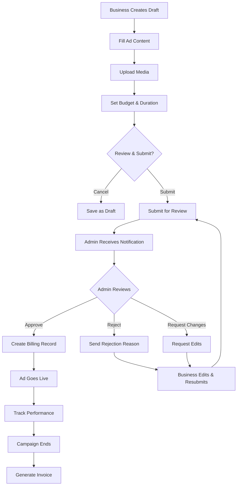

# Story 4B.2: Ad Request & Approval Workflow

**Epic:** 4B - Missing Business Owner Features  
**Priority:** 🔴 P0 - CRITICAL (Monetization)  
**Effort:** 8 days  
**Status:** 📝 PLANNED  
**Owner:** TBD

---

## 📋 Overview

**Problem:** No system exists for businesses to request ads, owners to approve them, or billing to be tracked. The enhanced project brief specifies a complete ad marketplace with approval workflows, but this is currently missing.

**Solution:** Build a comprehensive ad request and approval system where:
1. Business owners create ad requests (text, image, video)
2. Requests go to Sync Admin approval queue
3. Admins review and approve/reject with feedback
4. Approved ads go live with billing tracking
5. Businesses can view ad performance and billing

**Business Value:**
- 💰 **PRIMARY REVENUE STREAM** for platform
- 📈 Enables monetization strategy
- 🎯 Drives business engagement
- 🏗️ Foundation for ad marketplace

---

## 👥 User Stories

### Primary User Story
```
As a business owner,
I want to request promotional ads for my business,
So that I can increase visibility and attract more customers.
```

### Supporting User Stories
```
As a business owner,
I want to see ad pricing and submission requirements,
So that I can budget and prepare my ad content.

As a business owner,
I want to track my ad request status,
So that I know when my ad will go live.

As a Sync platform owner/admin,
I want to review and approve ad requests,
So that I can ensure quality and compliance.

As a Sync admin,
I want to reject inappropriate ads with feedback,
So that businesses can resubmit improved content.

As a business owner,
I want to see ad performance metrics,
So that I can measure ROI on my ad spend.
```

---

## ✅ Acceptance Criteria

### Must Have (MVP)

#### 1. Ad Request Creation (Business Side)
- [ ] **Ad Request Form** at `/business/advertising/new`
  - [ ] Ad type selector (Banner, Featured, Sponsored)
  - [ ] Title/headline input (max 60 chars)
  - [ ] Description (max 200 chars)
  - [ ] Media upload (image/video)
  - [ ] Target audience selection (optional)
  - [ ] Budget and duration picker
  - [ ] Terms acceptance checkbox
- [ ] **Media Validation:**
  - [ ] Max 1 image OR 1 video per ad
  - [ ] Image: Max 5MB, formats: JPG, PNG, WebP
  - [ ] Video: Max 60 seconds, max 50MB, MP4
  - [ ] Preview before submission
- [ ] **Pricing Display:**
  - [ ] Clear pricing table by ad type
  - [ ] Estimated reach shown
  - [ ] Total cost calculator
- [ ] **Submission Confirmation:**
  - [ ] Review page before submit
  - [ ] Confirmation modal
  - [ ] Receipt/reference number

#### 2. Ad Request Queue (Admin Side)
- [ ] **Admin Dashboard** at `/admin/advertising/queue`
  - [ ] Pending requests list
  - [ ] Priority sorting (by date, business tier)
  - [ ] Quick filters (type, status, date)
- [ ] **Ad Preview:**
  - [ ] Full ad content display
  - [ ] Business info sidebar
  - [ ] Billing details
  - [ ] Submission timestamp
- [ ] **Approval Actions:**
  - [ ] Approve button
  - [ ] Reject with reason field (required)
  - [ ] Request changes option
  - [ ] Bulk approve (admin only)

#### 3. Ad Approval Workflow
- [ ] **Status States:**
  - [ ] `draft` - Being created
  - [ ] `pending` - Submitted, awaiting review
  - [ ] `approved` - Ready to go live
  - [ ] `rejected` - Rejected with feedback
  - [ ] `changes_requested` - Needs edits
  - [ ] `live` - Currently running
  - [ ] `completed` - Finished campaign
  - [ ] `cancelled` - Cancelled by business
- [ ] **Notifications:**
  - [ ] Email to business on submission
  - [ ] Email to admin on new request
  - [ ] Email to business on approval/rejection
  - [ ] In-app notification badges
- [ ] **Timeline/Audit Log:**
  - [ ] All status changes logged
  - [ ] Admin actions tracked
  - [ ] Business actions tracked

#### 4. Billing Integration
- [ ] **Billing Record Creation:**
  - [ ] Auto-create `unbilled_amounts` record on approval
  - [ ] Link to business and ad request
  - [ ] Set amount from pricing tier
  - [ ] Status: `pending` → `billed` → `paid`
- [ ] **Business Billing View:**
  - [ ] Unbilled balance shown in dashboard
  - [ ] Ad spend breakdown
  - [ ] Payment history
  - [ ] Invoice generation (future)

#### 5. Ad Management (Business Side)
- [ ] **My Ads Page** at `/business/advertising/my-ads`
  - [ ] List all ads (drafts, pending, live, completed)
  - [ ] Status badges with color coding
  - [ ] Quick actions (edit draft, view metrics, cancel)
- [ ] **Ad Performance Metrics:**
  - [ ] Impressions count
  - [ ] Click-through rate
  - [ ] Conversion tracking (future)
  - [ ] Date range filtering

### Should Have
- [ ] A/B testing for ad variations
- [ ] Scheduled ad campaigns
- [ ] Pause/resume functionality
- [ ] Advanced targeting (demographics, interests)

### Won't Have (This Story)
- ⛔ Payment processing (Story 4B.5)
- ⛔ Driver targeting (Story 4B.3)
- ⛔ Advanced analytics dashboard
- ⛔ Self-serve ad editing while live

---

## 🛠️ Technical Requirements

### Database Schema

#### 1. New Table: `ad_requests`
```sql
CREATE TABLE ad_requests (
  id UUID PRIMARY KEY DEFAULT gen_random_uuid(),
  business_id UUID NOT NULL REFERENCES businesses(id),
  
  -- Ad Content
  ad_type TEXT NOT NULL CHECK (ad_type IN ('banner', 'featured', 'sponsored')),
  title TEXT NOT NULL,
  description TEXT NOT NULL,
  media_url TEXT,
  media_type TEXT CHECK (media_type IN ('image', 'video')),
  
  -- Targeting & Budget
  target_audience JSONB DEFAULT '{}',
  budget_cents INTEGER NOT NULL,
  duration_days INTEGER NOT NULL,
  estimated_reach INTEGER,
  
  -- Workflow Status
  status TEXT NOT NULL DEFAULT 'draft' 
    CHECK (status IN ('draft', 'pending', 'approved', 'rejected', 
                      'changes_requested', 'live', 'completed', 'cancelled')),
  submission_date TIMESTAMPTZ,
  review_date TIMESTAMPTZ,
  go_live_date TIMESTAMPTZ,
  end_date TIMESTAMPTZ,
  
  -- Approval Details
  reviewed_by UUID REFERENCES auth.users(id),
  rejection_reason TEXT,
  admin_notes TEXT,
  
  -- Billing
  billing_id UUID REFERENCES unbilled_amounts(id),
  
  -- Metrics
  impressions INTEGER DEFAULT 0,
  clicks INTEGER DEFAULT 0,
  
  -- Timestamps
  created_at TIMESTAMPTZ DEFAULT now(),
  updated_at TIMESTAMPTZ DEFAULT now()
);

CREATE INDEX idx_ad_requests_business ON ad_requests(business_id);
CREATE INDEX idx_ad_requests_status ON ad_requests(status);
CREATE INDEX idx_ad_requests_submission ON ad_requests(submission_date);
```

#### 2. Update: `unbilled_amounts` table
```sql
-- Add reference to ad_requests
ALTER TABLE unbilled_amounts 
ADD COLUMN ad_request_id UUID REFERENCES ad_requests(id);

CREATE INDEX idx_unbilled_amounts_ad_request ON unbilled_amounts(ad_request_id);
```

#### 3. New Table: `ad_request_history`
```sql
CREATE TABLE ad_request_history (
  id UUID PRIMARY KEY DEFAULT gen_random_uuid(),
  ad_request_id UUID NOT NULL REFERENCES ad_requests(id),
  changed_by UUID NOT NULL REFERENCES auth.users(id),
  
  from_status TEXT NOT NULL,
  to_status TEXT NOT NULL,
  reason TEXT,
  notes TEXT,
  
  created_at TIMESTAMPTZ DEFAULT now()
);

CREATE INDEX idx_ad_history_request ON ad_request_history(ad_request_id);
```

### API Endpoints

#### Business Endpoints

##### 1. Create Ad Request (Draft)
```typescript
POST /api/business/ads/create
Body: {
  businessId: string,
  adType: 'banner' | 'featured' | 'sponsored',
  title: string,
  description: string,
  mediaUrl?: string,
  mediaType?: 'image' | 'video',
  budgetCents: number,
  durationDays: number
}
Response: {
  adRequestId: string,
  status: 'draft'
}
```

##### 2. Submit Ad Request for Review
```typescript
POST /api/business/ads/submit
Body: {
  adRequestId: string
}
Response: {
  success: boolean,
  submissionDate: string,
  estimatedReviewTime: string
}
```

##### 3. Get My Ads
```typescript
GET /api/business/ads?businessId={id}&status={status}&page={n}
Response: {
  ads: AdRequest[],
  pagination: {...}
}
```

##### 4. Cancel Ad Request
```typescript
POST /api/business/ads/cancel
Body: {
  adRequestId: string,
  reason?: string
}
```

#### Admin Endpoints

##### 1. Get Pending Ad Requests
```typescript
GET /api/admin/ads/pending?page={n}&sort={field}&order={asc|desc}
Response: {
  requests: AdRequest[],
  counts: {
    pending: number,
    changes_requested: number
  },
  pagination: {...}
}
```

##### 2. Approve Ad Request
```typescript
POST /api/admin/ads/approve
Body: {
  adRequestId: string,
  goLiveDate?: string,
  adminNotes?: string
}
Response: {
  success: boolean,
  billingId: string
}
```

##### 3. Reject Ad Request
```typescript
POST /api/admin/ads/reject
Body: {
  adRequestId: string,
  rejectionReason: string (required),
  adminNotes?: string
}
```

##### 4. Request Changes
```typescript
POST /api/admin/ads/request-changes
Body: {
  adRequestId: string,
  changeRequests: string (required)
}
```

### React Components

#### Business Side Components

##### 1. `AdRequestForm.tsx`
```typescript
src/components/business/ads/AdRequestForm.tsx
- Multi-step form wizard
- Media upload with preview
- Budget calculator
- Terms agreement
- Draft auto-save
```

##### 2. `MyAdsPage.tsx`
```typescript
src/components/business/ads/MyAdsPage.tsx
- Ad list with filters
- Status badges
- Quick actions menu
- Performance metrics cards
```

##### 3. `AdPreviewCard.tsx`
```typescript
src/components/business/ads/AdPreviewCard.tsx
- Visual ad preview
- Metric displays
- Status indicator
- Action buttons
```

#### Admin Side Components

##### 1. `AdApprovalQueue.tsx`
```typescript
src/components/admin/ads/AdApprovalQueue.tsx
- Pending requests table
- Filters and search
- Priority indicators
- Bulk actions
```

##### 2. `AdReviewPanel.tsx`
```typescript
src/components/admin/ads/AdReviewPanel.tsx
- Full ad content display
- Business info sidebar
- Approval action buttons
- Rejection reason textarea
- History timeline
```

##### 3. `AdMetricsDashboard.tsx`
```typescript
src/components/admin/ads/AdMetricsDashboard.tsx
- Platform-wide ad stats
- Revenue charts
- Approval rates
- Top performing ads
```

### Custom Hooks

##### `useAdRequest.ts`
```typescript
export function useAdRequest() {
  const createDraft = async (data: AdRequestData) => {...}
  const submitForReview = async (id: string) => {...}
  const cancelRequest = async (id: string) => {...}
  const getMyAds = async (filters: AdFilters) => {...}
  
  return {
    createDraft,
    submitForReview,
    cancelRequest,
    getMyAds,
    loading,
    error
  }
}
```

##### `useAdApproval.ts` (Admin)
```typescript
export function useAdApproval() {
  const getPending = async () => {...}
  const approveRequest = async (id: string, notes?: string) => {...}
  const rejectRequest = async (id: string, reason: string) => {...}
  const requestChanges = async (id: string, changes: string) => {...}
  
  return {
    getPending,
    approveRequest,
    rejectRequest,
    requestChanges,
    loading,
    error
  }
}
```

---

## 🎨 UI/UX Requirements

### Wireframe: Ad Request Form (Business)

```
┌─────────────────────────────────────────┐
│ Create New Ad Campaign                   │
├─────────────────────────────────────────┤
│ Step 1 of 3: Ad Type & Content          │
│                                          │
│ Choose Ad Type:                          │
│  ( ) Banner Ad - $50/week               │
│  (•) Featured Ad - $100/week            │
│  ( ) Sponsored Post - $200/week         │
│                                          │
│ Ad Title:                                │
│ ┌────────────────────────────────────┐  │
│ │ 20% Off All Pizzas This Week!     │  │
│ └────────────────────────────────────┘  │
│ 60 characters max                        │
│                                          │
│ Description:                             │
│ ┌────────────────────────────────────┐  │
│ │ Visit us at Main St. location...  │  │
│ └────────────────────────────────────┘  │
│ 200 characters max                       │
│                                          │
│ Upload Media:                            │
│ ┌────────────────────────────────────┐  │
│ │  [+] Upload Image or Video        │  │
│ └────────────────────────────────────┘  │
│ Max 5MB image or 60s video              │
│                                          │
│ [Cancel]              [Next: Budget →]  │
└─────────────────────────────────────────┘
```

### Wireframe: Admin Approval Queue

```
┌──────────────────────────────────────────────────────┐
│ Ad Approval Queue                         [Filters ▾]│
├──────────────────────────────────────────────────────┤
│ Pending: 12 | Changes Requested: 3                   │
│                                                       │
│ ┌──────────────────────────────────────────────────┐│
│ │ 🟡 Pending | Featured Ad                         ││
│ │ Pizza Palace - "20% Off Weekend Special"         ││
│ │ Submitted: 2 hours ago | Budget: $100            ││
│ │ [View Details] [Quick Approve] [Reject]          ││
│ └──────────────────────────────────────────────────┘│
│                                                       │
│ ┌──────────────────────────────────────────────────┐│
│ │ 🟡 Pending | Banner Ad                           ││
│ │ Coffee Corner - "Buy 1 Get 1 Free"               ││
│ │ Submitted: 5 hours ago | Budget: $50             ││
│ │ [View Details] [Quick Approve] [Reject]          ││
│ └──────────────────────────────────────────────────┘│
│                                                       │
│ [Load More]                                           │
└──────────────────────────────────────────────────────┘
```

### Wireframe: Ad Review Panel

```
┌──────────────────────────────────────────────────────┐
│ Review Ad Request #AD-12345                           │
├──────────────────────────────────────────────────────┤
│                                                       │
│ ┌─────────────────────┐  ┌─────────────────────────┐│
│ │ [Ad Preview]        │  │ Business Info           ││
│ │                     │  │ Name: Pizza Palace      ││
│ │ 20% OFF             │  │ Tier: Premium           ││
│ │ All Pizzas!         │  │ Owner: John Smith       ││
│ │ [Image Preview]     │  │ Contact: john@pizza.com ││
│ │                     │  │                         ││
│ │ Visit Main Street!  │  │ Billing Info            ││
│ │                     │  │ Type: Featured Ad       ││
│ └─────────────────────┘  │ Budget: $100            ││
│                          │ Duration: 7 days        ││
│ Ad Details               │ Unbilled: $0            ││
│ Title: 20% Off All...    │                         ││
│ Description: Visit...    │ Timeline                ││
│ Media: image.jpg         │ • Submitted: 2h ago     ││
│                          │ • Status: Pending       ││
│ Admin Notes:             │                         ││
│ ┌──────────────────────┐│                         ││
│ │                      │││                         ││
│ └──────────────────────┘│                         ││
│                          │                         ││
│ ┌──────────┐ ┌─────────┐│                         ││
│ │ Reject   │ │ Approve │└─────────────────────────┘│
│ └──────────┘ └─────────┘                            │
└──────────────────────────────────────────────────────┘
```

### User Flow Diagram



---

## 🧪 Test Plan

### Unit Tests

#### Ad Request Validation
```typescript
describe('Ad Request Validation', () => {
  it('validates required fields')
  it('enforces title length limits')
  it('validates media file types')
  it('validates media file sizes')
  it('calculates budget correctly')
  it('validates duration range')
})
```

#### Approval Workflow
```typescript
describe('Ad Approval Workflow', () => {
  it('transitions status on approval')
  it('creates billing record on approval')
  it('sends notification on status change')
  it('requires rejection reason')
  it('logs all status changes')
})
```

### Integration Tests

```typescript
describe('Ad Request Flow', () => {
  it('creates draft request')
  it('uploads media successfully')
  it('submits for review')
  it('admin approves request')
  it('billing record created')
  it('ad goes live')
  it('tracks impressions and clicks')
})
```

### E2E Test Scenarios

#### Happy Path
```gherkin
Given a business owner is logged in
When they create a new ad request
And upload an image
And set budget to $100 for 7 days
And submit for review
Then admin sees request in queue
When admin approves the request
Then business receives approval notification
And billing record is created
And ad status changes to "live"
```

#### Rejection Flow
```gherkin
Given an ad request is pending review
When admin reviews the ad
And finds content policy violation
And rejects with reason "Contains prohibited content"
Then business receives rejection notification
And can view rejection reason
And can edit and resubmit
```

---

## 📝 Implementation Plan

### Day 1-2: Database & Schema
- [ ] Create `ad_requests` table
- [ ] Create `ad_request_history` table
- [ ] Update `unbilled_amounts` table
- [ ] Add RLS policies
- [ ] Create indexes
- [ ] Seed test data

### Day 3-4: API Endpoints
- [ ] Business ad creation endpoints
- [ ] Business ad management endpoints
- [ ] Admin approval endpoints
- [ ] Billing integration logic
- [ ] Notification triggers
- [ ] Unit tests for APIs

### Day 5-6: Business UI
- [ ] Ad request form with wizard
- [ ] Media upload component
- [ ] My Ads page
- [ ] Ad preview cards
- [ ] Status indicators
- [ ] Notification integration

### Day 7: Admin UI
- [ ] Approval queue page
- [ ] Ad review panel
- [ ] Bulk actions
- [ ] Admin notes interface
- [ ] History timeline

### Day 8: Testing & Polish
- [ ] Integration tests
- [ ] E2E scenarios
- [ ] Error handling
- [ ] Loading states
- [ ] Mobile responsiveness
- [ ] Documentation

---

## 🔗 Integration Points

### Existing Systems
- **Billing System:** Creates `unbilled_amounts` records
- **Notifications:** Triggers emails on status changes
- **Media Upload:** Uses existing upload infrastructure
- **Business Dashboard:** Adds "Advertising" menu item

### Database Tables
- **Read:** `businesses`, `auth.users`, `pricing_tiers`
- **Write:** `ad_requests`, `ad_request_history`, `unbilled_amounts`

### External Dependencies
- Email service for notifications
- File storage for media uploads
- Payment processor (future integration)

---

## 🚨 Edge Cases & Error Handling

### Edge Cases
1. **Media upload failure:** Retry mechanism
2. **Admin unavailable:** Auto-reminder after 24h
3. **Business cancels during review:** Handle gracefully
4. **Duplicate submissions:** Detect and warn
5. **Budget changes mid-review:** Lock after submission

### Error Messages
```typescript
const ERROR_MESSAGES = {
  MEDIA_TOO_LARGE: 'Media file exceeds size limit',
  INVALID_MEDIA_TYPE: 'Unsupported media format',
  TITLE_TOO_LONG: 'Title must be 60 characters or less',
  MISSING_REQUIRED_FIELD: 'Please fill in all required fields',
  INSUFFICIENT_BUDGET: 'Budget too low for selected ad type',
  SUBMISSION_FAILED: 'Failed to submit ad request. Please try again.',
  APPROVAL_FAILED: 'Failed to approve ad request',
  REJECTION_REASON_REQUIRED: 'Rejection reason is required'
}
```

---

## 📊 Success Metrics

### Functional Metrics
- [ ] Ad request submission rate
- [ ] Average review time <24 hours
- [ ] Approval rate >80%
- [ ] Resubmission rate <10%

### Business Metrics
- [ ] Weekly ad revenue
- [ ] Active campaigns
- [ ] Ad request conversion rate
- [ ] Customer satisfaction scores

---

## 📚 Definition of Done

### Code Complete
- [ ] All database migrations applied
- [ ] All API endpoints functional
- [ ] Business UI complete
- [ ] Admin UI complete
- [ ] Billing integration working
- [ ] Notifications sending

### Testing Complete
- [ ] Unit tests passing (>80% coverage)
- [ ] Integration tests passing
- [ ] E2E scenarios verified
- [ ] Performance validated
- [ ] Security review passed

### Documentation Complete
- [ ] API documentation
- [ ] User guides (business & admin)
- [ ] Database schema docs
- [ ] Workflow diagrams
- [ ] README updated

### Deployment Complete
- [ ] Code reviewed and approved
- [ ] Deployed to staging
- [ ] QA sign-off obtained
- [ ] Deployed to production
- [ ] Monitoring enabled

---

## 🔄 Future Enhancements

### Phase 2
- Advanced targeting (demographics, interests)
- A/B testing capabilities
- Scheduled campaigns
- Performance analytics dashboard
- Self-serve ad editing

### Phase 3
- Programmatic ad buying
- Real-time bidding
- Ad marketplace
- Campaign automation
- AI-powered ad optimization

---

**Story Status:** 📝 PLANNED  
**Blocked By:** None ✅  
**Blocking:** Story 4B.3 (Targeted Campaigns), Story 4B.5 (Billing UI)  
**Ready for Development:** YES 🚀

