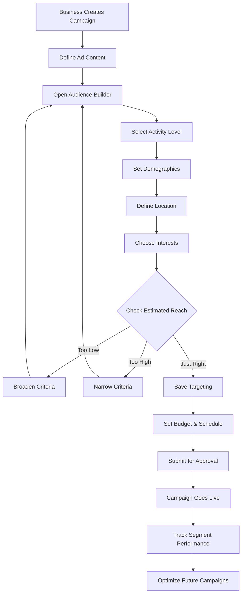

# Story 4B.3: Targeted Campaigns System

**Epic:** 4B - Missing Business Owner Features  
**Priority:** 🔴 P0 - CRITICAL (Competitive Advantage)  
**Effort:** 10 days  
**Status:** 🚧 **PHASE 4 COMPLETE - UI COMPONENTS** (✅ 60% Complete)  
**Owner:** Development Team  
**Completed:** 2025-01-10  
**Next Phase:** Backend Integration & Database Implementation

---

## ✅ Phase 4 Implementation Summary (2025-01-10)

### What Was Implemented

#### 1. UI Components (✅ Complete)
- **TargetingEditor** (`src/components/campaign/TargetingEditor.tsx`)
  - 4 category tabs: Demographics, Location, Behavior, Vehicle
  - Badge-based selection UI
  - Real-time form validation
  - Clear all functionality
  - Read-only mode support

- **ReachEstimator** (`src/components/campaign/ReachEstimator.tsx`)
  - Live audience size calculation (updates every 3 seconds)
  - Demographic breakdown charts
  - Cost projections and per-impression pricing
  - Confidence indicators (High/Medium/Low)
  - Progress visualizations

- **TargetingValidator** (`src/components/campaign/TargetingValidator.tsx`)
  - Real-time validation messages
  - 3 types: Errors (red), Warnings (yellow), Tips (blue)
  - Category badges for context
  - Auto-dismiss when issues resolved

- **RecommendationCard** (`src/components/campaign/RecommendationCard.tsx`)
  - 5 pre-built targeting strategies
  - Performance predictions (reach, CTR, confidence)
  - One-click apply functionality
  - Expandable details view

#### 2. Demo Page (✅ Complete)
- **Location:** `/demo/targeting` (http://localhost:5173/demo/targeting)
- Interactive demonstration of all 4 components
- Real-time JSON preview
- Sample data loading
- Full testing environment

#### 3. TypeScript Types (✅ Complete)
- `TargetingRules` interface in `src/types/campaigns.ts`
- Demographic, Location, Behavior, Vehicle type definitions
- Validation rule types
- Recommendation strategy types

#### 4. Documentation (✅ Complete)
- Comprehensive testing guide: `docs/Targeting_Demo_Testing_Guide.md`
- Component feature documentation
- Test scenarios and acceptance criteria

### What's Pending (⏳ Backend Integration)

#### Database Schema (Planned)
- `driver_activity_scores` table
- `user_interests` table
- `campaign_targets` table
- `campaign_segment_performance` table
- Demographic fields in `users` table

#### API Endpoints (Planned)
- `POST /api/campaigns/estimate-reach`
- `POST /api/campaigns/create-targeted`
- `GET /api/campaigns/{id}/segment-performance`
- `GET /api/drivers/segments`

#### Background Jobs (Planned)
- Daily activity score calculation
- Nightly interest profile updates

### Files Created/Modified
```
src/
  components/campaign/
    TargetingEditor.tsx          (✅ NEW)
    ReachEstimator.tsx           (✅ NEW)
    TargetingValidator.tsx       (✅ NEW)
    RecommendationCard.tsx       (✅ NEW)
  pages/
    TargetingDemoSimple.tsx      (✅ NEW)
  types/
    campaigns.ts                 (✅ MODIFIED)
docs/
  Targeting_Demo_Testing_Guide.md (✅ NEW)
  EPIC_4B_Missing_Business_Owner_Features.md (✅ UPDATED)
  STORY_4B.3_Targeted_Campaigns_System.md (✅ UPDATED)
```

---

## 📋 Overview

**Problem:** The Enhanced Project Brief specifies sophisticated campaign targeting including:
- Top 10% active drivers (engagement-based targeting)
- Demographic targeting (age, gender, income level)
- Location-based targeting (radius, neighborhoods, zones)
- Interest-based targeting (food preferences, shopping habits)

**Current State:** None of this exists. Ads/campaigns are broadcast-only.

**Solution:** Build a comprehensive targeting system that allows businesses to:
1. Select target audience by driver activity level
2. Filter by demographics
3. Define geographic boundaries
4. Target by interests and behaviors
5. See estimated reach before campaign launch
6. Track performance by segment

**Business Value:**
- 🎯 **10X Campaign Effectiveness** - precision targeting
- 💰 **Higher ROI** for advertisers = willing to pay more
- 🚀 **Competitive Differentiator** - unique to Sync
- 📊 **Data-driven insights** for businesses

---

## 👥 User Stories

### Primary User Story
```
As a business owner,
I want to target my campaigns to specific driver segments,
So that I maximize ROI and reach the right customers.
```

### Supporting User Stories
```
As a business owner,
I want to target the top 10% most active drivers,
So that my campaign reaches high-value customers.

As a business owner,
I want to target drivers within 5 miles of my store,
So that I attract nearby customers.

As a business owner,
I want to target drivers by demographics (age, gender),
So that I reach my ideal customer profile.

As a business owner,
I want to see estimated reach for my targeting,
So that I can validate my campaign size.

As a business owner,
I want to see campaign performance by segment,
So that I can optimize future campaigns.

As a driver,
I want to see relevant offers based on my location and interests,
So that I don't waste time on irrelevant deals.
```

---

## ✅ Acceptance Criteria

### ✅ Phase 4 Complete (UI Components)

#### 5. Campaign Creation with Targeting UI
- [✅] **Targeting Wizard** Components:
  - [✅] TargetingEditor with 4 category tabs
  - [✅] Demographics filters (age, gender, trips, rating)
  - [✅] Location targeting UI (placeholder for map integration)
  - [✅] Behavior filters (trips/week, peak hours, trip types)
  - [✅] Vehicle targeting (types, year)
- [✅] **Estimated Reach Display:**
  - [✅] Real-time calculation (mock data)
  - [✅] Shows driver count
  - [✅] Shows potential impressions
  - [✅] Cost per impression estimate
  - [✅] Confidence indicators
  - [✅] Demographic breakdowns

#### Additional UI Features
- [✅] **Targeting Validator:**
  - [✅] Real-time validation messages
  - [✅] Error/Warning/Tip categorization
  - [✅] Category badges
  - [✅] Auto-dismiss on fix
- [✅] **AI Recommendations:**
  - [✅] 5 pre-built targeting strategies
  - [✅] Performance predictions
  - [✅] One-click apply
  - [✅] Expandable details
- [✅] **Demo Page:**
  - [✅] Interactive testing environment
  - [✅] JSON preview
  - [✅] Sample data loading

### ⏳ Pending (Backend Integration)

#### 1. Driver Segmentation System
- [ ] **Activity-Based Segmentation:**
  - [ ] Calculate driver activity scores
  - [ ] Rank drivers by activity (rides, hours, revenue)
  - [ ] Top 10% segment auto-updated daily
  - [ ] Top 25% segment
  - [ ] Active (last 7 days) segment
  - [ ] Inactive (30+ days) segment
- [ ] **Storage:**
  - [ ] `driver_segments` table
  - [ ] `driver_activity_scores` table
  - [ ] Background job to recalculate scores

#### 2. Demographic Targeting
- [ ] **User Profile Fields** (add to existing `users` table):
  - [ ] Age / Date of Birth
  - [ ] Gender (optional)
  - [ ] Income bracket (optional, self-reported)
  - [ ] Occupation (optional)
- [ ] **Targeting UI:**
  - [ ] Age range slider (18-65+)
  - [ ] Gender checkboxes (All, Male, Female, Other)
  - [ ] Income brackets (optional filter)

#### 3. Location-Based Targeting
- [ ] **Geographic Filters:**
  - [ ] Radius targeting (1, 3, 5, 10, 20 miles)
  - [ ] Neighborhood/zone selection
  - [ ] Multiple location targeting
  - [ ] Exclude zones option
- [ ] **Map Integration:**
  - [ ] Visual map selector
  - [ ] Drag-to-define radius
  - [ ] Show driver density heatmap
  - [ ] Show estimated reach

#### 4. Interest-Based Targeting
- [ ] **Interest Categories:**
  - [ ] Food & Dining
  - [ ] Shopping & Retail
  - [ ] Entertainment
  - [ ] Health & Wellness
  - [ ] Automotive
  - [ ] Travel & Hospitality
- [ ] **Interest Tracking:**
  - [ ] Track coupon collections by category
  - [ ] Track business visits by category
  - [ ] Track search history
  - [ ] Build interest profiles

#### 5. Campaign Creation with Targeting
- [ ] **Targeting Wizard** in Ad Request Form:
  - [ ] Step 1: Ad Content (existing)
  - [ ] Step 2: Target Audience (NEW)
  - [ ] Step 3: Budget & Schedule (existing)
  - [ ] Step 4: Review & Launch
- [ ] **Audience Builder:**
  - [ ] Activity level selector
  - [ ] Demographics filters
  - [ ] Location selector
  - [ ] Interest checkboxes
  - [ ] "AND/OR" logic builder
- [ ] **Estimated Reach Display:**
  - [ ] Real-time calculation
  - [ ] Shows driver count
  - [ ] Shows potential impressions
  - [ ] Cost per impression estimate

#### 6. Campaign Performance by Segment
- [ ] **Analytics Dashboard:**
  - [ ] Impressions by segment
  - [ ] Click-through rate by segment
  - [ ] Conversion rate by segment
  - [ ] Best performing segments
  - [ ] Segment comparison charts

### Should Have
- [ ] Lookalike audience targeting
- [ ] Custom audience upload (CSV)
- [ ] Retargeting campaigns
- [ ] Exclusion lists

### Won't Have (This Story)
- ⛔ Real-time bidding
- ⛔ Predictive audience modeling (AI/ML)
- ⛔ Cross-platform targeting

---

## 🛠️ Technical Requirements

### Database Schema

#### 1. New Table: `driver_activity_scores`
```sql
CREATE TABLE driver_activity_scores (
  user_id UUID PRIMARY KEY REFERENCES auth.users(id),
  
  -- Activity Metrics
  total_rides INTEGER DEFAULT 0,
  total_hours_online NUMERIC DEFAULT 0,
  total_revenue_cents BIGINT DEFAULT 0,
  
  -- Time-Based Metrics
  rides_last_7d INTEGER DEFAULT 0,
  rides_last_30d INTEGER DEFAULT 0,
  hours_last_7d NUMERIC DEFAULT 0,
  hours_last_30d NUMERIC DEFAULT 0,
  
  -- Engagement Score (0-100)
  activity_score NUMERIC NOT NULL DEFAULT 0,
  percentile_rank NUMERIC, -- 0-100, where 100 = top 1%
  
  -- Segmentation
  segment TEXT CHECK (segment IN ('top_10', 'top_25', 'active', 'inactive')),
  
  -- Timestamps
  last_activity_at TIMESTAMPTZ,
  calculated_at TIMESTAMPTZ DEFAULT now(),
  updated_at TIMESTAMPTZ DEFAULT now()
);

CREATE INDEX idx_activity_scores_segment ON driver_activity_scores(segment);
CREATE INDEX idx_activity_scores_rank ON driver_activity_scores(percentile_rank DESC);
CREATE INDEX idx_activity_scores_score ON driver_activity_scores(activity_score DESC);
```

#### 2. Update: `users` table (add demographics)
```sql
ALTER TABLE users 
ADD COLUMN date_of_birth DATE,
ADD COLUMN gender TEXT CHECK (gender IN ('male', 'female', 'other', 'prefer_not_to_say')),
ADD COLUMN income_bracket TEXT CHECK (income_bracket IN ('<25k', '25k-50k', '50k-75k', '75k-100k', '>100k')),
ADD COLUMN occupation TEXT;

-- Computed age column
ALTER TABLE users 
ADD COLUMN age INTEGER GENERATED ALWAYS AS 
  (EXTRACT(YEAR FROM AGE(CURRENT_DATE, date_of_birth))) STORED;
```

#### 3. New Table: `user_interests`
```sql
CREATE TABLE user_interests (
  id UUID PRIMARY KEY DEFAULT gen_random_uuid(),
  user_id UUID NOT NULL REFERENCES auth.users(id),
  
  category TEXT NOT NULL CHECK (category IN (
    'food_dining', 'shopping_retail', 'entertainment', 
    'health_wellness', 'automotive', 'travel_hospitality'
  )),
  
  -- Interest Strength (0-100)
  score INTEGER DEFAULT 0,
  
  -- Tracking
  interactions_count INTEGER DEFAULT 0,
  last_interaction_at TIMESTAMPTZ,
  
  created_at TIMESTAMPTZ DEFAULT now(),
  updated_at TIMESTAMPTZ DEFAULT now(),
  
  UNIQUE(user_id, category)
);

CREATE INDEX idx_user_interests_user ON user_interests(user_id);
CREATE INDEX idx_user_interests_category ON user_interests(category);
CREATE INDEX idx_user_interests_score ON user_interests(score DESC);
```

#### 4. New Table: `campaign_targets`
```sql
CREATE TABLE campaign_targets (
  id UUID PRIMARY KEY DEFAULT gen_random_uuid(),
  campaign_id UUID NOT NULL REFERENCES ad_requests(id),
  
  -- Activity Targeting
  activity_segments TEXT[] DEFAULT ARRAY[]::TEXT[],
  min_activity_score INTEGER,
  
  -- Demographics
  age_min INTEGER,
  age_max INTEGER,
  genders TEXT[] DEFAULT ARRAY[]::TEXT[],
  income_brackets TEXT[] DEFAULT ARRAY[]::TEXT[],
  
  -- Location
  location_center GEOGRAPHY(POINT, 4326),
  radius_miles NUMERIC,
  included_zones TEXT[] DEFAULT ARRAY[]::TEXT[],
  excluded_zones TEXT[] DEFAULT ARRAY[]::TEXT[],
  
  -- Interests
  interest_categories TEXT[] DEFAULT ARRAY[]::TEXT[],
  min_interest_score INTEGER,
  
  -- Logic
  targeting_logic JSONB DEFAULT '{"operator": "AND"}',
  
  -- Reach Estimation
  estimated_reach INTEGER,
  actual_reach INTEGER DEFAULT 0,
  
  created_at TIMESTAMPTZ DEFAULT now(),
  updated_at TIMESTAMPTZ DEFAULT now()
);

CREATE INDEX idx_campaign_targets_campaign ON campaign_targets(campaign_id);
CREATE INDEX idx_campaign_targets_location ON campaign_targets USING GIST(location_center);
```

#### 5. New Table: `campaign_segment_performance`
```sql
CREATE TABLE campaign_segment_performance (
  id UUID PRIMARY KEY DEFAULT gen_random_uuid(),
  campaign_id UUID NOT NULL REFERENCES ad_requests(id),
  
  segment_type TEXT NOT NULL, -- 'activity', 'age', 'gender', 'location', 'interest'
  segment_value TEXT NOT NULL,
  
  impressions INTEGER DEFAULT 0,
  clicks INTEGER DEFAULT 0,
  conversions INTEGER DEFAULT 0,
  
  click_through_rate NUMERIC,
  conversion_rate NUMERIC,
  
  created_at TIMESTAMPTZ DEFAULT now(),
  updated_at TIMESTAMPTZ DEFAULT now(),
  
  UNIQUE(campaign_id, segment_type, segment_value)
);

CREATE INDEX idx_segment_performance_campaign ON campaign_segment_performance(campaign_id);
```

### Background Jobs

#### 1. Calculate Driver Activity Scores
```typescript
// Run daily at 2 AM
async function calculateActivityScores() {
  // 1. Aggregate ride data from rides table
  // 2. Calculate total rides, hours, revenue
  // 3. Calculate 7d and 30d metrics
  // 4. Compute activity score (weighted formula)
  // 5. Calculate percentile ranks
  // 6. Assign segments (top_10, top_25, active, inactive)
  // 7. Update driver_activity_scores table
}
```

#### 2. Update Interest Profiles
```typescript
// Run nightly
async function updateInterestProfiles() {
  // 1. Analyze coupon collections
  // 2. Track business visits
  // 3. Analyze search queries
  // 4. Calculate interest scores by category
  // 5. Update user_interests table
}
```

### API Endpoints

#### Targeting Endpoints

##### 1. Get Estimated Reach
```typescript
POST /api/campaigns/estimate-reach
Body: {
  activitySegments?: string[],
  ageMin?: number,
  ageMax?: number,
  genders?: string[],
  locationCenter?: { lat: number, lng: number },
  radiusMiles?: number,
  interestCategories?: string[]
}
Response: {
  estimatedReach: number,
  breakdown: {
    byActivity: {...},
    byAge: {...},
    byGender: {...},
    byLocation: {...},
    byInterest: {...}
  }
}
```

##### 2. Create Campaign with Targeting
```typescript
POST /api/campaigns/create-targeted
Body: {
  adRequestId: string,
  targets: CampaignTargets
}
Response: {
  success: boolean,
  campaignId: string,
  estimatedReach: number
}
```

##### 3. Get Segment Performance
```typescript
GET /api/campaigns/{id}/segment-performance
Response: {
  segments: SegmentPerformance[],
  totalImpressions: number,
  totalClicks: number,
  bestPerforming: {...}
}
```

##### 4. Get Driver Segments
```typescript
GET /api/drivers/segments?segment={top_10|top_25|active|inactive}
Response: {
  drivers: DriverProfile[],
  count: number
}
```

### React Components

#### 1. `AudienceBuilder.tsx`
```typescript
src/components/business/campaigns/AudienceBuilder.tsx
- Activity segment selector
- Demographics filters
- Location map picker
- Interest category checkboxes
- Estimated reach display
- AND/OR logic builder
```

#### 2. `ReachEstimator.tsx`
```typescript
src/components/business/campaigns/ReachEstimator.tsx
- Real-time reach calculation
- Driver count display
- Breakdown by segment
- Cost per impression
- Recommendation engine
```

#### 3. `LocationTargeting.tsx`
```typescript
src/components/business/campaigns/LocationTargeting.tsx
- Interactive map (Leaflet/Mapbox)
- Radius selector
- Zone selection
- Driver density heatmap
- Preview target area
```

#### 4. `SegmentPerformanceDashboard.tsx`
```typescript
src/components/business/campaigns/SegmentPerformanceDashboard.tsx
- Performance charts by segment
- Comparison tables
- Best/worst performers
- Recommendations
```

### Custom Hooks

#### `useAudienceTargeting.ts`
```typescript
export function useAudienceTargeting() {
  const estimateReach = async (targets: TargetingCriteria) => {...}
  const saveTargeting = async (campaignId: string, targets: TargetingCriteria) => {...}
  const getSegmentPerformance = async (campaignId: string) => {...}
  
  return {
    estimateReach,
    saveTargeting,
    getSegmentPerformance,
    loading,
    error
  }
}
```

#### `useDriverSegments.ts`
```typescript
export function useDriverSegments() {
  const getSegment = async (segment: SegmentType) => {...}
  const getActivityScore = async (userId: string) => {...}
  
  return {
    getSegment,
    getActivityScore,
    loading,
    error
  }
}
```

---

## 🎨 UI/UX Requirements

### Wireframe: Audience Builder

```
┌──────────────────────────────────────────────────────┐
│ Target Audience Builder           [Estimated Reach] │
├──────────────────────────────────────────────────────┤
│                                                       │
│ 1. Driver Activity Level                             │
│ ┌──────────────────────────────────────────────────┐│
│ │ ☑ Top 10% Most Active (1,234 drivers)           ││
│ │ ☑ Top 25% (3,456 drivers)                        ││
│ │ ☐ Active (last 7 days)                           ││
│ │ ☐ All Drivers                                    ││
│ └──────────────────────────────────────────────────┘│
│                                                       │
│ 2. Demographics                                       │
│ Age Range: [18] ━━━━●━━━━━ [65+]                    │
│ Gender:  ☑ All  ☐ Male  ☐ Female  ☐ Other           │
│                                                       │
│ 3. Location                                           │
│ ┌──────────────────────────────────────────────────┐│
│ │ [Map with radius selector]                       ││
│ │      📍 Your Business                             ││
│ │      ◯ 5 mile radius                             ││
│ └──────────────────────────────────────────────────┘│
│ Radius: ◯ 1mi  ◯ 3mi  ●5mi  ◯ 10mi  ◯ 20mi         │
│                                                       │
│ 4. Interests                                          │
│ ☑ Food & Dining    ☐ Shopping & Retail              │
│ ☐ Entertainment    ☐ Health & Wellness              │
│                                                       │
│ ┌──────────────────────────────────────────────────┐│
│ │ 📊 Estimated Reach                                ││
│ │ 847 drivers match your criteria                  ││
│ │ ~3,200 estimated impressions/week                 ││
│ │ Cost: $100 ($0.03/impression)                    ││
│ └──────────────────────────────────────────────────┘│
│                                                       │
│ [Back]                        [Save & Continue →]   │
└──────────────────────────────────────────────────────┘
```

### Wireframe: Segment Performance Dashboard

```
┌──────────────────────────────────────────────────────┐
│ Campaign Performance by Segment                       │
├──────────────────────────────────────────────────────┤
│                                                       │
│ Campaign: "20% Off Weekend Special"                  │
│ Status: Live | Budget: $100 | Duration: 7 days       │
│                                                       │
│ ┌─────────────────────┬──────────┬──────┬──────────┐│
│ │ Segment             │ Impres.  │ CTR  │ Conv.    ││
│ ├─────────────────────┼──────────┼──────┼──────────┤│
│ │ Top 10% Active      │ 1,234    │ 8.5% │ 12 sales ││
│ │ Top 25% Active      │ 2,456    │ 6.2% │ 18 sales ││
│ │ Age 25-34           │ 1,890    │ 7.1% │ 15 sales ││
│ │ Age 35-44           │ 1,123    │ 5.8% │ 10 sales ││
│ │ Male                │ 2,345    │ 6.5% │ 20 sales ││
│ │ Female              │ 1,234    │ 7.2% │ 15 sales ││
│ │ Within 5 miles      │ 3,456    │ 7.5% │ 30 sales ││
│ │ Food & Dining       │ 2,890    │ 8.1% │ 28 sales ││
│ └─────────────────────┴──────────┴──────┴──────────┘│
│                                                       │
│ 📈 Best Performing Segment:                          │
│    Top 10% Active Drivers in Food & Dining interest  │
│    Recommendation: Allocate more budget here!        │
│                                                       │
│ [Export Report] [Create Similar Campaign]            │
└──────────────────────────────────────────────────────┘
```

### User Flow Diagram



---

## 🧪 Test Plan

### Unit Tests

#### Activity Score Calculation
```typescript
describe('Activity Score Calculation', () => {
  it('calculates score based on rides')
  it('calculates score based on hours online')
  it('calculates score based on revenue')
  it('assigns correct percentile rank')
  it('assigns correct segment')
})
```

#### Reach Estimation
```typescript
describe('Reach Estimation', () => {
  it('estimates reach for activity segment')
  it('estimates reach for demographics')
  it('estimates reach for location')
  it('estimates reach for interests')
  it('combines multiple criteria with AND logic')
  it('combines multiple criteria with OR logic')
})
```

### Integration Tests

```typescript
describe('Targeted Campaign Flow', () => {
  it('creates campaign with targeting')
  it('estimates reach accurately')
  it('delivers to correct segments')
  it('tracks segment performance')
  it('updates interest profiles')
})
```

### E2E Test Scenarios

#### Happy Path
```gherkin
Given a business owner creates a new campaign
When they select "Top 10% Active Drivers"
And set age range to 25-44
And set radius to 5 miles
And select "Food & Dining" interest
Then estimated reach shows 847 drivers
When they launch the campaign
Then only targeted drivers see the ad
And segment performance is tracked
```

---

## 📝 Implementation Plan

### Day 1-2: Database Schema
- [ ] Create activity_scores table
- [ ] Add demographic fields to users
- [ ] Create user_interests table
- [ ] Create campaign_targets table
- [ ] Create segment_performance table
- [ ] Add indexes and RLS

### Day 3-4: Activity Score Calculation
- [ ] Build activity score algorithm
- [ ] Create background job
- [ ] Test percentile ranking
- [ ] Seed initial scores
- [ ] Verify segment assignments

### Day 5-6: Reach Estimation Engine
- [ ] Build estimation algorithm
- [ ] Create API endpoint
- [ ] Test various targeting combos
- [ ] Optimize performance
- [ ] Add caching

### Day 7-8: UI Components
- [ ] Audience Builder component
- [ ] Location targeting map
- [ ] Reach estimator display
- [ ] Segment performance dashboard
- [ ] Integration with campaign form

### Day 9: Interest Tracking
- [ ] Track coupon collections
- [ ] Track business visits
- [ ] Calculate interest scores
- [ ] Background job for updates

### Day 10: Testing & Polish
- [ ] Integration tests
- [ ] E2E scenarios
- [ ] Performance optimization
- [ ] Documentation

---

## 🔗 Integration Points

### Existing Systems
- **Ad Requests:** Add targeting step to workflow
- **Campaign Performance:** Link segment tracking
- **User Profiles:** Add demographic fields
- **Location Services:** GPS data for targeting

### Database Tables
- **Read:** `users`, `rides`, `user_coupon_collections`, `businesses`
- **Write:** `driver_activity_scores`, `user_interests`, `campaign_targets`, `campaign_segment_performance`

---

## 🚨 Edge Cases & Error Handling

### Edge Cases
1. **Zero reach:** Criteria too narrow
2. **All drivers:** Criteria too broad
3. **New drivers:** No activity score yet
4. **Location changes:** Driver moves
5. **Interest changes:** Evolving preferences

### Privacy Considerations
- Demographic data is optional
- Interest tracking is anonymous
- No PII exposed to businesses
- Opt-out mechanism for tracking

---

## 📊 Success Metrics

### Functional Metrics
- [ ] Reach estimation accuracy >90%
- [ ] Segment assignment latency <1s
- [ ] Query performance <500ms

### Business Metrics
- [ ] Targeted campaigns CTR vs broadcast
- [ ] ROI improvement for businesses
- [ ] Adoption rate of targeting features

---

## 📚 Definition of Done

### Code Complete
- [ ] All database migrations applied
- [ ] Activity score calculation working
- [ ] Reach estimation accurate
- [ ] UI components functional
- [ ] Interest tracking operational

### Testing Complete
- [ ] Unit tests passing (>80% coverage)
- [ ] Integration tests passing
- [ ] E2E scenarios verified
- [ ] Performance validated

### Documentation Complete
- [ ] Algorithm documentation
- [ ] API documentation
- [ ] User guide
- [ ] Privacy policy update

---

**Story Status:** 📝 PLANNED  
**Blocked By:** Story 4B.2 (Ad Request System)  
**Blocking:** None  
**Ready for Development:** After 4B.2 ✅

