# Architecture Diagrams - Friends Module

**Visual documentation of the Friends Module architecture using Mermaid diagrams.**

---

## 📋 Table of Contents

1. [System Architecture](#system-architecture)
2. [Data Flow](#data-flow)
3. [Component Hierarchy](#component-hierarchy)
4. [Database Schema](#database-schema)
5. [Real-time Architecture](#real-time-architecture)
6. [Deployment Architecture](#deployment-architecture)

---

## 🏗️ System Architecture

### High-Level Architecture

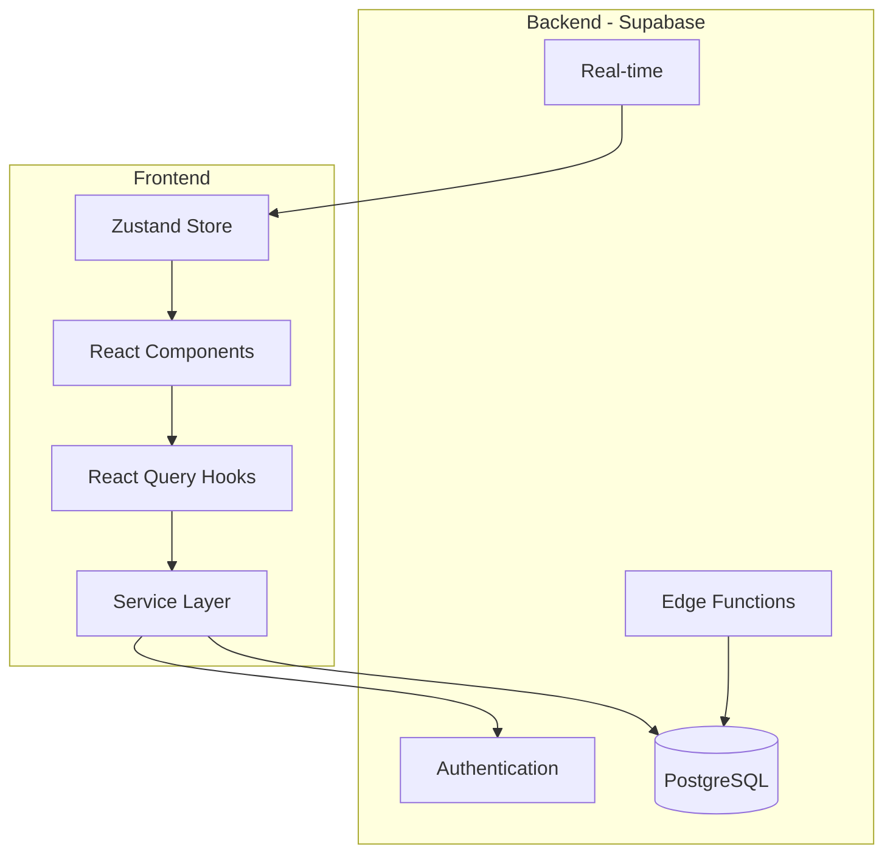
```mermaid
graph TB
    subgraph "Frontend"
        UI[React Components]
        Hooks[React Query Hooks]
        Services[Service Layer]
        Store[Zustand Store]
    end

    subgraph "Backend - Supabase"
        Auth[Authentication]
        DB[(PostgreSQL)]
        RT[Real-time]
        Edge[Edge Functions]
    end

    UI --> Hooks
    Hooks --> Services
    Services --> Auth
    Services --> DB
    RT --> Store
    Store --> UI
    Edge --> DB
```

### Frontend Architecture

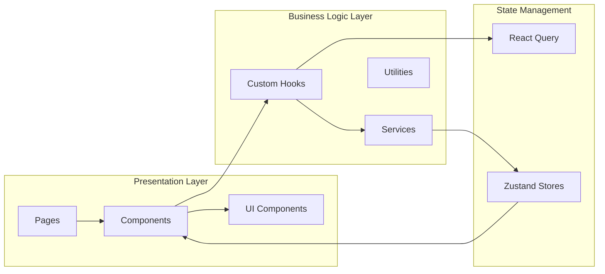
```mermaid
graph LR
    subgraph "Presentation Layer"
        Pages[Pages]
        Components[Components]
        UI[UI Components]
    end

    subgraph "Business Logic Layer"
        Hooks[Custom Hooks]
        Services[Services]
        Utils[Utilities]
    end

    subgraph "State Management"
        ReactQuery[React Query]
        Zustand[Zustand Stores]
    end

    Pages --> Components
    Components --> UI
    Components --> Hooks
    Hooks --> Services
    Hooks --> ReactQuery
    Services --> Zustand
    Zustand --> Components
```

### Technology Stack

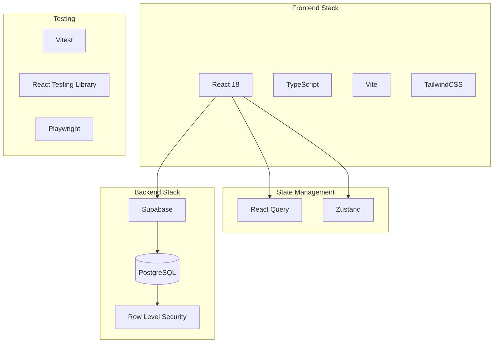
```mermaid
graph TD
    subgraph "Frontend Stack"
        React[React 18]
        TS[TypeScript]
        Vite[Vite]
        TW[TailwindCSS]
    end

    subgraph "State Management"
        RQ[React Query]
        Zustand[Zustand]
    end

    subgraph "Backend Stack"
        Supabase[Supabase]
        PG[(PostgreSQL)]
        RLS[Row Level Security]
    end

    subgraph "Testing"
        Vitest[Vitest]
        RTL[React Testing Library]
        PW[Playwright]
    end

    React --> RQ
    React --> Zustand
    React --> Supabase
    Supabase --> PG
    PG --> RLS
```

---

## 🔄 Data Flow

### Friend Request Flow

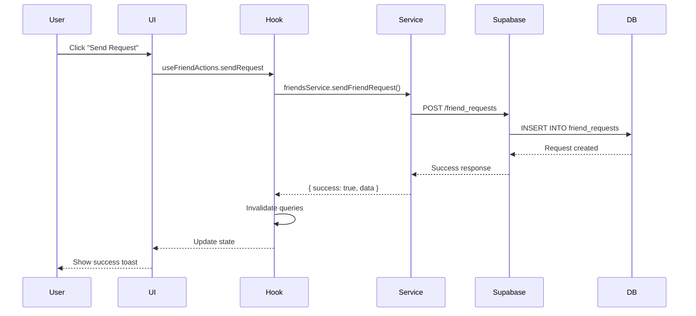
```mermaid
sequenceDiagram
    participant User
    participant UI
    participant Hook
    participant Service
    participant Supabase
    participant DB

    User->>UI: Click "Send Request"
    UI->>Hook: useFriendActions.sendRequest
    Hook->>Service: friendsService.sendFriendRequest()
    Service->>Supabase: POST /friend_requests
    Supabase->>DB: INSERT INTO friend_requests
    DB-->>Supabase: Request created
    Supabase-->>Service: Success response
    Service-->>Hook: { success: true, data }
    Hook->>Hook: Invalidate queries
    Hook-->>UI: Update state
    UI-->>User: Show success toast
```

### Real-time Update Flow

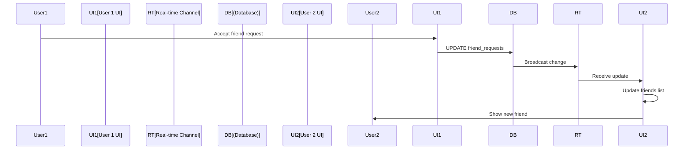
```mermaid
sequenceDiagram
    participant User1
    participant UI1[User 1 UI]
    participant RT[Real-time Channel]
    participant DB[(Database)]
    participant UI2[User 2 UI]
    participant User2

    User1->>UI1: Accept friend request
    UI1->>DB: UPDATE friend_requests
    DB->>RT: Broadcast change
    RT->>UI2: Receive update
    UI2->>UI2: Update friends list
    UI2->>User2: Show new friend
```

### Authentication Flow

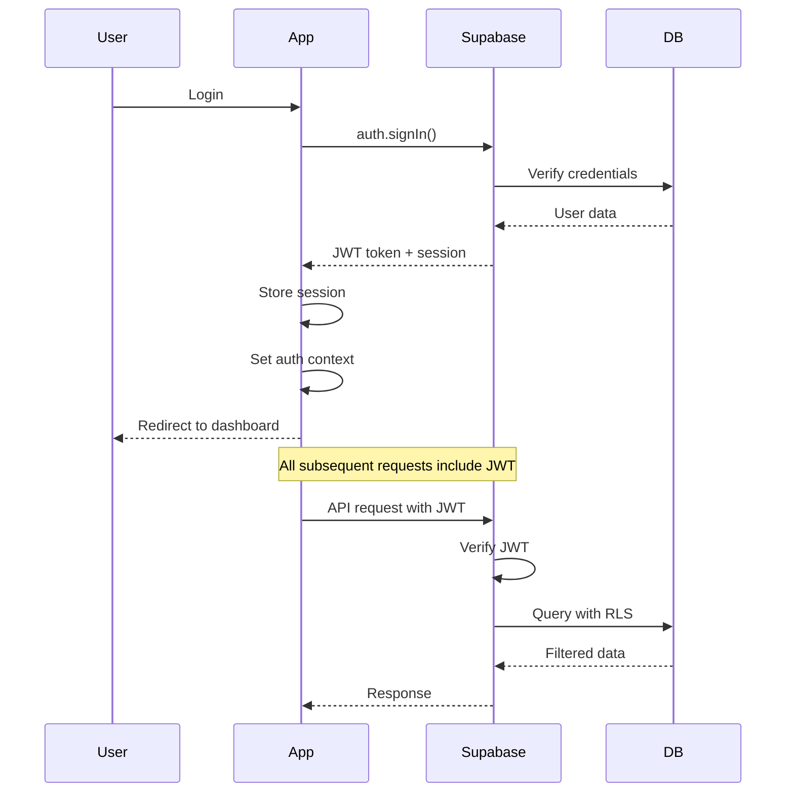
```mermaid
sequenceDiagram
    participant User
    participant App
    participant Supabase
    participant DB

    User->>App: Login
    App->>Supabase: auth.signIn()
    Supabase->>DB: Verify credentials
    DB-->>Supabase: User data
    Supabase-->>App: JWT token + session
    App->>App: Store session
    App->>App: Set auth context
    App-->>User: Redirect to dashboard

    Note over App,Supabase: All subsequent requests include JWT

    App->>Supabase: API request with JWT
    Supabase->>Supabase: Verify JWT
    Supabase->>DB: Query with RLS
    DB-->>Supabase: Filtered data
    Supabase-->>App: Response
```

### Error Handling Flow

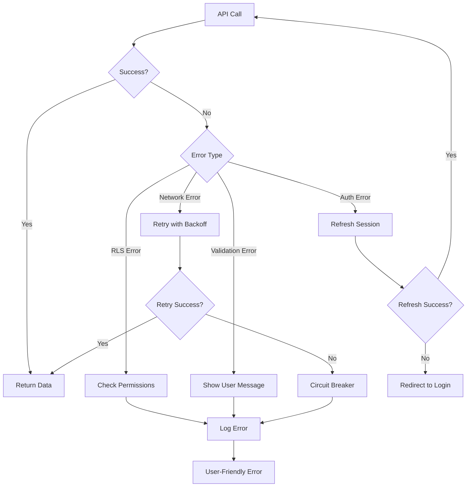
```mermaid
graph TD
    A[API Call] --> B{Success?}
    B -->|Yes| C[Return Data]
    B -->|No| D{Error Type}

    D -->|Network Error| E[Retry with Backoff]
    D -->|Auth Error| F[Refresh Session]
    D -->|RLS Error| G[Check Permissions]
    D -->|Validation Error| H[Show User Message]

    E --> I{Retry Success?}
    I -->|Yes| C
    I -->|No| J[Circuit Breaker]

    F --> K{Refresh Success?}
    K -->|Yes| A
    K -->|No| L[Redirect to Login]

    G --> M[Log Error]
    H --> M
    J --> M
    M --> N[User-Friendly Error]
```

---

## 🧩 Component Hierarchy

### Friends Module Components

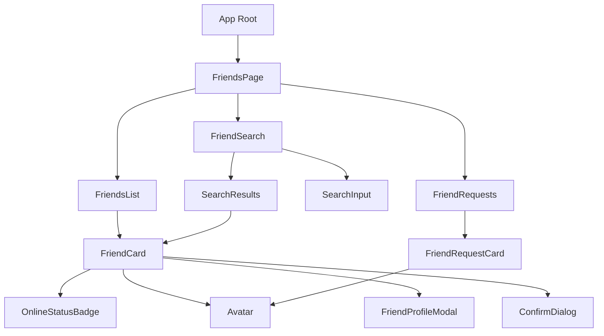
```mermaid
graph TD
    App[App Root]

    App --> FriendsPage[FriendsPage]

    FriendsPage --> FriendsList[FriendsList]
    FriendsPage --> FriendRequests[FriendRequests]
    FriendsPage --> FriendSearch[FriendSearch]

    FriendsList --> FriendCard[FriendCard]
    FriendCard --> OnlineStatus[OnlineStatusBadge]
    FriendCard --> Avatar[Avatar]

    FriendRequests --> RequestCard[FriendRequestCard]
    RequestCard --> Avatar

    FriendSearch --> SearchInput[SearchInput]
    FriendSearch --> SearchResults[SearchResults]
    SearchResults --> FriendCard

    FriendCard --> ProfileModal[FriendProfileModal]
    FriendCard --> ConfirmDialog[ConfirmDialog]
```

### Hook Dependencies

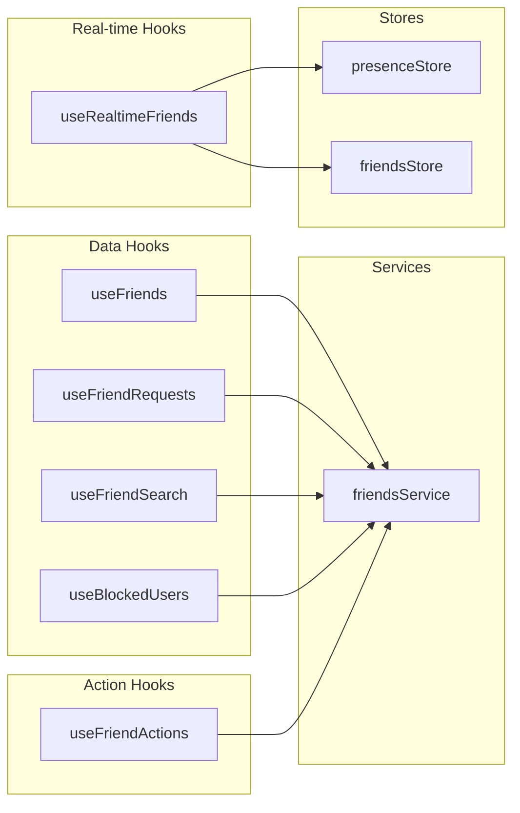
```mermaid
graph LR
    subgraph "Data Hooks"
        useFriends[useFriends]
        useFriendRequests[useFriendRequests]
        useFriendSearch[useFriendSearch]
        useBlockedUsers[useBlockedUsers]
    end

    subgraph "Action Hooks"
        useFriendActions[useFriendActions]
    end

    subgraph "Real-time Hooks"
        useRealtimeFriends[useRealtimeFriends]
    end

    subgraph "Services"
        friendsService[friendsService]
    end

    subgraph "Stores"
        friendsStore[friendsStore]
        presenceStore[presenceStore]
    end

    useFriends --> friendsService
    useFriendRequests --> friendsService
    useFriendSearch --> friendsService
    useFriendActions --> friendsService
    useBlockedUsers --> friendsService

    useRealtimeFriends --> presenceStore
    useRealtimeFriends --> friendsStore
```

---

## 🗄️ Database Schema

### Entity Relationship Diagram

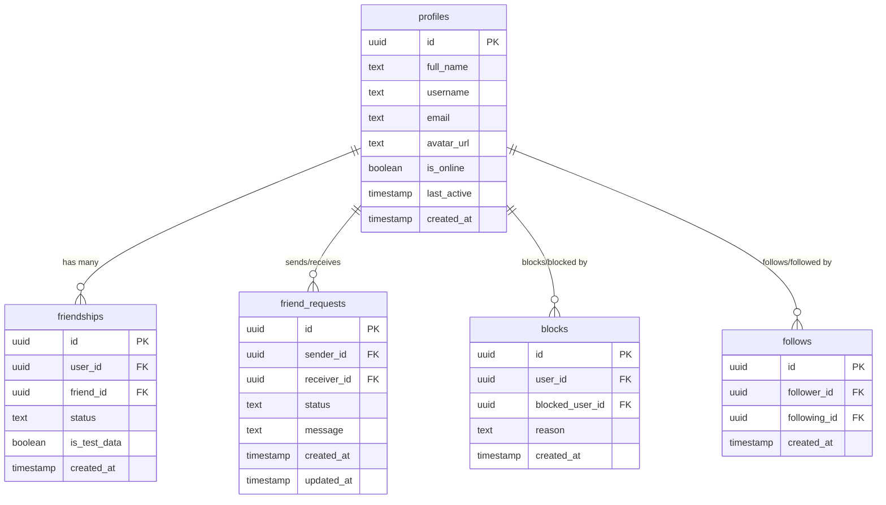
```mermaid
erDiagram
    profiles ||--o{ friendships : "has many"
    profiles ||--o{ friend_requests : "sends/receives"
    profiles ||--o{ blocks : "blocks/blocked by"
    profiles ||--o{ follows : "follows/followed by"

    profiles {
        uuid id PK
        text full_name
        text username
        text email
        text avatar_url
        boolean is_online
        timestamp last_active
        timestamp created_at
    }

    friendships {
        uuid id PK
        uuid user_id FK
        uuid friend_id FK
        text status
        boolean is_test_data
        timestamp created_at
    }

    friend_requests {
        uuid id PK
        uuid sender_id FK
        uuid receiver_id FK
        text status
        text message
        timestamp created_at
        timestamp updated_at
    }

    blocks {
        uuid id PK
        uuid user_id FK
        uuid blocked_user_id FK
        text reason
        timestamp created_at
    }

    follows {
        uuid id PK
        uuid follower_id FK
        uuid following_id FK
        timestamp created_at
    }
```

### Database Indexes

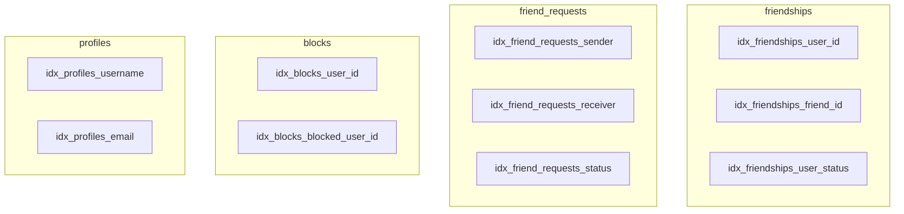
```mermaid
graph TD
    subgraph "friendships"
        F1[idx_friendships_user_id]
        F2[idx_friendships_friend_id]
        F3[idx_friendships_user_status]
    end

    subgraph "friend_requests"
        R1[idx_friend_requests_sender]
        R2[idx_friend_requests_receiver]
        R3[idx_friend_requests_status]
    end

    subgraph "blocks"
        B1[idx_blocks_user_id]
        B2[idx_blocks_blocked_user_id]
    end

    subgraph "profiles"
        P1[idx_profiles_username]
        P2[idx_profiles_email]
    end
```

---

## ⚡ Real-time Architecture

### Real-time Subscription Flow

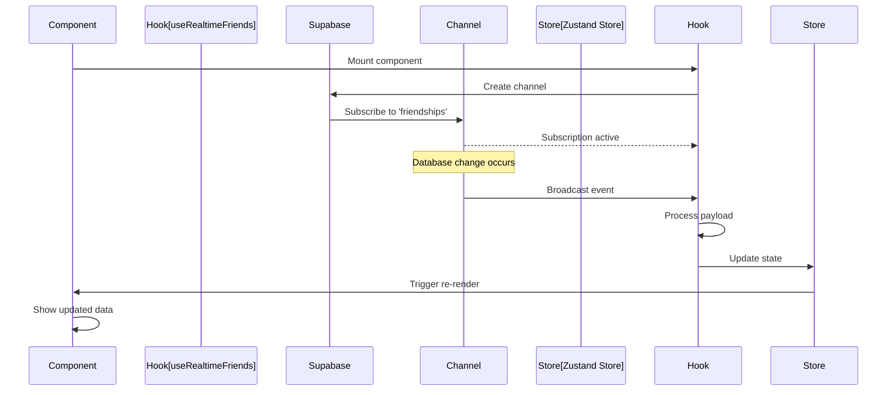
```mermaid
sequenceDiagram
    participant Component
    participant Hook[useRealtimeFriends]
    participant Supabase
    participant Channel
    participant Store[Zustand Store]

    Component->>Hook: Mount component
    Hook->>Supabase: Create channel
    Supabase->>Channel: Subscribe to 'friendships'
    Channel-->>Hook: Subscription active

    Note over Channel: Database change occurs

    Channel->>Hook: Broadcast event
    Hook->>Hook: Process payload
    Hook->>Store: Update state
    Store->>Component: Trigger re-render
    Component->>Component: Show updated data
```

### Presence System

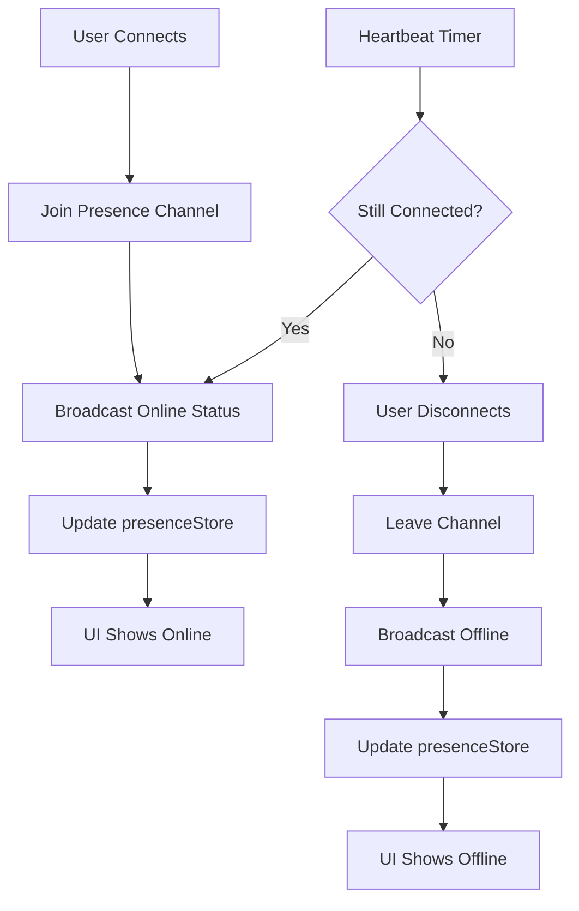
```mermaid
graph TD
    A[User Connects] --> B[Join Presence Channel]
    B --> C[Broadcast Online Status]
    C --> D[Update presenceStore]
    D --> E[UI Shows Online]

    F[User Disconnects] --> G[Leave Channel]
    G --> H[Broadcast Offline]
    H --> I[Update presenceStore]
    I --> J[UI Shows Offline]

    K[Heartbeat Timer] --> L{Still Connected?}
    L -->|Yes| C
    L -->|No| F
```

---

## 🚀 Deployment Architecture

### Production Environment

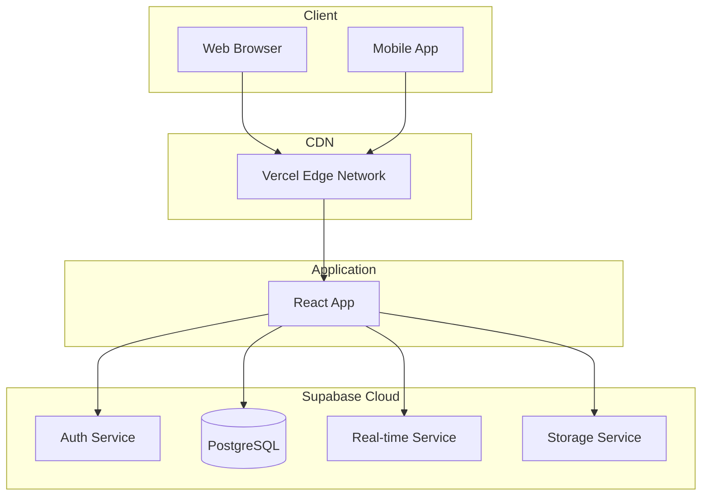
```mermaid
graph TB
    subgraph "Client"
        Browser[Web Browser]
        Mobile[Mobile App]
    end

    subgraph "CDN"
        Vercel[Vercel Edge Network]
    end

    subgraph "Application"
        App[React App]
    end

    subgraph "Supabase Cloud"
        Auth[Auth Service]
        DB[(PostgreSQL)]
        RT[Real-time Service]
        Storage[Storage Service]
    end

    Browser --> Vercel
    Mobile --> Vercel
    Vercel --> App
    App --> Auth
    App --> DB
    App --> RT
    App --> Storage
```

### CI/CD Pipeline

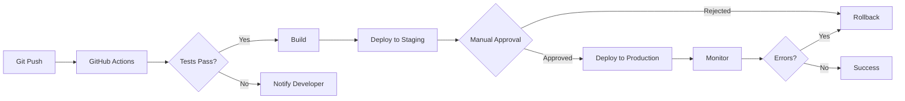
```mermaid
graph LR
    A[Git Push] --> B[GitHub Actions]
    B --> C{Tests Pass?}
    C -->|Yes| D[Build]
    C -->|No| E[Notify Developer]
    D --> F[Deploy to Staging]
    F --> G{Manual Approval}
    G -->|Approved| H[Deploy to Production]
    G -->|Rejected| I[Rollback]
    H --> J[Monitor]
    J --> K{Errors?}
    K -->|Yes| I
    K -->|No| L[Success]
```

### Environment Setup

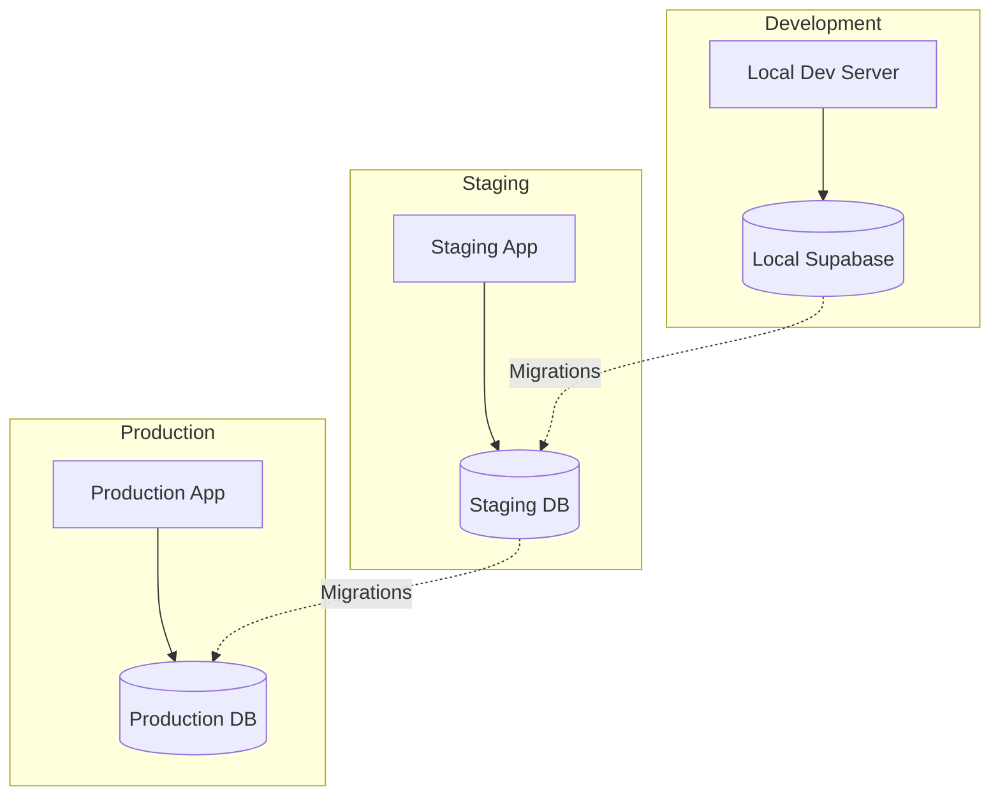
```mermaid
graph TD
    subgraph "Development"
        DevDB[(Local Supabase)]
        DevApp[Local Dev Server]
    end

    subgraph "Staging"
        StageDB[(Staging DB)]
        StageApp[Staging App]
    end

    subgraph "Production"
        ProdDB[(Production DB)]
        ProdApp[Production App]
    end

    DevApp --> DevDB
    StageApp --> StageDB
    ProdApp --> ProdDB

    DevDB -.->|Migrations| StageDB
    StageDB -.->|Migrations| ProdDB
```

---

## 📊 State Management Flow

### React Query + Zustand Integration

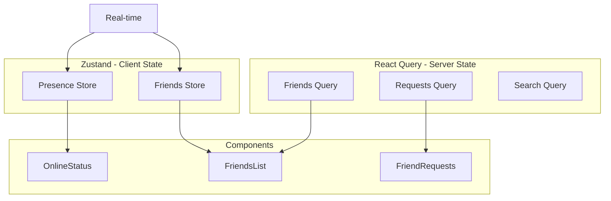
```mermaid
graph TD
    subgraph "React Query - Server State"
        Q1[Friends Query]
        Q2[Requests Query]
        Q3[Search Query]
    end

    subgraph "Zustand - Client State"
        Z1[Presence Store]
        Z2[Friends Store]
    end

    subgraph "Components"
        C1[FriendsList]
        C2[FriendRequests]
        C3[OnlineStatus]
    end

    Q1 --> C1
    Q2 --> C2
    Z1 --> C3
    Z2 --> C1

    RT[Real-time] --> Z1
    RT --> Z2
```

---

## 🔐 Security Architecture

### Row Level Security (RLS)

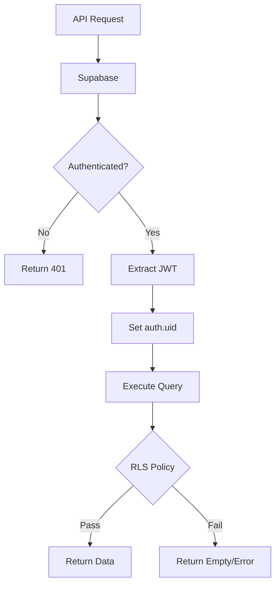
```mermaid
graph TD
    A[API Request] --> B[Supabase]
    B --> C{Authenticated?}
    C -->|No| D[Return 401]
    C -->|Yes| E[Extract JWT]
    E --> F[Set auth.uid]
    F --> G[Execute Query]
    G --> H{RLS Policy}
    H -->|Pass| I[Return Data]
    H -->|Fail| J[Return Empty/Error]
```

### Data Access Policies

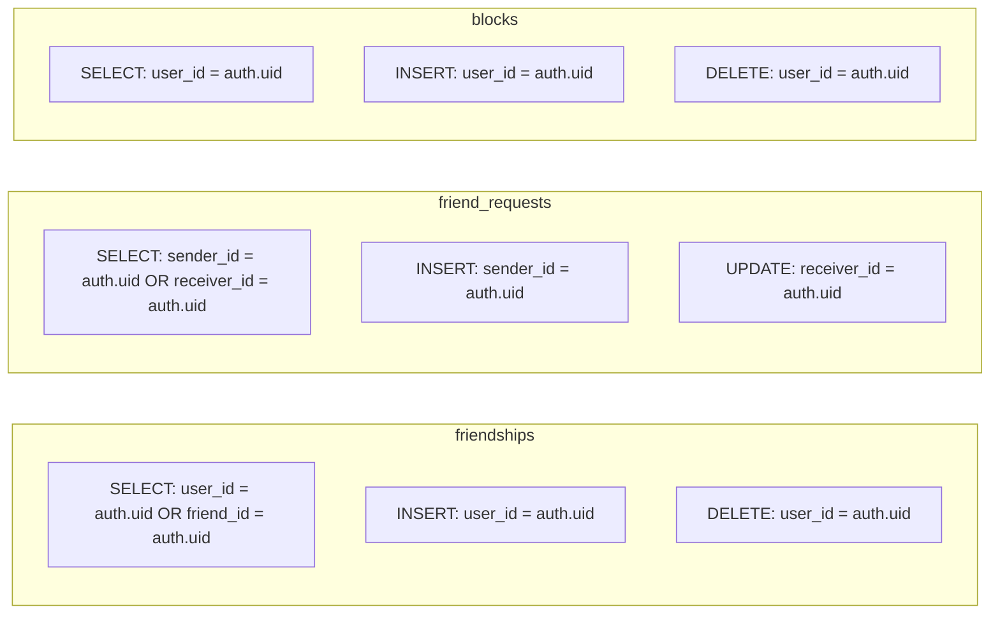
```mermaid
graph LR
    subgraph "friendships"
        F1[SELECT: user_id = auth.uid OR friend_id = auth.uid]
        F2[INSERT: user_id = auth.uid]
        F3[DELETE: user_id = auth.uid]
    end

    subgraph "friend_requests"
        R1[SELECT: sender_id = auth.uid OR receiver_id = auth.uid]
        R2[INSERT: sender_id = auth.uid]
        R3[UPDATE: receiver_id = auth.uid]
    end

    subgraph "blocks"
        B1[SELECT: user_id = auth.uid]
        B2[INSERT: user_id = auth.uid]
        B3[DELETE: user_id = auth.uid]
    end
```

---

## 📚 Additional Resources

- [API Documentation](../api/) - Complete API reference
- [Migration Guide](./migration.md) - Migration instructions
- [Onboarding Guide](./onboarding.md) - Getting started
- [Troubleshooting](./troubleshooting.md) - Common issues

---

**Last Updated:** 2025-11-29  
**Version:** 1.0.0  
**Maintainer:** Engineering Team
