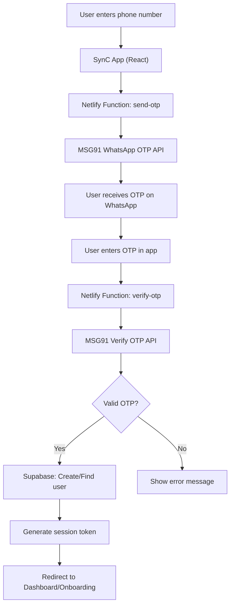

# 📱 EPIC 20: WhatsApp OTP Authentication (MSG91)

**Status:** 🔵 Not Started  
**Created:** 2026-05-12  
**Owner:** Full-Stack Engineering  
**Dependencies:** EPIC 2 (Authentication) — existing email/password auth must be in place  
**Priority:** 🟠 High  
**Estimated Effort:** 12–18 story points  
**Target Market:** Indian SMB users (WhatsApp-first communication preference)

---

## 🎯 Epic Goal

Add WhatsApp OTP-based phone login to SynC alongside the existing email/password authentication. Users will be able to log in or sign up using their phone number, receiving a one-time password via WhatsApp through the MSG91 service. This approach is ideal for the Indian SMB market that SynC targets.

### Core Objectives:
1. **Secure Backend API** — Build Netlify serverless functions to proxy OTP send/verify requests to MSG91 (keys never exposed to frontend)
2. **Supabase User Integration** — Create/find Supabase Auth users for phone-based login, ensuring seamless compatibility with existing `authStore`, `Profile`, and protected routes
3. **WhatsApp Login UI** — Create a phone number entry + OTP verification screen that matches the existing app design language
4. **Auth Store Extension** — Add `signInWithPhone` method to the existing auth store for phone-based session management
5. **Routing** — Add new `/auth/whatsapp-login` route for the WhatsApp login flow

---

## 🏗️ Architecture Overview



> [!IMPORTANT]
> The MSG91 API keys are **never exposed** to the frontend. All OTP operations go through Netlify serverless functions, which act as a secure backend proxy.

---

## 🔑 Key Design Decisions

> [!IMPORTANT]
> ### Decision 1: Supabase Auth Approach
> We will use **Supabase Admin `createUser`** to create phone-based accounts. This means:
> - Phone users get a real Supabase Auth user (same as email users)
> - We generate a Supabase session via `admin.generateLink` or a custom JWT
> - The existing `authStore`, `Profile`, and all protected routes work seamlessly
>
> **Alternative Considered:** Supabase's built-in phone auth (rejected because it uses Twilio, not MSG91, and doesn't support WhatsApp delivery)

> [!IMPORTANT]
> ### Decision 2: Login Page UX
> The plan adds a **"Continue with WhatsApp"** button on the existing Login page, which leads to a new phone-number entry screen → OTP verification screen. The existing email/password form remains unchanged. Is this the UX you want, or would you prefer phone-first (phone number field shown by default)?
>
> **Alternative Considered:** Phone-first UX (phone number field shown by default)

> [!WARNING]
> ### Decision 3: OTP Length
> MSG91 supports 4-digit and 6-digit OTPs. The existing `OtpInput` component defaults to 6 digits. We'll use **4-digit OTPs** (faster to type, standard for WhatsApp). Needs confirmation if 6-digit is preferred.

---

## ❓ Open Questions

> [!IMPORTANT]
> ### Q1: Do you already have an MSG91 account?
> If not, you'll need to create one. Detailed steps are provided in the "Manual Action Items" section below.

> [!IMPORTANT]
> ### Q2: Netlify Functions or Supabase Edge Functions?
> The project currently has **both** Netlify Functions (`netlify/functions/`) and Supabase Edge Functions (`supabase/functions/`). This plan uses **Netlify Functions** since the app is deployed on Netlify and there's already a working pattern (`web-vitals.ts`). Needs confirmation if Supabase Edge Functions are preferred.

> [!IMPORTANT]
> ### Q3: SMS Fallback
> Should we also implement SMS OTP as a fallback for users who don't have WhatsApp? MSG91 supports both. We can add a "Send via SMS instead" link below the WhatsApp OTP screen.

---

## ✅ Success Criteria

| Metric | Target |
|--------|--------|
| New user can sign up via WhatsApp OTP | ✅ Yes |
| Existing phone user can log in via WhatsApp OTP | ✅ Yes |
| Phone users get a real Supabase Auth user (same as email) | ✅ Yes |
| OTP delivery via WhatsApp through MSG91 | ✅ Yes |
| MSG91 keys are never exposed to the frontend | ✅ Yes |
| Rate limiting prevents OTP abuse | ✅ Yes (3 per 10 min per number) |
| Existing email/password login remains unchanged | ✅ Yes |
| New users routed to onboarding after phone signup | ✅ Yes |
| Existing users routed to dashboard after phone login | ✅ Yes |
| Mobile-responsive UI | ✅ Yes |
| Build passes with zero TypeScript errors | ✅ Yes |
| All existing tests pass (no regressions) | ✅ Yes |

---

## 📋 Manual Action Items (No Coding Required)

These are steps that must be completed **manually** on external websites before development can begin.

---

### Step 1: Create an MSG91 Account

1. Open your browser and go to **[https://msg91.com](https://msg91.com)**
2. Click the **"Sign Up Free"** or **"Get Started"** button (usually top-right corner)
3. Fill in:
   - **Your Name**
   - **Email Address** (use a business email if you have one)
   - **Phone Number** (your personal phone number with country code, e.g., +91 98765 43210)
   - **Company Name**: Enter `SynC` or your business name
   - **Password**: Choose a strong password
4. Click **Sign Up**
5. You'll receive a verification email — open your email inbox, find the email from MSG91, and click the verification link
6. Once verified, log in to your MSG91 dashboard at **[https://control.msg91.com](https://control.msg91.com)**

---

### Step 2: Get Your Auth Key

1. After logging in to MSG91, look at the top-right corner of the dashboard
2. Click on your **profile icon** or **account name**
3. Go to **"API Keys"** or **"Auth Key"** section
4. You'll see a long string of numbers and letters — this is your **Auth Key**
5. **Copy this key** and save it somewhere safe (you'll need it later)
   - It will look something like: `408354Acde12345f67890abc`
6. ⚠️ **Never share this key publicly** — it's like a password for your MSG91 account

---

### Step 3: Enable WhatsApp Business API

1. In the MSG91 dashboard, go to the left sidebar
2. Click on **"WhatsApp"** (it may be under "Channels" or directly in the sidebar)
3. Click **"Get Started"** or **"Enable WhatsApp"**
4. You'll need to:
   - Connect your **Facebook Business Manager** account (follow the on-screen prompts)
   - Verify your business with Meta/Facebook
   - Set up a **WhatsApp Business Phone Number** (this is the number users will see messages from)
5. This process may take **24-48 hours** for Meta approval
6. Once approved, your WhatsApp channel will show as **"Active"** in the MSG91 dashboard

> [!NOTE]
> If WhatsApp approval takes time, we can start development using **SMS OTP** first (which works instantly) and switch to WhatsApp once approved.

---

### Step 4: Create the OTP Template

1. In the MSG91 dashboard, go to **"OTP"** section in the left sidebar
2. Click **"Templates"** or **"Create Template"**
3. Select **"WhatsApp"** as the channel
4. Enter the template content:
   ```
   Your SynC verification code is {{otp}}. Valid for 5 minutes. Do not share this code with anyone.
   ```
5. Set the **OTP variable** as `{{otp}}` (MSG91 will auto-fill this)
6. Click **Submit for Approval**
7. Meta will review the template (usually within a few hours)
8. Once approved, you'll see a **Template ID** — **copy this and save it**
   - It will look something like: `65abc123def456789012345`

---

### Step 5: Provide the Credentials

Once steps 1-4 are complete, the following 2 values are needed to configure the app:

| What | Where to find it | Example |
|------|------------------|---------|
| **MSG91 Auth Key** | MSG91 Dashboard → Profile → API Keys | `408354Acde12345f67890abc` |
| **MSG91 Template ID** | MSG91 Dashboard → OTP → Templates | `65abc123def456789012345` |

These will be added as **secure environment variables** in Netlify (not in code).

---

### Step 6: Add Secrets to Netlify (I'll guide you through this)

1. Go to **[https://app.netlify.com](https://app.netlify.com)** and log in
2. Select your **SynC project/site**
3. Go to **Site Configuration** → **Environment Variables** (in the left sidebar)
4. Click **"Add a variable"** and add these two:

| Key | Value |
|-----|-------|
| `MSG91_AUTH_KEY` | *(paste your Auth Key from Step 2)* |
| `MSG91_TEMPLATE_ID` | *(paste your Template ID from Step 4)* |

5. Click **Save**
6. These are now securely stored — they're never visible in your code or to users

---

## 📊 Stories Breakdown

| # | Story | Priority | Estimate | Dependencies |
|---|-------|----------|----------|--------------|
| 20.1 | Backend — Netlify `send-otp` Serverless Function | 🔴 Critical | 3 pts | Manual Steps 1-6 |
| 20.2 | Backend — Netlify `verify-otp` Serverless Function | 🔴 Critical | 3 pts | 20.1 |
| 20.3 | Frontend — `whatsappAuthService.ts` Service Layer | 🟠 High | 2 pts | 20.1, 20.2 |
| 20.4 | Frontend — `WhatsAppLogin.tsx` UI Component | 🟠 High | 3 pts | 20.3 |
| 20.5 | Auth Store — `signInWithPhone` Integration | 🟠 High | 2 pts | 20.2, 20.3 |
| 20.6 | Routing — WhatsApp Login Route + Login Page Update | 🟡 Medium | 1 pt | 20.4 |
| 20.7 | Database — Phone Index Migration | 🟡 Medium | 1 pt | None |
| 20.8 | Configuration — Environment Variables Documentation | 🟢 Low | 1 pt | None |

### 📌 Recommended Execution Order

1. **20.7 + 20.8** (parallel) — Database index + env var documentation. Independent, quick wins.
2. **20.1** — `send-otp` Netlify Function. Foundation for all OTP flows.
3. **20.2** — `verify-otp` Netlify Function. Depends on 20.1 patterns.
4. **20.3** — `whatsappAuthService.ts`. Frontend service calling the Netlify Functions.
5. **20.5** — Auth store `signInWithPhone`. Integrates the service into the app state.
6. **20.4** — `WhatsAppLogin.tsx` UI. Main user-facing component.
7. **20.6** — Routing + Login page button update. Final wiring.

---

## 📖 Story Details

---

### Story 20.1: Backend — Netlify `send-otp` Serverless Function 🔵

These are the secure backend APIs that talk to MSG91. The app never talks to MSG91 directly.

**Goal**: Create a secure backend API that sends OTP via MSG91's WhatsApp API.

#### [NEW] `netlify/functions/send-otp.ts`

**Netlify Function — `POST /.netlify/functions/send-otp`**

Receives the user's phone number from the app, validates it, applies rate limiting, and sends an OTP via MSG91's WhatsApp API.

**Key Logic:**
- Validates phone number format (10-digit Indian number, or international with country code)
- Rate limiting: max 3 OTP requests per phone number per 10 minutes (using an in-memory Map; sufficient for Netlify Functions)
- Calls MSG91 `POST https://control.msg91.com/api/v5/otp` with the auth key and template ID
- Returns `{ success: true, type: "whatsapp" }` on success
- Returns `{ success: false, error: "..." }` with appropriate error codes on failure

**Acceptance Criteria:**
- [ ] Function deployed to Netlify
- [ ] Validates Indian 10-digit phone numbers
- [ ] Validates international numbers with country code
- [ ] Rate limits: max 3 OTP requests per phone number per 10 minutes
- [ ] Successfully calls MSG91 API to send WhatsApp OTP
- [ ] Returns appropriate success/error responses
- [ ] MSG91 Auth Key and Template ID read from environment variables (never hardcoded)

---

### Story 20.2: Backend — Netlify `verify-otp` Serverless Function 🔵

**Goal**: Create a secure backend API that verifies OTP with MSG91 and handles Supabase user creation/login.

#### [NEW] `netlify/functions/verify-otp.ts`

**Netlify Function — `POST /.netlify/functions/verify-otp`**

Receives the phone number + OTP from the app, verifies it with MSG91, and handles Supabase user creation/login.

**Key Logic:**
- Calls MSG91 `GET https://control.msg91.com/api/v5/otp/verify?otp=XXXX&mobile=91XXXXXXXXXX`
- If OTP is valid:
  - Checks if a user with this phone number already exists in Supabase (query `profiles` table by phone)
  - **Existing user**: Fetches the user and generates a new session
  - **New user**: Creates a new Supabase Auth user via `supabase.auth.admin.createUser({ phone, phone_confirm: true })`, creates a profile row
  - Returns `{ success: true, session: {...}, isNewUser: true/false }`
- If OTP is invalid: Returns `{ success: false, error: "Invalid OTP" }`

> [!NOTE]
> This function requires the **Supabase Service Role Key** (admin key) to create users. This is already available via Supabase project settings and will be added as a Netlify environment variable (`SUPABASE_SERVICE_ROLE_KEY`).

**Acceptance Criteria:**
- [ ] Function deployed to Netlify
- [ ] Successfully verifies OTP against MSG91 API
- [ ] Creates new Supabase Auth user for new phone numbers
- [ ] Finds existing Supabase Auth user for known phone numbers
- [ ] Generates a valid Supabase session for the authenticated user
- [ ] Returns `isNewUser` flag to control redirect (onboarding vs dashboard)
- [ ] Returns appropriate error responses for invalid/expired OTPs
- [ ] Supabase Service Role Key read from environment variable (never hardcoded)

---

### Story 20.3: Frontend — `whatsappAuthService.ts` Service Layer 🔵

**Goal**: Create a dedicated frontend service that handles all WhatsApp OTP API calls.

#### [NEW] `src/services/whatsappAuthService.ts`

A dedicated service that handles all WhatsApp OTP API calls from the frontend:

```typescript
// Functions:
sendWhatsAppOtp(phone: string): Promise<{ success: boolean; type: string }>
verifyWhatsAppOtp(phone: string, otp: string): Promise<{ success: boolean; session: any; isNewUser: boolean }>
```

**Key Logic:**
- Calls the Netlify Functions (`/.netlify/functions/send-otp`, `/.netlify/functions/verify-otp`)
- Handles network errors, timeouts (30s), and retries
- Returns typed responses

**Acceptance Criteria:**
- [ ] `sendWhatsAppOtp` calls `/.netlify/functions/send-otp` with phone number
- [ ] `verifyWhatsAppOtp` calls `/.netlify/functions/verify-otp` with phone + OTP
- [ ] Handles network errors gracefully with user-friendly messages
- [ ] Implements 30-second timeout for API calls
- [ ] Returns fully typed responses

---

### Story 20.4: Frontend — `WhatsAppLogin.tsx` UI Component 🔵

**Goal**: Create a full-page WhatsApp login flow with phone entry and OTP verification screens.

#### [NEW] `src/components/auth/WhatsAppLogin.tsx`

A new full-page component for the WhatsApp login flow. Contains two screens managed by internal state:

**Screen 1 — Phone Number Entry:**
- Country code selector (defaulting to +91 India)
- Phone number input field (10 digits)
- Green "Continue with WhatsApp" button with WhatsApp icon
- "Back to email login" link
- Input validation (must be exactly 10 digits)

**Screen 2 — OTP Verification:**
- Uses the existing `OtpInput` component (already exists at `src/components/auth/OtpInput.tsx`)
- "We sent a code to your WhatsApp" message showing the masked phone number
- Resend timer (30-second countdown before allowing resend)
- "Resend Code" button (disabled during countdown)
- "Change Number" link to go back to Screen 1
- Loading spinner during verification
- Error message display

**Design Approach:**
- Matches the existing Login/SignUp visual style (white card, indigo accents, rounded-xl inputs, shadow-2xl card)
- WhatsApp-themed green (#25D366) for the primary CTA button
- Mobile-first responsive design
- Uses the same SynC logo header as Login.tsx

**Acceptance Criteria:**
- [ ] Phone number entry screen with country code selector (default +91)
- [ ] Input validation: exactly 10 digits for Indian numbers
- [ ] OTP verification screen using existing `OtpInput` component
- [ ] Masked phone number display on OTP screen
- [ ] 30-second resend countdown timer
- [ ] "Resend Code" button (disabled during countdown)
- [ ] "Change Number" link navigates back to phone entry
- [ ] "Back to email login" link navigates to `/login`
- [ ] Loading spinner during OTP send and verify operations
- [ ] Clear error message display for all failure cases
- [ ] Visual design matches existing Login/SignUp style
- [ ] WhatsApp green (#25D366) primary CTA button
- [ ] Mobile-first responsive design
- [ ] SynC logo header consistent with Login.tsx

---

### Story 20.5: Auth Store — `signInWithPhone` Integration 🔵

**Goal**: Add phone-based login methods to the existing auth store.

#### [MODIFY] `src/store/authStore.ts`

Add new methods to the auth store for phone-based login:

```typescript
// New methods added to AuthState interface:
signInWithPhone: (phone: string, otp: string) => Promise<{ isNewUser: boolean }>
```

**Key Logic:**
- Calls `whatsappAuthService.verifyWhatsAppOtp()`
- On success: Sets the Supabase session, fetches the user profile, updates store state
- On failure: Throws user-friendly error
- Handles the `isNewUser` flag to redirect new users to onboarding

#### [MODIFY] `src/lib/supabase.ts`

- Verify the `phone` field is already defined on the `Profile` interface ✅ (line 134: `phone?: string`)
- No changes expected — the Profile type already supports phone

**Acceptance Criteria:**
- [ ] `signInWithPhone(phone, otp)` method added to auth store
- [ ] Calls `whatsappAuthService.verifyWhatsAppOtp()` internally
- [ ] Sets Supabase session on successful verification
- [ ] Fetches and stores user profile after login
- [ ] Returns `isNewUser` flag for routing decisions
- [ ] Throws user-friendly errors on failure
- [ ] `Profile` interface verified to include `phone?: string`

---

### Story 20.6: Routing — WhatsApp Login Route + Login Page Update 🔵

**Goal**: Wire up the WhatsApp login route and update the existing login page.

#### [MODIFY] `src/router/Router.tsx`

Add new route for the WhatsApp login page:

```typescript
{
  path: '/auth/whatsapp-login',
  element: <RouteLoader><WhatsAppLogin /></RouteLoader>,
  protected: false,
  title: 'WhatsApp Login - SynC',
  description: 'Login with WhatsApp OTP'
}
```

#### [MODIFY] `src/components/Login.tsx`

Changes to the existing login page:
- Replace the current non-functional "Sign in with Phone" button (line 199-207) with a working **"Continue with WhatsApp"** button
- The new button navigates to `/auth/whatsapp-login`
- Add WhatsApp icon (green brand color)
- Keep the existing Google button placeholder (for future implementation)

**Acceptance Criteria:**
- [ ] `/auth/whatsapp-login` route added to Router.tsx
- [ ] Route is public (not protected)
- [ ] Route has proper title and description for SEO
- [ ] Login page "Sign in with Phone" button replaced with "Continue with WhatsApp"
- [ ] WhatsApp button navigates to `/auth/whatsapp-login`
- [ ] WhatsApp icon with green brand color on the button
- [ ] Existing Google button placeholder preserved

---

### Story 20.7: Database — Phone Index Migration 🔵

**Goal**: Create a database index for fast phone number lookups during OTP verification.

#### [NEW] `supabase/migrations/xxx_add_phone_index.sql`

Create an index on the `profiles.phone` column for fast lookups during OTP verification:

```sql
-- Only if not already indexed
CREATE INDEX IF NOT EXISTS idx_profiles_phone ON profiles(phone) WHERE phone IS NOT NULL;
```

**Acceptance Criteria:**
- [ ] Migration file created in `supabase/migrations/`
- [ ] Partial index on `profiles.phone` where phone is not null
- [ ] Index creation is idempotent (`IF NOT EXISTS`)
- [ ] Migration applied successfully to Supabase

---

### Story 20.8: Configuration — Environment Variables Documentation 🔵

**Goal**: Document all new environment variables needed for the WhatsApp OTP feature.

#### [MODIFY] `.env.example`

Add documentation for the new environment variables (these go in Netlify, not in the `.env` file, but documented for clarity):

```
# ============================================
# MSG91 WHATSAPP OTP (Server-side only — set in Netlify Environment Variables)
# ============================================
# MSG91_AUTH_KEY=your_msg91_auth_key
# MSG91_TEMPLATE_ID=your_msg91_template_id
# SUPABASE_SERVICE_ROLE_KEY=your_supabase_service_role_key
```

**Acceptance Criteria:**
- [ ] `.env.example` updated with MSG91 environment variable documentation
- [ ] Comments clearly indicate these are server-side only (Netlify env vars)
- [ ] All three keys documented: `MSG91_AUTH_KEY`, `MSG91_TEMPLATE_ID`, `SUPABASE_SERVICE_ROLE_KEY`

---

## 📁 File Summary Table

| Action | File | Story | Description |
|--------|------|-------|-------------|
| **NEW** | `netlify/functions/send-otp.ts` | 20.1 | Backend function to send OTP via MSG91 |
| **NEW** | `netlify/functions/verify-otp.ts` | 20.2 | Backend function to verify OTP & create/login user |
| **NEW** | `src/services/whatsappAuthService.ts` | 20.3 | Frontend service for OTP API calls |
| **NEW** | `src/components/auth/WhatsAppLogin.tsx` | 20.4 | Phone entry + OTP verification UI |
| **MODIFY** | `src/store/authStore.ts` | 20.5 | Add `signInWithPhone` method |
| **MODIFY** | `src/lib/supabase.ts` | 20.5 | Verify `phone` field on Profile interface |
| **MODIFY** | `src/router/Router.tsx` | 20.6 | Add WhatsApp login route |
| **MODIFY** | `src/components/Login.tsx` | 20.6 | Add working WhatsApp login button |
| **NEW** | `supabase/migrations/xxx_add_phone_index.sql` | 20.7 | Index for phone number lookups |
| **MODIFY** | `.env.example` | 20.8 | Document new env vars |

---

## 🔒 Security Measures

| Concern | Solution |
|---------|----------|
| MSG91 key exposure | Keys stored in Netlify env vars, never in frontend code |
| OTP brute force | Rate limiting in `send-otp` function (3 per 10 min per number) |
| OTP guessing | MSG91 handles attempt limits server-side; we also limit verify attempts |
| Spam/abuse | Phone number format validation, rate limiting |
| MITM attacks | All API calls over HTTPS |
| Session hijacking | Standard Supabase JWT session management (PKCE flow already configured) |

---

## 🧪 Verification Strategy

### Automated Tests
1. **Build check**: `npm run build` — ensure no TypeScript errors
2. **Existing tests**: `npm test` — ensure no regressions
3. **Manual browser test**: Start dev server, navigate to login page, click WhatsApp button, verify the phone number entry form renders correctly

### Manual Verification
1. **End-to-end flow** (requires live MSG91 credentials):
   - Enter phone number → receive WhatsApp OTP → enter OTP → verify login/signup
   - Test with an existing user (should log in directly)
   - Test with a new phone number (should go to onboarding)
2. **Error cases**:
   - Invalid phone number format
   - Wrong OTP
   - Expired OTP
   - Rate limit exceeded (send more than 3 OTPs in 10 minutes)
3. **UI review**:
   - Mobile responsiveness
   - Loading states
   - Error message clarity
   - Back navigation works correctly

---

## ⚠️ Risk Mitigation

> [!CAUTION]
> MSG91 WhatsApp Business API approval may take 24-48 hours from Meta. Development can proceed using SMS OTP first and switch to WhatsApp once approved.

- **WhatsApp approval delay**: Start development with SMS OTP fallback; switch to WhatsApp when approved
- **Supabase Admin API**: The `verify-otp` function uses the Service Role Key — ensure this key is only in server-side env vars, never client-side
- **Rate limit bypass**: In-memory rate limiting resets on function cold starts; acceptable for Netlify Functions, but monitor for abuse patterns
- **OTP template rejection**: Meta may reject the WhatsApp template — have a backup template ready with different wording

---

## ✅ Definition of Done

- [ ] MSG91 account created and WhatsApp Business API enabled
- [ ] OTP template approved by Meta
- [ ] `MSG91_AUTH_KEY`, `MSG91_TEMPLATE_ID`, and `SUPABASE_SERVICE_ROLE_KEY` set in Netlify environment variables
- [ ] `send-otp` Netlify Function deployed and working
- [ ] `verify-otp` Netlify Function deployed and working with Supabase user creation/login
- [ ] `whatsappAuthService.ts` frontend service created with typed responses
- [ ] `WhatsAppLogin.tsx` UI component with phone entry + OTP verification screens
- [ ] `signInWithPhone` method added to auth store
- [ ] `/auth/whatsapp-login` route added to Router.tsx
- [ ] Login page "Continue with WhatsApp" button navigates to WhatsApp login flow
- [ ] `profiles.phone` database index created via migration
- [ ] `.env.example` updated with new environment variable documentation
- [ ] `npm run build` passes with zero TypeScript errors
- [ ] `npm test` passes with no regressions
- [ ] End-to-end flow tested: phone entry → WhatsApp OTP → verification → dashboard/onboarding
- [ ] Error cases tested: invalid phone, wrong OTP, expired OTP, rate limit
- [ ] UI review: mobile responsiveness, loading states, error messages, back navigation

---

## 🚀 Future Enhancements (Not in This Epic)

- 📱 **Auto-read OTP** on Android (Capacitor SMS retrieval plugin)
- 📨 **SMS fallback** if WhatsApp delivery fails
- 🔒 **Device fingerprinting** for enhanced security
- 📊 **OTP analytics** (success rates, delivery times) via PostHog
- 🌍 **International phone support** with country picker
- 🔗 **Account linking** — let existing email users add their phone number later
