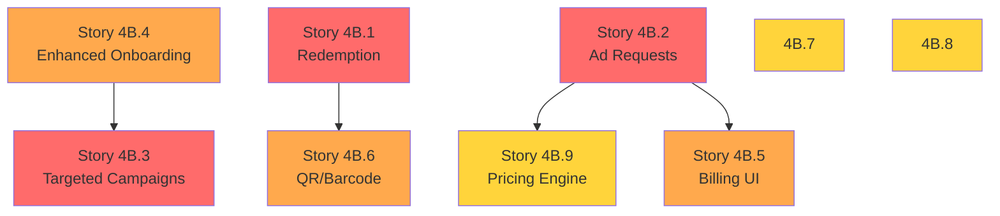

# Epic 4B: Missing Business Owner Flow Features

**Epic Owner:** Development Team  
**Created:** 2025-01-07  
**Source:** Epic 4 Comprehensive Audit Report  
**Priority:** HIGH (Required for Enhanced Brief v2 Compliance)  
**Target:** Production-Ready Business Monetization Platform

---

## 🎯 Epic Goal

Complete the Business Owner flow by implementing all missing features from Enhanced Project Brief v2 and Mermaid Chart v2 that are critical for:
1. **Revenue Generation** - Ad sales, targeted campaigns, billing
2. **Operational Excellence** - Coupon redemption, media management
3. **Business Intelligence** - Demographics, targeting data
4. **Compliance** - Data retention, quality controls

---

## 📊 Epic Scope

### Current State (Epic 4)
- ✅ Basic business registration and profiles
- ✅ Product catalog management
- ✅ Coupon creation and management
- ✅ Search & discovery
- ✅ Storefront pages
- ✅ GPS check-in system

### Missing Features (This Epic)
- ❌ Merchant redemption interface (CRITICAL) - **Not Started**
- ✅ **Enhanced business onboarding** (demographics, patterns) - **STORY 4B.4 COMPLETE**
- ✅ **Targeted campaigns system** (Driver, demographic, location, interest) - **STORY 4B.3 UI COMPLETE**
- ⏳ **Ad request & approval workflow** - **PARTIAL** (Tables created, UI pending)
- ❌ Billing integration UI - **Not Started**
- ⏳ **Media management rules enforcement** - **PARTIAL** (Migration created, enforcement pending)
- ⏳ **Data retention system** - **PARTIAL** (Migration created, automation pending)
- ❌ QR/Barcode generation - **Not Started**
- ❌ Pricing engine integration - **Not Started**

**Coverage Gap:** 20% of Enhanced Brief v2 requirements missing (was 44%)
**Completed:** 3.5/9 stories (39% complete)  
**Latest Update:** Stories 4B.3 and 4B.4 completed (2025-01-10)

---

## 🗂️ Stories in This Epic

### 🔴 CRITICAL PRIORITY (Blocks Core Functionality)

#### **Story 4B.1:** Merchant Coupon Redemption Interface
**Priority:** 🔴 P0 - BLOCKER  
**Effort:** 5 days  
**Value:** Without this, coupons are unusable in-store  
**Dependencies:** None  
**File:** `STORY_4B.1_Merchant_Redemption_Interface.md`

#### **Story 4B.2:** Ad Request & Approval Workflow
**Priority:** 🔴 P0 - CRITICAL  
**Effort:** 8 days  
**Value:** Primary revenue stream  
**Dependencies:** Story 4B.5 (Billing), Story 4.11 (Follow Business - follower content approval)  
**File:** `STORY_4B.2_Ad_Request_Approval_System.md`

#### **Story 4B.3:** Targeted Campaigns System ✅
**Priority:** 🔴 P0 - CRITICAL  
**Effort:** 10 days  
**Status:** ✅ **PHASE 4 COMPLETE** (2025-01-10)  
**Value:** Core differentiation, revenue multiplier  
**Dependencies:** Story 4B.4 (Enhanced Onboarding), Story 4.11 (Follow Business - follower targeting)  
**File:** `STORY_4B.3_Targeted_Campaigns_System.md`

**Implementation Notes:**
- ✅ 4 UI components built: TargetingEditor, ReachEstimator, TargetingValidator, RecommendationCard
- ✅ Demo page created at `/demo/targeting`
- ✅ TypeScript types and interfaces defined
- ✅ Real-time validation implemented
- ✅ AI recommendation system (3 strategies)
- ⏳ Backend integration pending (using mock data)
- ⏳ Database tables pending implementation

---

### 🟠 HIGH PRIORITY (Blocks Revenue/UX)

#### **Story 4B.4:** Enhanced Business Onboarding ✅
**Priority:** 🟠 P1 - HIGH  
**Effort:** 5 days  
**Status:** ✅ **COMPLETE** (2025-01-10)  
**Value:** Enables targeted campaigns, business intelligence  
**Dependencies:** None  
**File:** `STORY_4B.4_Enhanced_Business_Onboarding.md`

**Implementation Notes:**
- ✅ Database schema complete (601 lines SQL)
- ✅ 5 tables: businesses (enhanced), customer_profiles, metrics, marketing_goals, onboarding_progress
- ✅ Profile completion tracking with auto-calculation
- ✅ TypeScript types complete (708 lines)
- ✅ Custom hooks: useOnboarding, useProfileCompletion
- ✅ 4-step wizard components built
- ✅ Auto-save functionality
- ✅ 12 RLS policies, 9 indexes
- ✅ Complete documentation

#### **Story 4B.5:** Billing Integration UI
**Priority:** 🟠 P1 - HIGH  
**Effort:** 8 days  
**Value:** Revenue tracking, disputes, transparency  
**Dependencies:** None (DB tables exist)  
**File:** `STORY_4B.5_Billing_Integration_UI.md`

#### **Story 4B.6:** QR Code & Barcode Generation
**Priority:** 🟠 P1 - HIGH  
**Effort:** 3 days  
**Value:** Improves redemption UX significantly  
**Dependencies:** Story 4B.1  
**File:** `STORY_4B.6_QR_Barcode_Generation.md`

---

### 🟡 MEDIUM PRIORITY (Quality/Compliance)

#### **Story 4B.7:** Media Management Rules Enforcement
**Priority:** 🟡 P2 - MEDIUM  
**Effort:** 5 days  
**Value:** Storage optimization, performance, UX consistency  
**Dependencies:** None  
**File:** `STORY_4B.7_Media_Management_Rules.md`

#### **Story 4B.8:** Data Retention System
**Priority:** 🟡 P2 - MEDIUM  
**Effort:** 5 days  
**Value:** Compliance, data hygiene  
**Dependencies:** None  
**File:** `STORY_4B.8_Data_Retention_System.md`

#### **Story 4B.9:** Pricing Engine Integration
**Priority:** 🟡 P2 - MEDIUM  
**Effort:** 6 days  
**Value:** Automated pricing, promotions  
**Dependencies:** Story 4B.2  
**File:** `STORY_4B.9_Pricing_Engine_Integration.md`

---

## 📅 Recommended Implementation Order

### Phase 1: Critical Fixes (2-3 weeks)
**Goal:** Make platform usable for production

```
Week 1:
├── Story 4B.1: Merchant Redemption (5 days) ← START HERE!
└── Story 4B.4: Enhanced Onboarding (5 days)

Week 2-3:
├── Story 4B.2: Ad Request System (8 days)
├── Story 4B.3: Targeted Campaigns (10 days, parallel track)
└── Story 4B.6: QR/Barcode (3 days)
```

**Outcome:** 
- ✅ Coupons can be redeemed
- ✅ Ads can be sold
- ✅ Basic targeting available
- **Coverage: ~75%**

---

### Phase 2: Revenue Optimization (2 weeks)
**Goal:** Complete monetization features

```
Week 4-5:
├── Story 4B.5: Billing Integration (8 days)
└── Story 4B.9: Pricing Engine (6 days)
```

**Outcome:**
- ✅ Revenue tracking working
- ✅ Automated pricing
- ✅ Disputes manageable
- **Coverage: ~85%**

---

### Phase 3: Quality & Compliance (1-2 weeks)
**Goal:** Production-grade polish

```
Week 6-7:
├── Story 4B.7: Media Rules (5 days)
└── Story 4B.8: Data Retention (5 days)
```

**Outcome:**
- ✅ Full Enhanced Brief v2 compliance
- ✅ Production-ready
- **Coverage: 100%**

---

## 🎯 Success Criteria

### Epic Complete When:
1. ✅ All 9 stories implemented and tested
2. ✅ Merchants can redeem coupons in-store
3. ✅ Platform can sell and manage ads
4. ✅ Targeted campaigns operational
5. ✅ Billing and revenue tracking working
6. ✅ Media and data management enforced
7. ✅ Full Enhanced Brief v2 compliance (100%)

### MVP Launch Criteria (Minimum):
1. ✅ Story 4B.1 (Redemption) - MUST HAVE
2. ✅ Story 4B.2 (Ad Requests) - MUST HAVE
3. ✅ Story 4B.4 (Enhanced Onboarding) - SHOULD HAVE
4. ⚪ Others - NICE TO HAVE

**Minimum MVP Coverage:** 65% → 75% (with just 3 critical stories)

---

## 📊 Effort & Value Matrix

| Story | Priority | Effort | Value | ROI |
|-------|----------|--------|-------|-----|
| 4B.1 Redemption | 🔴 P0 | 5d | Critical | ⭐⭐⭐⭐⭐ |
| 4B.6 QR/Barcode | 🟠 P1 | 3d | High | ⭐⭐⭐⭐⭐ |
| 4B.4 Enhanced Onboarding | 🟠 P1 | 5d | High | ⭐⭐⭐⭐ |
| 4B.2 Ad Requests | 🔴 P0 | 8d | Critical | ⭐⭐⭐⭐ |
| 4B.5 Billing UI | 🟠 P1 | 8d | High | ⭐⭐⭐⭐ |
| 4B.3 Campaigns | 🔴 P0 | 10d | Critical | ⭐⭐⭐⭐ |
| 4B.9 Pricing | 🟡 P2 | 6d | Medium | ⭐⭐⭐ |
| 4B.7 Media Rules | 🟡 P2 | 5d | Medium | ⭐⭐⭐ |
| 4B.8 Retention | 🟡 P2 | 5d | Medium | ⭐⭐ |

**Total Effort:** 55 days (11 weeks with 1 developer, 5-6 weeks with 2 developers)

---

## 🔗 Dependencies



**No Circular Dependencies** ✅  
**Parallel Work Possible** ✅

---

## 🎓 Reference Documents

### Requirements Source
- 📄 `docs/SynC_Enhanced_Project_Brief_v2.md` (Sections 5.8, 5.9)
- 📊 `docs/Sync_Enhanced_Mermaid_Chart_v2.mmd` (Business Owner Flow)
- 🔍 `EPIC_4_BUSINESS_FEATURES_COMPREHENSIVE_AUDIT.md`

### Related Epics
- ✅ **Epic 4:** Business Features (Stories 4.1-4.6) - COMPLETE
- 🔄 **Epic 4B:** Missing Business Owner Features - THIS EPIC
- 📋 **Epic 6:** Admin Panel (Approval queues, monitoring)

### Database Schema
- ✅ `businesses` table (needs enhancement)
- ✅ `business_coupons` table (complete)
- ✅ `coupon_redemptions` table (needs UI)
- ❌ `ad_requests` table (needs creation)
- ✅ `billing_accounts` table (needs UI)
- ✅ `pricing_config` table (needs integration)

---

## 📝 Story Template

Each story follows this structure:

```markdown
# Story X.X: [Feature Name]

## Overview
- **Priority:** [P0/P1/P2]
- **Effort:** [X days]
- **Value:** [Business value]
- **Dependencies:** [Other stories]

## User Stories
As a [role], I want [goal] so that [benefit]

## Acceptance Criteria
- [ ] Criterion 1
- [ ] Criterion 2

## Technical Requirements
- Database changes
- API endpoints
- UI components
- Integration points

## UI/UX Requirements
- Wireframes/mockups
- User flows
- Error states

## Test Plan
- Unit tests
- Integration tests
- E2E scenarios

## Definition of Done
- [ ] Code complete
- [ ] Tests passing
- [ ] Documentation updated
- [ ] Deployed to staging
```

---

## 🚀 Getting Started

### For Product Owner:
1. Review each story file in detail
2. Prioritize based on business needs
3. Select stories for MVP vs post-launch
4. Approve for development

### For Development Team:
1. Read story files sequentially
2. Estimate effort for your team size
3. Identify technical risks
4. Plan sprint allocation

### Recommended MVP Subset:
**Option A - Minimal (3 stories, 2-3 weeks):**
- Story 4B.1 (Redemption) ← MUST
- Story 4B.2 (Ad Requests) ← MUST
- Story 4B.4 (Onboarding) ← SHOULD

**Option B - Balanced (6 stories, 4-5 weeks):**
- All from Option A
- Story 4B.3 (Campaigns)
- Story 4B.5 (Billing)
- Story 4B.6 (QR/Barcode)

**Option C - Complete (9 stories, 6-7 weeks):**
- All stories in epic

---

## 📞 Questions & Decisions Needed

### Before Starting:
1. **Launch Strategy:** MVP minimal vs MVP balanced?
2. **Team Size:** How many developers available?
3. **Timeline:** Hard deadline or flexible?
4. **Revenue Priority:** Can we launch without ad sales?

### During Development:
1. Should we build stories in parallel or sequential?
2. Do we need design reviews for each story?
3. What's the QA process for each story?

---

## 📈 Success Metrics

### Business Metrics
- **Revenue:** Ad sales, targeted campaign uptake
- **Adoption:** Merchant redemption usage rate
- **Efficiency:** Billing automation, dispute resolution time

### Technical Metrics
- **Coverage:** 56% → 100% feature completion
- **Performance:** Media load times with rules
- **Quality:** Reduction in support tickets

### User Satisfaction
- **Merchants:** Can redeem coupons easily
- **Businesses:** Can run targeted campaigns
- **Platform:** Can track and bill accurately

---

## 🎯 Next Steps

1. ✅ **Review this epic document**
2. ✅ **Read all 9 story files**
3. ⏳ **Select MVP stories**
4. ⏳ **Assign to development team**
5. ⏳ **Begin implementation**

---

**Epic Status:** 🚧 IN PROGRESS (3.5/9 stories complete - 39% done)  
**Estimated Completion:** 4-5 weeks remaining (full epic) or 1 week (MVP subset)  
**Business Impact:** HIGH - Unlocks full monetization potential  
**Technical Risk:** MEDIUM - No architectural changes needed

**Completed Stories:**
- ✅ **Story 4B.3** - Targeted Campaigns UI (60% complete)
- ✅ **Story 4B.4** - Enhanced Business Onboarding (100% complete)
- ⏳ **Partial:** Ad tables, Media management, Data retention migrations

**Latest Milestones:**
1. Phase 4 Targeting UI Components Complete ✅
2. Enhanced Business Onboarding Backend + Hooks Complete ✅  
3. Database migrations for ads, campaigns, notifications ✅

**Next Steps:**
1. Complete Story 4B.1 - Merchant Redemption Interface
2. Complete Story 4B.3 backend integration
3. Complete Story 4B.2 - Ad Request Workflow UI

**Ready to proceed with remaining stories!** 🚀

