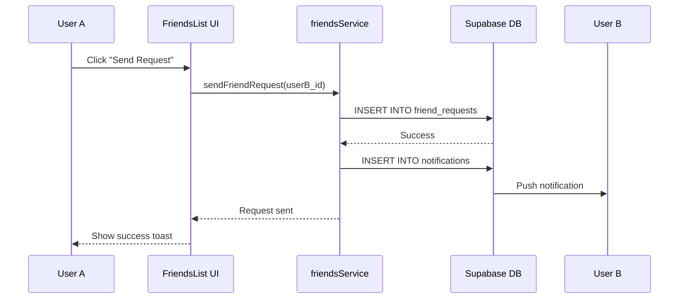

# 📚 EPIC 9.9: Documentation & Developer Experience

**Epic Owner:** Engineering / Product  
**Stakeholders:** Engineering, Product, QA, Community  
**Dependencies:** All previous epics (9.1-9.8)  
**Timeline:** Week 10 (1 week)  
**Status:** 📋 Planning

---

## 🎯 **Epic Goal**

Ensure the Friends Module is **easy to understand, maintain, and extend** with:
- Comprehensive API documentation
- Component Storybook (visual documentation)
- Migration guides (from old friends module)
- Developer onboarding guide
- Troubleshooting guide
- Architecture diagrams (Mermaid)
- Code examples and best practices

---

## 🎯 **MCP Integration Strategy**

1. **🧠 Context7 MCP** (Heavy) - Code analysis, documentation generation
2. **🎨 Shadcn MCP** (Medium) - Component Storybook
3. **🐙 GitHub MCP** (Medium) - Documentation hosting, issue tracking

---

## ✅ **Success Criteria**

| Objective | Target |
|-----------|--------|
| **API Documentation Coverage** | 100% |
| **Component Storybook Coverage** | 100% (all UI components) |
| **Migration Guide** | Complete (step-by-step) |
| **Onboarding Time** | < 2 hours (new dev) |
| **Troubleshooting Guide** | Top 10 issues documented |
| **Architecture Diagrams** | 5+ diagrams (Mermaid) |
| **Code Examples** | 20+ snippets |

---

## 🗂️ **Stories**

### **STORY 9.9.1: API Documentation (JSDoc + OpenAPI)** ⏱️ 2 days
**Priority:** 🔴 Critical  
**MCP Usage:** 🧠 Context7 MCP

**Acceptance Criteria:**
- [ ] JSDoc comments for all services, hooks, and functions
- [ ] OpenAPI spec for Supabase Edge Functions
- [ ] Auto-generated docs site (TypeDoc or Docusaurus)
- [ ] Examples for every function

**Example JSDoc:**
```typescript
/**
 * Sends a friend request to a user.
 * @param friendId - The ID of the user to send a request to.
 * @returns A promise resolving to the created friend request.
 * @throws {Error} If the user is already a friend or blocked.
 * @example
 * const request = await sendFriendRequest('user-123');
 * console.log(request.status); // 'pending'
 */
export async function sendFriendRequest(friendId: string): Promise<FriendRequest> {
  // ...
}
```

**MCP Commands:**
```bash
# Generate docs from JSDoc
warp mcp run context7 "generate API documentation from src/services/friendsService.ts"

# Validate JSDoc coverage
npm run docs:validate
```

---

### **STORY 9.9.2: Component Storybook (Visual Documentation)** ⏱️ 2 days
**Priority:** 🔴 Critical  
**MCP Usage:** 🎨 Shadcn MCP

**Acceptance Criteria:**
- [ ] Storybook for all UI components
- [ ] Stories for all states (loading, error, empty, populated)
- [ ] Interactive controls (Storybook controls)
- [ ] Accessibility testing (a11y addon)
- [ ] Hosted on Chromatic or GitHub Pages

**Example Story:**
```typescript
// src/components/FriendRequestCard.stories.tsx
import type { Meta, StoryObj } from '@storybook/react';
import { FriendRequestCard } from './FriendRequestCard';

const meta: Meta<typeof FriendRequestCard> = {
  title: 'Friends/FriendRequestCard',
  component: FriendRequestCard,
  parameters: {
    layout: 'centered',
  },
  tags: ['autodocs'],
};

export default meta;
type Story = StoryObj<typeof FriendRequestCard>;

export const Pending: Story = {
  args: {
    request: {
      id: '1',
      sender: {
        id: 'user-123',
        username: 'johndoe',
        avatar: 'https://i.pravatar.cc/150?u=johndoe',
      },
      status: 'pending',
      createdAt: '2024-01-01T12:00:00Z',
    },
  },
};

export const Accepted: Story = {
  args: {
    request: { ...Pending.args.request, status: 'accepted' },
  },
};

export const Loading: Story = {
  args: {
    request: Pending.args.request,
    isLoading: true,
  },
};
```

**MCP Commands:**
```bash
# Start Storybook
npm run storybook

# Build and deploy to Chromatic
npm run build-storybook
npx chromatic --project-token=<token>
```

---

### **STORY 9.9.3: Migration Guide (Old → New Friends Module)** ⏱️ 1 day
**Priority:** 🔴 Critical

**Acceptance Criteria:**
- [ ] Step-by-step migration plan
- [ ] Database migration scripts documented
- [ ] Code changes required (service, hooks, components)
- [ ] Rollback plan
- [ ] Testing checklist

**Migration Guide Structure:**
```markdown
# Migration Guide: Old Friends Module → Epic 9.x Friends Module

## 1. Database Migration
- Run migration: `supabase migration up`
- Verify tables: `friendships`, `friend_requests`, `blocks`, `follows`
- Check RLS policies: `SHOW POLICIES ON friendships`

## 2. Code Changes
- Replace `useFriends` hook → `useFriends` (new)
- Update `friendService.ts` → `friendsService.ts` (new)
- Remove old `ContactsSidebar*.tsx` → Use new `FriendsList.tsx`

## 3. Testing
- [ ] Run unit tests: `npm run test`
- [ ] Run E2E tests: `npm run test:e2e`
- [ ] Manual test: Send/accept friend request

## 4. Rollback Plan
- If migration fails, run: `supabase migration down`
- Restore old code from Git: `git checkout old-friends-branch`
```

---

### **STORY 9.9.4: Developer Onboarding Guide** ⏱️ 1 day
**Priority:** 🟡 Medium

**Acceptance Criteria:**
- [ ] "Getting started" guide (< 30 minutes)
- [ ] Video walkthrough (optional)
- [ ] FAQ section
- [ ] Common tasks (add friend, block user, etc.)
- [ ] Architecture overview

**Onboarding Guide Structure:**
```markdown
# Friends Module - Developer Onboarding

## Welcome! 🎉
This guide will get you up to speed with the Friends Module in < 30 minutes.

## Prerequisites
- Node.js 18+
- Supabase account
- Familiarity with React, TypeScript, Zustand

## Step 1: Clone and Setup (5 min)
git clone <repo>
npm install
cp .env.example .env
# Add Supabase keys to .env
npm run dev

## Step 2: Explore the Code (10 min)
- `src/services/friendsService.ts` - Core business logic
- `src/hooks/useFriends.ts` - React hooks
- `src/components/FriendsList.tsx` - Main UI component
- `supabase/migrations/` - Database schema

## Step 3: Run Tests (5 min)
npm run test
npm run test:e2e

## Step 4: Make Your First Change (10 min)
- Add a new feature to `FriendsList.tsx`
- Write a test
- Submit a PR

## Common Tasks
- How to add a new friend: `await sendFriendRequest(userId)`
- How to block a user: `await blockUser(userId)`
- How to search friends: `useFriendSearch(query)`

## FAQ
Q: Where is the friends list stored?
A: In Zustand store (`useFriendsStore`)

Q: How do I debug RLS policies?
A: Use Supabase SQL Editor + `SET request.jwt.claim.sub = 'user-id'`
```

---

### **STORY 9.9.5: Troubleshooting Guide** ⏱️ 1 day
**Priority:** 🟡 Medium

**Acceptance Criteria:**
- [ ] Top 10 common issues documented
- [ ] Error messages explained
- [ ] Debugging tips
- [ ] Support channels

**Troubleshooting Guide:**
```markdown
# Troubleshooting Guide

## Issue 1: Friend request not appearing
**Symptoms:** User sent a friend request, but recipient doesn't see it.
**Cause:** RLS policy blocking visibility.
**Solution:**
1. Check RLS policies on `friend_requests` table.
2. Verify `request_receiver` policy allows SELECT.
3. Test with SQL Editor: `SET request.jwt.claim.sub = 'receiver-id'; SELECT * FROM friend_requests WHERE receiver_id = 'receiver-id';`

## Issue 2: Blocked user still visible in search
**Symptoms:** Blocked user appears in search results.
**Cause:** Block list not synced.
**Solution:**
1. Check `blocks` table: `SELECT * FROM blocks WHERE user_id = auth.uid();`
2. Verify `search_users()` function excludes blocked users.
3. Clear cache: `useFriendsStore.getState().clearCache();`

## Issue 3: Friend list not updating in real-time
**Symptoms:** Friend list doesn't update after accepting a request.
**Cause:** Supabase realtime subscription not connected.
**Solution:**
1. Check subscription status: `console.log(useFriendsStore.getState().subscriptionStatus);`
2. Reconnect: `supabase.removeAllChannels(); setupRealtimeSubscription();`
3. Verify RLS policies allow SELECT for new friendships.

## Issue 4: Performance slow with 1000+ friends
**Symptoms:** Friends list takes > 1s to load.
**Cause:** Missing database indexes.
**Solution:**
1. Run EXPLAIN ANALYZE on query.
2. Add indexes: `CREATE INDEX IF NOT EXISTS idx_friendships_user_id ON friendships(user_id);`
3. Consider pagination: Load 50 friends at a time.

## Need Help?
- Slack: #friends-module-support
- GitHub Issues: https://github.com/your-org/sync_warp/issues
- Email: engineering@yourcompany.com
```

---

### **STORY 9.9.6: Architecture Diagrams (Mermaid)** ⏱️ 1 day
**Priority:** 🟡 Medium

**Acceptance Criteria:**
- [ ] 5+ Mermaid diagrams:
  1. System architecture (database, services, UI)
  2. Friend request flow (sequence diagram)
  3. Database schema (ERD)
  4. Component hierarchy
  5. State management (Zustand store)
- [ ] Hosted on GitHub (rendered in README)

**Example Diagram:**


---

### **STORY 9.9.7: Code Examples & Best Practices** ⏱️ 1 day
**Priority:** 🟡 Medium  
**MCP Usage:** 🧠 Context7 MCP

**Acceptance Criteria:**
- [ ] 20+ code snippets covering common use cases
- [ ] Best practices guide (error handling, testing, etc.)
- [ ] Anti-patterns to avoid
- [ ] Performance tips

**Code Examples:**
```typescript
// Example 1: Send friend request with error handling
try {
  const request = await sendFriendRequest(userId);
  toast.success(`Friend request sent to ${request.receiver.username}`);
} catch (error) {
  if (error.code === 'already_friends') {
    toast.info('You are already friends with this user');
  } else if (error.code === 'blocked') {
    toast.error('Cannot send request to this user');
  } else {
    toast.error('Failed to send request. Try again.');
  }
}

// Example 2: Search friends with debouncing
const { results, isLoading } = useFriendSearch(query, { debounce: 300 });

// Example 3: Optimistic UI updates
const acceptFriendRequest = async (requestId: string) => {
  // Optimistically update UI
  useFriendsStore.getState().addFriend({ id: requestId, status: 'accepted' });
  
  try {
    await acceptRequest(requestId);
  } catch (error) {
    // Rollback on error
    useFriendsStore.getState().removeFriend(requestId);
    throw error;
  }
};
```

**Best Practices:**
```markdown
## Best Practices

### Error Handling
✅ DO: Use try-catch for all async operations
✅ DO: Show user-friendly error messages
❌ DON'T: Silently fail without logging errors

### Testing
✅ DO: Write unit tests for all services
✅ DO: Mock Supabase client in tests
❌ DON'T: Test implementation details (test behavior)

### Performance
✅ DO: Use pagination for large friend lists
✅ DO: Debounce search queries
❌ DON'T: Load all friends at once

### Security
✅ DO: Always verify permissions in RLS policies
✅ DO: Use `auth.uid()` in queries
❌ DON'T: Trust client-side data
```

**MCP Commands:**
```bash
# Analyze code for best practices violations
warp mcp run context7 "find anti-patterns in src/services/friendsService.ts"
```

---

## 📦 **Deliverables**

### **Documentation Site:**
```
docs/
├── api/
│   ├── services.md
│   ├── hooks.md
│   └── functions.md
├── guides/
│   ├── migration.md
│   ├── onboarding.md
│   └── troubleshooting.md
├── architecture/
│   ├── overview.md
│   ├── database-schema.md
│   └── diagrams.mmd
└── examples/
    ├── send-friend-request.md
    ├── block-user.md
    └── search-friends.md
```

### **Storybook:**
- Hosted at: `https://storybook.yourapp.com`
- All components documented with stories

### **Videos (Optional):**
- YouTube: "Friends Module - Developer Walkthrough" (10 min)

---

## 📈 **Metrics**

- Documentation page views
- Onboarding time (new devs)
- Support ticket reduction (% decrease)
- Storybook usage (views per component)
- GitHub wiki contributions

---

## 🚀 **Post-Launch**

After Epic 9.9 completion:
1. **Announce** the new Friends Module to the team
2. **Training session** (1-hour live demo)
3. **Collect feedback** (surveys, interviews)
4. **Iterate** on documentation based on feedback
5. **Monitor metrics** (onboarding time, support tickets)

---

**Epic Series Complete!** 🎉  
See [EPIC 9.0: Friends Module Overview](./EPIC_9.0_Friends_Module_Overview.md) for roadmap.
