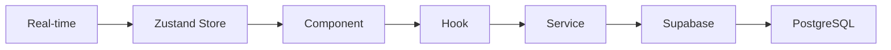

# Developer Onboarding Guide - Friends Module

**Welcome to the Friends Module!** 👋

This guide will help you get up and running with the Friends Module codebase. By the end of this guide, you'll be able to run the app locally, understand the codebase structure, and make your first contribution.

**Estimated Time:** 2-3 hours

---

## 📋 Table of Contents

1. [Prerequisites](#prerequisites)
2. [Environment Setup](#environment-setup)
3. [Codebase Overview](#codebase-overview)
4. [Development Workflow](#development-workflow)
5. [Testing](#testing)
6. [Common Tasks](#common-tasks)
7. [Debugging](#debugging)
8. [Resources](#resources)

---

## ✅ Prerequisites

Before you begin, ensure you have:

### Required Software

- **Node.js:** ≥ 18.0.0 ([Download](https://nodejs.org/))
- **npm:** ≥ 9.0.0 (comes with Node.js)
- **Git:** Latest version ([Download](https://git-scm.com/))
- **VS Code:** Recommended IDE ([Download](https://code.visualstudio.com/))

### Recommended VS Code Extensions

```json
{
  "recommendations": [
    "dbaeumer.vscode-eslint",
    "esbenp.prettier-vscode",
    "bradlc.vscode-tailwindcss",
    "ms-vscode.vscode-typescript-next"
  ]
}
```

### Accounts & Access

- [ ] GitHub account with repository access
- [ ] Supabase project access
- [ ] Slack workspace access (#friends-module channel)

---

## 🚀 Environment Setup

### Step 1: Clone the Repository

```bash
# Clone the repository
git clone https://github.com/your-org/sync_warp.git
cd sync_warp

# Checkout the main development branch
git checkout mobile_app_setup_antigravity
```

### Step 2: Install Dependencies

```bash
# Install all npm packages
npm install

# This may take 2-3 minutes
```

### Step 3: Environment Configuration

Create a `.env.local` file in the project root:

```bash
# Copy the example env file
cp .env.example .env.local
```

Add your Supabase credentials to `.env.local`:

```env
VITE_SUPABASE_URL=https://your-project.supabase.co
VITE_SUPABASE_ANON_KEY=your-anon-key-here
```

**Where to find these:**

1. Go to [Supabase Dashboard](https://supabase.com/dashboard)
2. Select your project
3. Go to Settings → API
4. Copy the URL and anon key

### Step 4: Verify Setup

```bash
# Run the development server
npm run dev

# You should see:
# ➜  Local:   http://localhost:5173/
# ➜  Network: use --host to expose
```

Open [http://localhost:5173](http://localhost:5173) in your browser. You should see the app running!

### Step 5: Run Tests

```bash
# Run all tests
npm test

# You should see 210+ tests passing ✅
```

**If tests pass, you're all set!** 🎉

---

## 📁 Codebase Overview

### Project Structure

```
sync_warp/
├── src/
│   ├── components/          # React components
│   │   ├── friends/        # Friends-related components
│   │   ├── ui/             # Reusable UI components
│   │   └── ...
│   ├── hooks/              # Custom React hooks
│   │   ├── friends/        # Friends-related hooks
│   │   └── realtime/       # Real-time hooks
│   ├── services/           # Business logic & API calls
│   │   └── friendsService.ts
│   ├── store/              # Zustand stores
│   │   ├── friendsStore.ts
│   │   └── presenceStore.ts
│   ├── types/              # TypeScript types
│   │   └── friends.ts
│   ├── utils/              # Utility functions
│   └── __tests__/          # Test files
├── docs/                   # Documentation
│   ├── api/               # API documentation
│   ├── guides/            # User guides
│   └── stories/           # Story documents
├── .storybook/            # Storybook configuration
└── supabase/              # Supabase migrations
```

### Key Files

| File                                    | Purpose                           |
| --------------------------------------- | --------------------------------- |
| `src/services/friendsService.ts`        | Core business logic for friends   |
| `src/hooks/friends/useFriends.ts`       | React Query hook for friends list |
| `src/store/friendsStore.ts`             | Global state for friends          |
| `src/components/friends/FriendCard.tsx` | Friend card component             |
| `src/types/friends.ts`                  | TypeScript types for friends      |

---

## 🏗️ Architecture Overview

### Technology Stack

**Frontend:**

- **React 18** - UI framework
- **TypeScript** - Type safety
- **Vite** - Build tool
- **TailwindCSS** - Styling
- **Shadcn UI** - Component library

**State Management:**

- **React Query** - Server state & caching
- **Zustand** - Client state (presence, real-time)

**Backend:**

- **Supabase** - Database & authentication
- **PostgreSQL** - Database
- **Row Level Security (RLS)** - Data security

**Testing:**

- **Vitest** - Unit & integration tests
- **React Testing Library** - Component tests
- **Playwright** - E2E tests (future)

### Data Flow



1. **Component** uses a **Hook** (e.g., `useFriends`)
2. **Hook** calls **Service** (e.g., `friendsService.getFriends()`)
3. **Service** makes API call to **Supabase**
4. **Supabase** queries **PostgreSQL** database
5. **Real-time** updates flow through **Zustand Store** to **Component**

---

## 🔄 Development Workflow

### Git Workflow

We use **Git Flow** with feature branches:

```bash
# 1. Create a feature branch
git checkout -b feature/add-friend-search

# 2. Make your changes
# ... edit files ...

# 3. Commit your changes
git add .
git commit -m "feat: add friend search functionality"

# 4. Push to remote
git push origin feature/add-friend-search

# 5. Create a Pull Request on GitHub
```

### Commit Message Convention

We follow **Conventional Commits**:

```
feat: add new feature
fix: bug fix
docs: documentation changes
test: add or update tests
refactor: code refactoring
style: formatting changes
chore: maintenance tasks
```

**Examples:**

```bash
git commit -m "feat: add friend search with debouncing"
git commit -m "fix: resolve friend request duplicate issue"
git commit -m "test: add tests for friendsService.getFriends"
```

### Running the App

```bash
# Development server (hot reload)
npm run dev

# Build for production
npm run build

# Preview production build
npm run preview

# Type checking
npm run type-check

# Linting
npm run lint
```

### Code Review Process

1. **Create PR** with descriptive title and description
2. **Request review** from 1-2 team members
3. **Address feedback** and push updates
4. **Merge** once approved (squash and merge)

---

## 🧪 Testing

### Running Tests

```bash
# Run all tests
npm test

# Run tests in watch mode
npm test -- --watch

# Run specific test file
npm test -- src/services/friendsService.test.ts

# Run tests with coverage
npm test -- --coverage
```

### Writing Tests

**Service Test Example:**

```typescript
// src/services/__tests__/friendsService.test.ts
import { describe, it, expect, beforeEach } from "vitest";
import { friendsService } from "../friendsService";

describe("friendsService", () => {
  describe("getFriends", () => {
    it("should return friends list", async () => {
      const { success, data } = await friendsService.getFriends("user-123");

      expect(success).toBe(true);
      expect(data).toBeInstanceOf(Array);
    });
  });
});
```

**Hook Test Example:**

```typescript
// src/hooks/friends/__tests__/useFriends.test.tsx
import { renderHook, waitFor } from "@testing-library/react";
import { useFriends } from "../useFriends";

it("should fetch friends", async () => {
  const { result } = renderHook(() => useFriends());

  await waitFor(() => expect(result.current.isSuccess).toBe(true));

  expect(result.current.data).toBeDefined();
});
```

### Test Coverage Goals

- **Services:** 90%+ coverage
- **Hooks:** 85%+ coverage
- **Components:** 80%+ coverage

---

## 🛠️ Common Tasks

### Task 1: Add a New Component

```bash
# 1. Create component file
touch src/components/friends/NewComponent.tsx

# 2. Create test file
touch src/components/friends/__tests__/NewComponent.test.tsx

# 3. Create Storybook story
touch src/components/friends/NewComponent.stories.tsx
```

**Component Template:**

```typescript
// src/components/friends/NewComponent.tsx
import React from 'react';

interface NewComponentProps {
  // Define props
}

export function NewComponent({ }: NewComponentProps) {
  return (
    <div>
      {/* Component content */}
    </div>
  );
}
```

### Task 2: Add a New Service Function

```typescript
// src/services/friendsService.ts

export const friendsService = {
  // ... existing functions

  /**
   * Your new function with JSDoc
   * @param userId - User ID
   * @returns ServiceResponse with data
   */
  async newFunction(userId: string): Promise<ServiceResponse<Data>> {
    try {
      // Implementation
      return { success: true, data };
    } catch (error) {
      return { success: false, error: getUserFriendlyErrorMessage(error) };
    }
  },
};
```

### Task 3: Add a New Hook

```typescript
// src/hooks/friends/useNewHook.ts
import { useQuery } from "@tanstack/react-query";
import { friendsService } from "@/services/friendsService";

export function useNewHook() {
  return useQuery({
    queryKey: ["newHook"],
    queryFn: () => friendsService.newFunction(),
  });
}
```

### Task 4: Fix a Bug

1. **Reproduce the bug** locally
2. **Write a failing test** that demonstrates the bug
3. **Fix the bug** in the code
4. **Verify the test passes**
5. **Commit with `fix:` prefix**

---

## 🐛 Debugging

### Common Issues

#### Issue 1: "Permission denied for table"

**Cause:** RLS policies not configured

**Solution:**

```sql
-- Check RLS policies in Supabase dashboard
SELECT * FROM pg_policies WHERE tablename = 'friendships';
```

#### Issue 2: "React Query not refetching"

**Cause:** Query key not invalidated

**Solution:**

```typescript
import { useQueryClient } from "@tanstack/react-query";

const queryClient = useQueryClient();
queryClient.invalidateQueries({ queryKey: ["friends"] });
```

#### Issue 3: "Module not found"

**Cause:** Import path incorrect

**Solution:**

```typescript
// Use @ alias for src/
import { friendsService } from "@/services/friendsService";

// Not relative paths
import { friendsService } from "../../services/friendsService";
```

### Debugging Tools

**React Query DevTools:**

```typescript
// Already configured in App.tsx
import { ReactQueryDevtools } from '@tanstack/react-query-devtools';

<ReactQueryDevtools initialIsOpen={false} />
```

**Browser DevTools:**

- **Network tab:** Check API calls
- **Console:** Check for errors
- **React DevTools:** Inspect component state

---

## 📚 Resources

### Documentation

- [API Documentation](../api/) - Complete API reference
- [Migration Guide](./migration.md) - Migrating from old module
- [Troubleshooting](./troubleshooting.md) - Common issues
- [Storybook](http://localhost:6006) - Component library

### External Resources

- [React Query Docs](https://tanstack.com/query/latest)
- [Zustand Docs](https://zustand-demo.pmnd.rs/)
- [Supabase Docs](https://supabase.com/docs)
- [TailwindCSS Docs](https://tailwindcss.com/docs)

### Team Communication

- **Slack:** #friends-module
- **GitHub:** [Issues](https://github.com/your-org/sync_warp/issues)
- **Meetings:** Fridays 2 PM (Sprint Planning)

---

## ✅ Onboarding Checklist

- [ ] Environment setup complete
- [ ] App runs locally
- [ ] All tests passing
- [ ] Read codebase overview
- [ ] Understand architecture
- [ ] Made first commit
- [ ] Created first PR
- [ ] Reviewed by team member
- [ ] Merged first PR 🎉

---

## 🎉 Next Steps

Now that you're onboarded:

1. **Pick a starter task** from the backlog (labeled `good-first-issue`)
2. **Join the team meeting** on Friday
3. **Ask questions** in #friends-module Slack channel
4. **Review open PRs** to learn the codebase

**Welcome to the team!** 🚀

---

**Last Updated:** 2025-11-29  
**Maintainer:** Engineering Team  
**Questions?** Ask in #friends-module or create a GitHub issue
