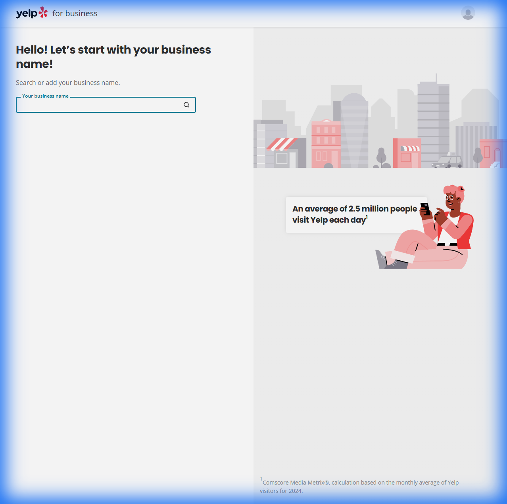
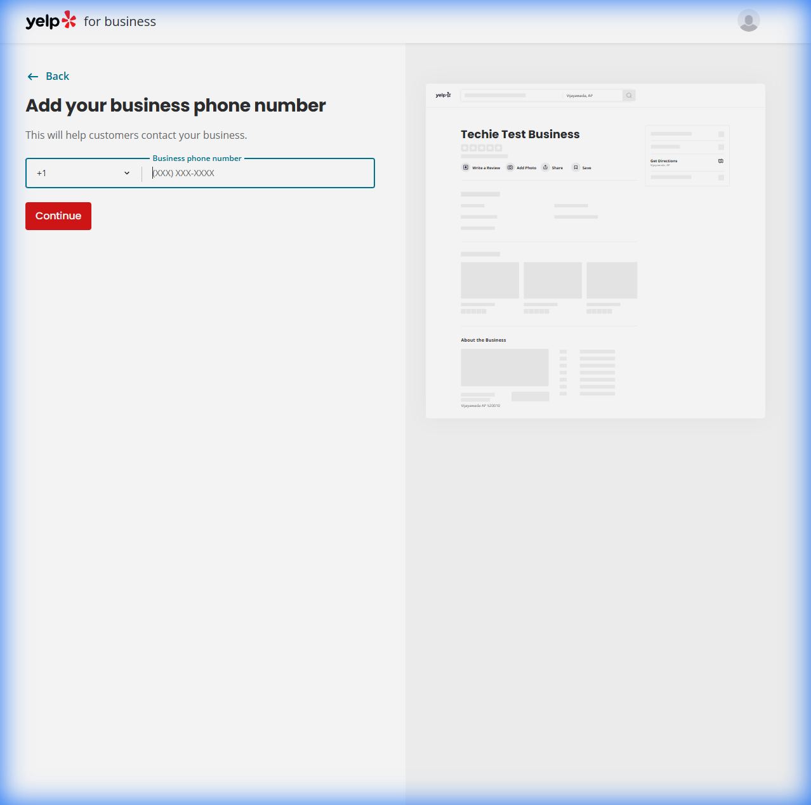
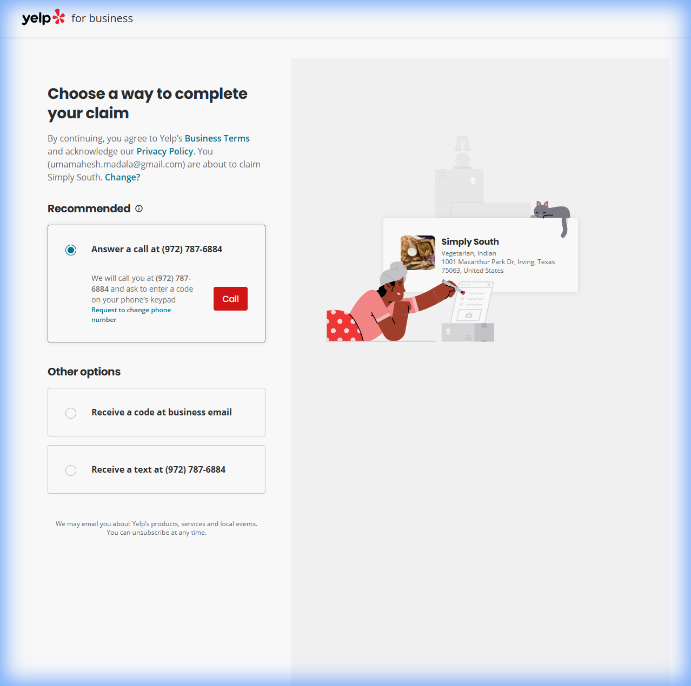
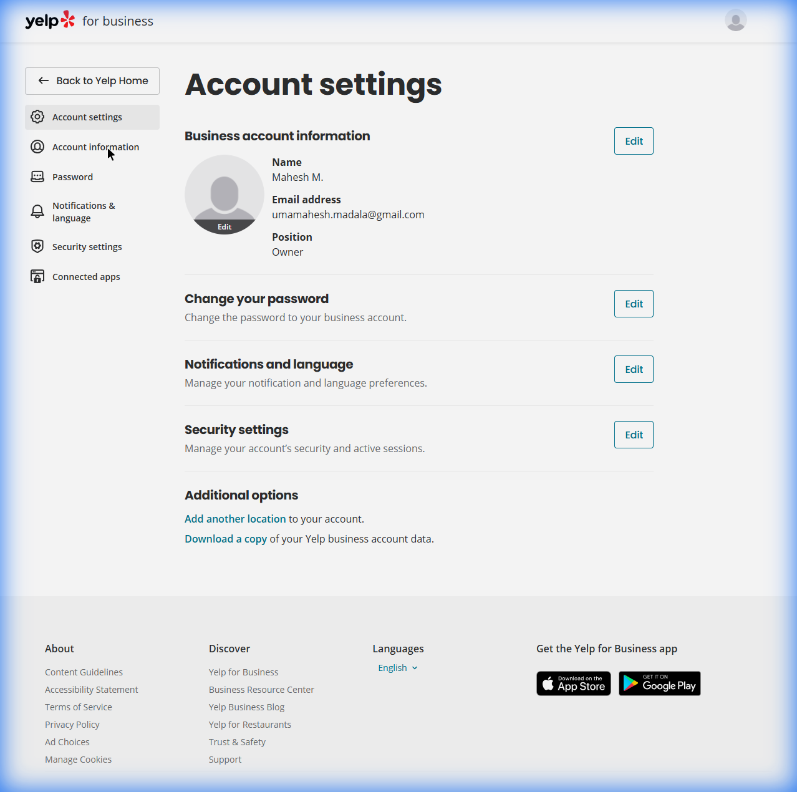

# Yelp Business Onboarding: Complete Step-by-Step Guide

> **Research Date:** January 11, 2026  
> **Platform:** [biz.yelp.com](https://biz.yelp.com) & [business.yelp.com](https://business.yelp.com)

---

## Executive Summary

Yelp for Business provides a comprehensive platform for business owners to claim, manage, and promote their business listings. The onboarding process is designed to be straightforward while ensuring legitimate business ownership through robust verification methods.

**Key Statistics:**
- 76+ million people visit Yelp each month
- 82% of Yelp users hire or buy from a business they found on the platform
- An average of 2.5 million people visit Yelp each day

---

## Part 1: The Complete Onboarding Flow

### Step 1: Business Name Search



**Screen Title:** "Hello! Let's start with your business name!"

**What Happens:**
- Users enter their business name in a smart search field
- The system searches Yelp's database for existing listings
- Two possible outcomes:
  1. **Business exists:** Select from dropdown to claim existing listing
  2. **Business is new:** Click "Add business with this name" to create new listing

**Form Fields:**
| Field | Type | Required | Notes |
|-------|------|----------|-------|
| Business Name | Text input with autocomplete | Yes | Searches existing Yelp database |

**UX Notes:**
- Clean, minimal interface with single focus on business name
- Illustration shows "An average of 2.5 million people visit Yelp each day" to encourage registration
- Back navigation available via "← Back" link

---

### Step 2: Business Phone Number



**Screen Title:** "Add your business phone number"
**Subtitle:** "This will help customers contact your business."

**Form Fields:**
| Field | Type | Required | Format | Notes |
|-------|------|----------|--------|-------|
| Country Code | Dropdown | Yes | +1 (default) | Supports international numbers |
| Phone Number | Text input | Yes | (XXX) XXX-XXXX | Auto-formatted as user types |

**Preview Panel:**
- Right side shows a **live preview** of how the business page will look
- Displays: Business name, empty star ratings, action buttons (Write a Review, Add Photo, Share, Save)
- Shows placeholder sections for photos and "About the Business"

**Validation:**
- Phone number must be valid and reachable
- Yelp may reject known VoIP or disposable numbers
- Real business phone numbers are required for verification

---

### Step 3: Business Verification



**Screen Title:** "Choose a way to complete your claim"

**Legal Notice:**
> "By continuing, you agree to Yelp's **Business Terms** and acknowledge our **Privacy Policy**."

**Verification Methods:**

````carousel
#### 📞 Option 1: Answer a Call (Recommended)
- **How it works:** Yelp auto-dials the business phone number
- **Process:** 
  1. Click "Call" button
  2. Answer incoming call at business
  3. Enter verification code via keypad
- **Speed:** Instant verification
- **Requirement:** Access to business phone during call
- **Link:** "Request to change phone number" if number is outdated
<!-- slide -->
#### 📧 Option 2: Receive Code at Business Email
- **How it works:** Verification link sent to official business email
- **Process:**
  1. Select email verification option
  2. Check business email inbox
  3. Click verification link
- **Speed:** Within minutes
- **Requirement:** Access to business domain email
<!-- slide -->
#### 📱 Option 3: Receive a Text
- **How it works:** SMS code sent to business mobile
- **Process:**
  1. Select text verification
  2. Receive SMS with code
  3. Enter code on Yelp
- **Speed:** Instant
- **Requirement:** Business number must accept SMS
````

**Business Preview Card:**
- Shows business name, category (e.g., "Vegetarian, Indian")
- Displays full address (Street, City, State, Zip, Country)
- Visual confirmation of which business is being claimed

---

### Step 4: Post-Verification Profile Setup

After successful verification, business owners gain access to the full dashboard. The following fields and features become available for editing:

#### 4.1 Core Business Information

| Field | Description | Required |
|-------|-------------|----------|
| Business Name | Official business name | Yes |
| Categories | Primary and secondary business categories (e.g., "Restaurant, Indian, Vegetarian") | Yes (at least 1) |
| Phone Number | Primary contact number | Yes |
| Website | Business website URL | No |
| Street Address | Physical location | Yes (if not service-area business) |
| City | City name | Yes |
| State/Province | State or province | Yes |
| ZIP/Postal Code | Postal code | Yes |
| Country | Country selection | Yes |
| Service Area | For businesses that travel to customers | Conditional |

#### 4.2 Hours of Operation

| Day | Open Time | Close Time | Closed Toggle |
|-----|-----------|------------|---------------|
| Monday | HH:MM AM/PM | HH:MM AM/PM | ☐ |
| Tuesday | HH:MM AM/PM | HH:MM AM/PM | ☐ |
| Wednesday | HH:MM AM/PM | HH:MM AM/PM | ☐ |
| Thursday | HH:MM AM/PM | HH:MM AM/PM | ☐ |
| Friday | HH:MM AM/PM | HH:MM AM/PM | ☐ |
| Saturday | HH:MM AM/PM | HH:MM AM/PM | ☐ |
| Sunday | HH:MM AM/PM | HH:MM AM/PM | ☐ |

**Special Hours Features:**
- Holiday hours scheduling
- Temporary closures
- Multiple time slots per day (for businesses with breaks)

---

## Part 2: Account Settings



### Navigation Sidebar
- ← Back to Yelp Home
- Account Settings
- Account Information
- Password
- Notifications & Language
- Security Settings
- Connected Apps

### 2.1 Business Account Information

| Field | Description | Editable |
|-------|-------------|----------|
| Name | Account holder's full name | Yes |
| Email Address | Login email (private, not shown on page) | Yes |
| Position | Role at business (Owner, Manager, Employee, etc.) | Yes |
| Profile Photo | Account avatar | Yes |

### 2.2 Password Settings
- **Current Password:** Required to make changes
- **New Password:** Must meet security requirements
- **Confirm Password:** Must match new password

### 2.3 Notifications & Language
- **Email Preferences:** Control marketing and transactional emails
- **Language Selection:** Dashboard language preference
- **Unsubscribe Option:** Complete email opt-out available

### 2.4 Security Settings
- **Active Sessions:** View all logged-in devices and locations
- **Remote Logout:** Ability to log out other sessions
- **Login History:** Track account access

### 2.5 Connected Apps
- View third-party apps with Yelp access
- Revoke access to connected applications
- Manage OAuth permissions

### 2.6 Additional Options
- **Add another location:** For multi-location businesses
- **Download account data:** GDPR/CCPA compliance data export

---

## Part 3: Pricing Tiers

### Free Tier: Yelp Business Page

**Cost:** $0/month (Always Free)

**Included Features (20+):**
- ✅ Claim and manage business listing
- ✅ Upload unlimited photos with captions
- ✅ Respond to customer reviews (public and private)
- ✅ Direct messaging with customers
- ✅ Basic analytics (Page Visits, Customer Leads)
- ✅ Request quotes feature
- ✅ Update business hours and information
- ✅ Add business description
- ✅ Mobile app management

---

### Paid Tier 1: Yelp Ads

**Cost:** Starting from **$150/month**

**Features:**
- 📈 Featured placement in search results
- 📍 Appear on competitor business pages
- 🎯 Location-based targeting
- 📱 Mobile-optimized ad formats
- 📊 Performance analytics and ROI tracking
- 🔍 Keyword targeting options

---

### Paid Tier 2: Upgrade Package

**Cost:** **$180/month**

**Features:**
- ✓ **Verified License Badge:** Display trustworthy checkmark
- ✓ **Business Highlights:** Custom icons (Family-owned, Eco-friendly, etc.)
- ✓ **Call-to-Action Button:** Custom CTA (Book Now, Get Quote, etc.)
- ✓ **Remove Competitor Ads:** No other businesses advertised on your page
- ✓ **Portfolio/Showcase:** Highlight best work
- ✓ **Video hosting:** Upload business videos

---

### Paid Tier 3: Combined Package (Most Popular)

**Cost:** Starting from **$270/month**

**Features:**
- All Yelp Ads features
- All Upgrade Package features
- Maximum visibility and conversion tools

---

## Part 4: Dashboard Features & Tools

### 4.1 Analytics & Insights

**Performance Summary:**
- Page visits over time
- Customer actions (calls, directions, website clicks)
- Lead generation metrics
- Revenue estimates

**About Your Audience:**
- Demographics insights
- Peak activity times
- User behavior patterns

**Customer Leads:**
- Quote requests
- Direct messages
- Call tracking (if enabled)

---

### 4.2 Review Management

**Capabilities:**
- View all customer reviews
- Respond publicly to reviews
- Send private messages to reviewers
- Flag inappropriate reviews for moderation
- Track review trends over time

**Best Practices Resources:**
- "Responding to Critical Reviews" guide
- "Winning Over Customers" tips
- Review response templates

---

### 4.3 Photo Management

**Upload Options:**
- Drag-and-drop photo upload
- Bulk upload support
- Mobile app upload

**Photo Features:**
- Add keyword-rich captions
- Set cover photo
- Organize by category (Interior, Exterior, Products, Team, etc.)
- High-resolution support

---

### 4.4 Messaging System

**Features:**
- Direct customer communication
- Quote request handling
- Automated/instant replies
- Message templates
- Notification preferences

---

### 4.5 AI-Powered Add-ons

**Yelp Receptionist:**
- AI answering service for missed calls
- 24/7 call handling
- Appointment booking
- Lead capture

**Yelp Host (Restaurants):**
- Front-of-house automation
- Waitlist management
- Reservation handling

---

## Part 5: Resource Center & Support

### Available Guides

| Category | Topics Covered |
|----------|----------------|
| **Managing the Basics** | Updating hours, info editing, category selection |
| **Reviews** | Response strategies, reputation management |
| **Photos** | Upload tips, optimization, visual branding |
| **Business Metrics** | Understanding analytics, tracking success |
| **Advertising** | Ad creation, targeting, budget management |

### Support Channels
- **Support Center:** Searchable knowledge base
- **Business Blog:** Industry tips and updates
- **Podcasts:** Business growth content
- **Success Stories:** Case studies from real businesses

---

## Part 6: Multi-Location & Enterprise Features

### For Multi-Location Businesses
- Centralized dashboard for all locations
- Bulk editing capabilities
- Location-specific analytics
- Unified review management

### For Advertising Agencies
- Agency-level access
- Client management tools
- Reporting dashboards
- API access (Yelp Fusion)

---

## Summary: Complete Onboarding Checklist

- [ ] **Step 1:** Search for your business on biz.yelp.com
- [ ] **Step 2:** Select existing listing or add new business
- [ ] **Step 3:** Enter business phone number
- [ ] **Step 4:** Complete verification (Call, Text, or Email)
- [ ] **Step 5:** Access dashboard and update business information
- [ ] **Step 6:** Add business hours
- [ ] **Step 7:** Upload photos
- [ ] **Step 8:** Write business description
- [ ] **Step 9:** Configure messaging settings
- [ ] **Step 10:** Review analytics and consider premium features

---

## Video Recording of Exploration

The complete browser exploration session was recorded during the research phase.

---

*This report was compiled through hands-on exploration of the Yelp for Business platform on January 11, 2026.*
