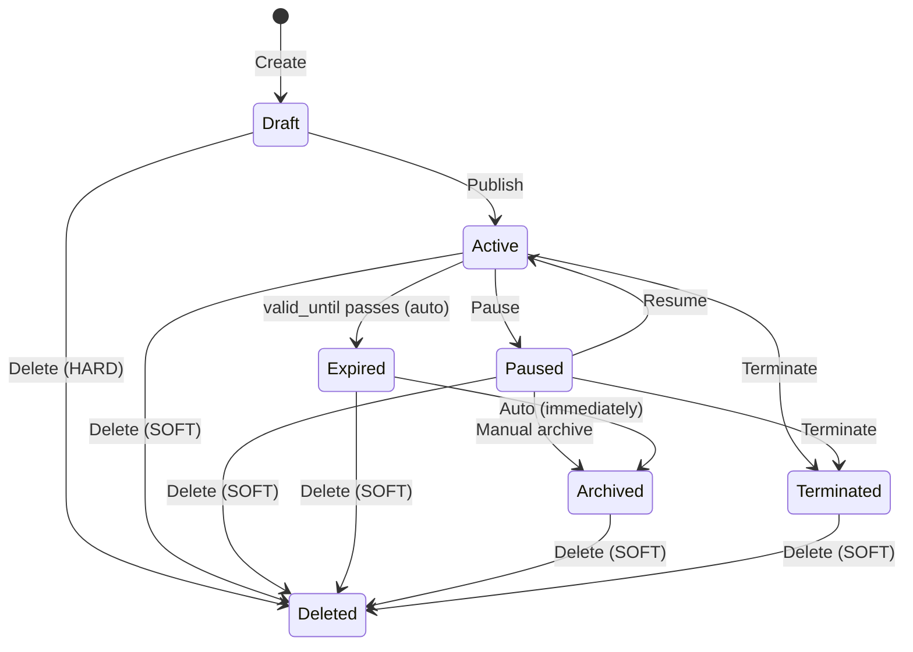

# Story 4.14: Offer Status Management

**Epic**: EPIC 4 - Business Features  
**Priority**: High  
**Effort**: 4-5 days  
**Status**: 📝 Specified  
**Created**: January 29, 2026  
**Depends On**: Story 4.12B (Offer Categorization)  
**Followed By**: Story 4.15 (Offer Tracking & Display Enhancements)

---

## Overview

Core offer lifecycle status management enabling business owners to control offer visibility through pause, terminate, archive, and delete actions. This is the foundational story that establishes the status workflow.

> [!IMPORTANT]
> Offers are **static public promotions** displayed on storefronts. They do NOT have claim/redemption tracking - purchases happen at the physical business.

---

## User Stories

---

### US-4.14.1: Delete Offers

**As a** business owner  
**I want to** delete offers I no longer need  
**So that** my storefront stays clean and relevant

#### Acceptance Criteria

| # | Criterion | Details |
|---|-----------|---------|
| 1 | **Draft: Hard delete** | Status = `draft` → permanently remove from database (no recovery) |
| 2 | **Active: Soft delete** | Status = `active` → set `deleted_at = NOW()` |
| 3 | **Paused: Soft delete** | Status = `paused` → set `deleted_at = NOW()` |
| 4 | **Archived: Soft delete** | Status = `archived` → set `deleted_at = NOW()` |
| 5 | **Expired: Soft delete** | Status = `expired` → set `deleted_at = NOW()` |
| 6 | **Terminated: Soft delete** | Status = `terminated` → set `deleted_at = NOW()` |
| 7 | **Hidden from queries** | All queries filter `WHERE deleted_at IS NULL` |
| 8 | **Confirmation dialog** | "Are you sure you want to delete this offer? This action cannot be undone." |
| 9 | **Draft confirmation** | "Delete draft? This will be permanently removed." |
| 10 | **UI feedback** | Success toast: "Offer deleted successfully" |
| 11 | **Audit logging** | Log `deleted` action to `offer_audit_log` before deletion (via Story 4.15) |

#### Database Change
- Add column: `deleted_at TIMESTAMPTZ DEFAULT NULL`

---

### US-4.14.2: Pause Offers

**As a** business owner  
**I want to** temporarily pause an offer  
**So that** I can resume it later

#### Acceptance Criteria

| # | Criterion | Details |
|---|-----------|---------|
| 1 | **Hides completely** | Paused offers NOT visible to customers (no "Currently Unavailable" message) |
| 2 | **Immediate effect** | Hidden from storefront as soon as pause is confirmed |
| 3 | **Resume available** | "Resume" button restores to `active` status instantly |
| 4 | **Can resume anytime** | No time limit - paused offers can be resumed days/weeks/months later |
| 5 | **Can pause when** | Status = `active` only (cannot pause drafts, archived, terminated) |
| 6 | **Paused badge** | Orange "Paused" badge on dashboard cards |
| 7 | **Stays in active list** | Paused offers visible in business dashboard with badge |
| 8 | **Can duplicate** | Paused offers can be duplicated |
| 9 | **Pause reason** | Optional text field (max 255 chars) - internal only, not shown to customers |
| 10 | **Confirmation** | "Pause this offer? It will be hidden from customers until you resume it." |
| 11 | **Audit logging** | Log `paused` action with reason to `offer_audit_log` (via Story 4.15) |
| 12 | **Resume logging** | Log `resumed` action to `offer_audit_log` when offer is resumed |

#### Database Change
- Add column: `pause_reason VARCHAR(255) DEFAULT NULL`

---

### US-4.14.3: Terminate Offers

**As a** business owner  
**I want to** permanently end an offer  
**So that** it cannot be mistakenly resumed

#### Acceptance Criteria

| # | Criterion | Details |
|---|-----------|---------|
| 1 | **Immediate effect** | Hidden from customers instantly on confirmation |
| 2 | **Cannot resume** | No "Resume" action available (button hidden/disabled) |
| 3 | **Must duplicate** | Only way to re-run is duplicating to create new offer |
| 4 | **Can terminate when** | Status = `active` or `paused` only |
| 5 | **Terminated badge** | Red "Terminated" badge on dashboard cards |
| 6 | **Terminated tab** | Filter/tab for terminated offers in offers list |
| 7 | **Reason dropdown** | Dropdown with: `Stock exhausted`, `Campaign ended early`, `Error in offer details`, `Business decision`, `Other` |
| 8 | **Free text for Other** | Text field appears when "Other" selected (max 255 chars) |
| 9 | **Customer message** | If customer had page open, on refresh: "This offer is no longer available" |
| 10 | **Confirmation** | "Terminate this offer? This cannot be undone. You must duplicate to re-run." |
| 11 | **Audit logging** | Log `terminated` action with reason to `offer_audit_log` (via Story 4.15) |

#### Database Change
- Add column: `terminate_reason VARCHAR(255) DEFAULT NULL`

---

### US-4.14.4: Archive Offers

**As a** business owner  
**I want** completed offers preserved as templates  
**So that** I can reference or duplicate them later

#### Acceptance Criteria

| # | Criterion | Details |
|---|-----------|---------|
| 1 | **Auto-archive on expiry** | When `valid_until` passes → status = `expired` → then `archived` IMMEDIATELY |
| 2 | **Manual archive** | Available for `active` or `paused` offers |
| 3 | **Hidden from customers** | Archived offers not visible on storefront |
| 4 | **Cannot resume** | Must duplicate to re-run (no Resume button) |
| 5 | **Can duplicate** | Archived offers can be duplicated |
| 6 | **Archived tab** | Filter/tab for archived offers in offers list |
| 7 | **Archived badge** | Gray "Archived" badge on dashboard cards |
| 8 | **Preserved indefinitely** | NOT auto-deleted (kept for reference forever) |
| 9 | **Searchable** | Can search archived offers by title, audit code |
| 10 | **Confirmation** | "Archive this offer? It will be hidden from customers." |
| 11 | **Audit logging** | Log `archived` action to `offer_audit_log` (via Story 4.15) |

---

### US-4.14.5: Duplicate Offers

**As a** business owner  
**I want to** duplicate successful offers  
**So that** I can quickly create similar campaigns

#### Acceptance Criteria

| # | Criterion | Details |
|---|-----------|---------|
| 1 | **Any status** | Can duplicate: Draft, Active, Paused, Expired, Terminated, Archived |
| 2 | **Copied fields** | `title`, `description`, `discount_value`, `discount_type`, `terms_conditions`, `offer_type_id`, `category_id`, `target_audience`, `icon_image_url` |
| 3 | **Reset: Dates** | `valid_from = NULL`, `valid_until = NULL` (user must fill before publish) |
| 4 | **Reset: Analytics** | `view_count = 0`, `share_count = 0`, `click_count = 0` |
| 5 | **Reset: Status** | `status = 'draft'` |
| 6 | **New audit code** | Fresh `audit_code` auto-generated (Story 4.15 dependency) |
| 7 | **New offer code** | Fresh `offer_code` if applicable |
| 8 | **Title suffix** | Append " (Copy)" to title (e.g., "Summer Sale (Copy)") |
| 9 | **Opens edit mode** | Navigate to edit form with new offer pre-loaded |
| 10 | **UI feedback** | Toast: "Offer duplicated! You can now edit the copy." |
| 11 | **Audit logging** | Log `duplicated` action on ORIGINAL offer with new offer ID in metadata (via Story 4.15) |

> [!NOTE]
> Audit code generation requires Story 4.15 to be implemented. During 4.14, generate a placeholder UUID-based code if audit code function doesn't exist yet.

---

## Database Schema Changes

### Table: `offers` (Add Columns)

| Column | Type | Default | Description |
|--------|------|---------|-------------|
| `deleted_at` | `TIMESTAMPTZ` | NULL | Soft delete timestamp |
| `pause_reason` | `VARCHAR(255)` | NULL | Internal pause notes |
| `terminate_reason` | `VARCHAR(255)` | NULL | Termination reason |

### Triggers

1. **Auto-archive on expiry**: When `valid_until < NOW()` and status = `active`, set status = `archived`

### RLS Policy Updates

- All SELECT queries: Add `AND deleted_at IS NULL`
- Customer queries: Add `AND status = 'active'`

---

## Status Workflow

> [!NOTE]
> **Expiry Flow**: When `valid_until` passes, offer transitions to `Expired` briefly, then auto-archives immediately. The `Expired` state exists only momentarily for audit trail purposes.

---

## Implementation Tasks

| # | Task | Priority | Effort |
|---|------|----------|--------|
| 1 | Migration: Add 3 columns to `offers` | P0 | 0.5d |
| 2 | Trigger: Auto-archive expired offers | P0 | 0.5d |
| 3 | Update RLS policies for soft delete | P0 | 0.5d |
| 4 | Hook: `deleteOffer(id)` with soft delete logic | P0 | 0.5d |
| 5 | Hook: `pauseOffer(id, reason?)` | P0 | 0.5d |
| 6 | Hook: `resumeOffer(id)` | P0 | 0.25d |
| 7 | Hook: `terminateOffer(id, reason?)` | P0 | 0.5d |
| 8 | Hook: `archiveOffer(id)` | P0 | 0.25d |
| 9 | Hook: `duplicateOffer(id)` - update existing | P0 | 0.5d |
| 10 | UI: `OfferActionsMenu` dropdown | P0 | 0.5d |
| 11 | UI: Status badges (Paused/Terminated/Archived) | P0 | 0.25d |
| 12 | UI: Confirmation modals for each action | P0 | 0.5d |
| 13 | UI: Status filter tabs in offers list | P1 | 0.5d |

**Total: 4-5 days**

---

## Test Scenarios

| # | Scenario | Expected Result |
|---|----------|-----------------|
| 1 | Pause active offer | Status = `paused`, hidden from storefront |
| 2 | Resume paused offer | Status = `active`, visible again |
| 3 | Terminate active offer | Status = `terminated`, cannot resume |
| 4 | Terminate paused offer | Status = `terminated`, cannot resume |
| 5 | Offer expires | Auto-archive immediately |
| 6 | Manually archive offer | Status = `archived`, in Archived tab |
| 7 | Duplicate archived offer | New draft created |
| 8 | Delete draft | Permanently removed |
| 9 | Delete active offer | Soft deleted, hidden |
| 10 | Filter by status | Correct offers shown |

---

## Out of Scope (See Story 4.15)

- Audit codes and display
- Draft auto-save and expiry warnings
- Featured offers
- Audit logging
