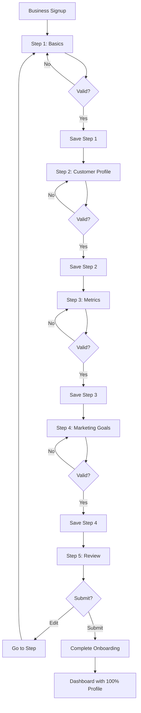

# Story 4B.4: Enhanced Business Onboarding

**Epic:** 4B - Missing Business Owner Features  
**Priority:** 🟠 P1 - HIGH (Data Foundation)  
**Effort:** 5 days  
**Status:** 📝 PLANNED  
**Owner:** TBD

---

## 📋 Overview

**Problem:** The Enhanced Project Brief specifies comprehensive business profile data collection including:
- Customer demographics (age range, income level, interests)
- Business metrics (average ticket size, busiest hours, seasonal patterns)
- Marketing preferences and goals
- Target customer profiles

**Current State:** Basic business registration only captures name, address, category, and contact info. Critical data for targeting and analytics is missing.

**Solution:** Enhance the business onboarding flow with a multi-step wizard that collects:
1. Business fundamentals (existing)
2. Customer demographics & target audience
3. Business metrics & performance data
4. Marketing goals & budget
5. Review & verification

**Business Value:**
- 📊 **Better Targeting** - enables sophisticated campaign targeting (Story 4B.3)
- 💰 **Higher Ad Revenue** - businesses with clear targets spend more
- 🎯 **Personalized Recommendations** - AI-driven suggestions
- 📈 **Analytics Foundation** - benchmarking and insights

---

## 👥 User Stories

### Primary User Story
```
As a new business owner,
I want to provide detailed information about my business and customers,
So that I can receive better targeting and marketing recommendations.
```

### Supporting User Stories
```
As a business owner,
I want to specify my target customer demographics,
So that campaigns reach the right audience.

As a business owner,
I want to share my average ticket size and busy hours,
So that the platform can optimize my ad timing.

As a business owner,
I want to set my marketing budget and goals,
So that I receive appropriate campaign suggestions.

As a platform admin,
I want comprehensive business data,
So that I can provide better services and insights.
```

---

## ✅ Acceptance Criteria

### Must Have (MVP)

#### 1. Enhanced Onboarding Wizard
- [ ] **Step 1: Business Basics** (existing + enhancements)
  - [ ] Business name, category, subcategory
  - [ ] Address with map verification
  - [ ] Phone, email, website
  - [ ] Operating hours
  - [ ] **NEW:** Number of employees
  - [ ] **NEW:** Years in business
- [ ] **Step 2: Target Customer Profile** (NEW)
  - [ ] Primary age range (18-24, 25-34, 35-44, 45-54, 55-64, 65+)
  - [ ] Gender distribution (% Male, % Female, % Other)
  - [ ] Income level (Low, Middle, Upper-Middle, High)
  - [ ] Interest categories (Food, Shopping, Entertainment, etc.)
  - [ ] Customer behavior notes (text area)
- [ ] **Step 3: Business Metrics** (NEW)
  - [ ] Average transaction size ($)
  - [ ] Average customer visits per month
  - [ ] Busiest hours/days
  - [ ] Seasonal patterns (monthly chart)
  - [ ] Current customer base size
- [ ] **Step 4: Marketing Goals** (NEW)
  - [ ] Primary goal (Awareness, Traffic, Sales, Loyalty)
  - [ ] Monthly marketing budget
  - [ ] Preferred campaign types
  - [ ] Competitor awareness
- [ ] **Step 5: Review & Launch**
  - [ ] Summary of all data
  - [ ] Edit any section
  - [ ] Terms & conditions
  - [ ] Submit for verification

#### 2. Database Schema Enhancements
- [ ] Add fields to `businesses` table
- [ ] Create `business_customer_profiles` table
- [ ] Create `business_metrics` table
- [ ] Create `business_marketing_goals` table

#### 3. Profile Completeness Indicator
- [ ] Progress bar during onboarding
- [ ] Profile completion percentage in dashboard
- [ ] Reminder prompts for incomplete sections
- [ ] Benefits of completing profile

#### 4. Edit Profile After Onboarding
- [ ] Edit any section from dashboard
- [ ] Save drafts
- [ ] Track changes history
- [ ] Admin review for major changes

### Should Have
- [ ] Import data from existing systems
- [ ] Competitor benchmarking
- [ ] Industry insights during onboarding
- [ ] Video tutorials for each step

### Won't Have (This Story)
- ⛔ Automated data verification (future)
- ⛔ AI-powered profile suggestions (future)
- ⛔ Integration with external business data APIs

---

## 🛠️ Technical Requirements

### Database Schema

#### 1. Update: `businesses` table
```sql
-- Add new fields to existing businesses table
ALTER TABLE businesses
ADD COLUMN employees_count INTEGER,
ADD COLUMN years_in_business INTEGER,
ADD COLUMN profile_completion_percentage INTEGER DEFAULT 0,
ADD COLUMN onboarding_completed_at TIMESTAMPTZ,
ADD COLUMN last_profile_update TIMESTAMPTZ;

-- Update existing constraint
ALTER TABLE businesses
ADD CONSTRAINT chk_employees_count CHECK (employees_count > 0),
ADD CONSTRAINT chk_years_in_business CHECK (years_in_business >= 0);
```

#### 2. New Table: `business_customer_profiles`
```sql
CREATE TABLE business_customer_profiles (
  id UUID PRIMARY KEY DEFAULT gen_random_uuid(),
  business_id UUID NOT NULL REFERENCES businesses(id) ON DELETE CASCADE,
  
  -- Demographics
  primary_age_ranges TEXT[] DEFAULT ARRAY[]::TEXT[], -- ['25-34', '35-44']
  gender_distribution JSONB DEFAULT '{"male": 0, "female": 0, "other": 0}',
  income_levels TEXT[] DEFAULT ARRAY[]::TEXT[], -- ['middle', 'upper_middle']
  
  -- Interests & Behavior
  interest_categories TEXT[] DEFAULT ARRAY[]::TEXT[],
  customer_behavior_notes TEXT,
  
  -- Additional Context
  typical_visit_duration INTEGER, -- minutes
  repeat_customer_rate INTEGER, -- percentage
  
  created_at TIMESTAMPTZ DEFAULT now(),
  updated_at TIMESTAMPTZ DEFAULT now(),
  
  UNIQUE(business_id)
);

CREATE INDEX idx_customer_profiles_business ON business_customer_profiles(business_id);
```

#### 3. New Table: `business_metrics`
```sql
CREATE TABLE business_metrics (
  id UUID PRIMARY KEY DEFAULT gen_random_uuid(),
  business_id UUID NOT NULL REFERENCES businesses(id) ON DELETE CASCADE,
  
  -- Transaction Metrics
  avg_transaction_cents INTEGER, -- average ticket size
  min_transaction_cents INTEGER,
  max_transaction_cents INTEGER,
  
  -- Customer Metrics
  avg_visits_per_customer_monthly INTEGER,
  current_customer_base_size INTEGER,
  new_customers_monthly INTEGER,
  
  -- Timing Metrics
  busiest_hours JSONB DEFAULT '[]', -- [{"day": "monday", "hour": 12}, ...]
  busiest_days TEXT[] DEFAULT ARRAY[]::TEXT[],
  
  -- Seasonal Patterns (monthly multipliers, 1.0 = average)
  seasonal_pattern JSONB DEFAULT '{
    "jan": 1.0, "feb": 1.0, "mar": 1.0, "apr": 1.0,
    "may": 1.0, "jun": 1.0, "jul": 1.0, "aug": 1.0,
    "sep": 1.0, "oct": 1.0, "nov": 1.0, "dec": 1.0
  }',
  
  -- Updated Metrics
  last_calculated_at TIMESTAMPTZ,
  data_source TEXT DEFAULT 'manual', -- 'manual', 'integrated', 'estimated'
  
  created_at TIMESTAMPTZ DEFAULT now(),
  updated_at TIMESTAMPTZ DEFAULT now(),
  
  UNIQUE(business_id)
);

CREATE INDEX idx_business_metrics_business ON business_metrics(business_id);
```

#### 4. New Table: `business_marketing_goals`
```sql
CREATE TABLE business_marketing_goals (
  id UUID PRIMARY KEY DEFAULT gen_random_uuid(),
  business_id UUID NOT NULL REFERENCES businesses(id) ON DELETE CASCADE,
  
  -- Goals
  primary_goal TEXT CHECK (primary_goal IN (
    'awareness', 'traffic', 'sales', 'loyalty', 'engagement'
  )),
  secondary_goals TEXT[] DEFAULT ARRAY[]::TEXT[],
  
  -- Budget
  monthly_budget_cents INTEGER,
  willing_to_spend_more BOOLEAN DEFAULT false,
  
  -- Preferences
  preferred_campaign_types TEXT[] DEFAULT ARRAY[]::TEXT[], -- ['coupons', 'ads', 'events']
  preferred_ad_frequency TEXT DEFAULT 'moderate', -- 'low', 'moderate', 'high'
  
  -- Competition
  aware_of_competitors BOOLEAN DEFAULT false,
  competitor_names TEXT[] DEFAULT ARRAY[]::TEXT[],
  
  -- Success Metrics
  target_new_customers_monthly INTEGER,
  target_revenue_increase_percentage INTEGER,
  
  created_at TIMESTAMPTZ DEFAULT now(),
  updated_at TIMESTAMPTZ DEFAULT now(),
  
  UNIQUE(business_id)
);

CREATE INDEX idx_marketing_goals_business ON business_marketing_goals(business_id);
```

#### 5. New Table: `business_onboarding_progress`
```sql
CREATE TABLE business_onboarding_progress (
  id UUID PRIMARY KEY DEFAULT gen_random_uuid(),
  business_id UUID NOT NULL REFERENCES businesses(id) ON DELETE CASCADE,
  
  step_number INTEGER NOT NULL,
  step_name TEXT NOT NULL,
  completed BOOLEAN DEFAULT false,
  completed_at TIMESTAMPTZ,
  data JSONB DEFAULT '{}',
  
  created_at TIMESTAMPTZ DEFAULT now(),
  updated_at TIMESTAMPTZ DEFAULT now(),
  
  UNIQUE(business_id, step_number)
);

CREATE INDEX idx_onboarding_progress_business ON business_onboarding_progress(business_id);
```

### API Endpoints

#### 1. Save Onboarding Step
```typescript
POST /api/business/onboarding/save-step
Body: {
  businessId: string,
  stepNumber: number,
  stepName: string,
  data: object
}
Response: {
  success: boolean,
  completionPercentage: number,
  nextStep: number
}
```

#### 2. Complete Onboarding
```typescript
POST /api/business/onboarding/complete
Body: {
  businessId: string
}
Response: {
  success: boolean,
  message: string,
  profileCompletionPercentage: number
}
```

#### 3. Get Onboarding Progress
```typescript
GET /api/business/onboarding/progress?businessId={id}
Response: {
  currentStep: number,
  totalSteps: number,
  completionPercentage: number,
  completedSteps: number[],
  nextStep: number
}
```

#### 4. Update Business Profile Section
```typescript
PUT /api/business/profile/section
Body: {
  businessId: string,
  section: 'customer_profile' | 'metrics' | 'marketing_goals',
  data: object
}
Response: {
  success: boolean,
  updatedAt: string
}
```

#### 5. Calculate Profile Completion
```typescript
GET /api/business/profile/completion?businessId={id}
Response: {
  percentage: number,
  missingFields: string[],
  recommendations: string[]
}
```

### React Components

#### 1. `EnhancedOnboardingWizard.tsx`
```typescript
src/components/business/onboarding/EnhancedOnboardingWizard.tsx
- Multi-step wizard layout
- Progress indicator
- Step validation
- Auto-save drafts
- Navigation controls
```

#### 2. `CustomerProfileStep.tsx`
```typescript
src/components/business/onboarding/CustomerProfileStep.tsx
- Age range multi-select
- Gender distribution sliders
- Income level checkboxes
- Interest category selector
- Behavior notes textarea
```

#### 3. `BusinessMetricsStep.tsx`
```typescript
src/components/business/onboarding/BusinessMetricsStep.tsx
- Average ticket input
- Customer volume inputs
- Busiest hours selector (calendar grid)
- Seasonal pattern chart
- Data source indicator
```

#### 4. `MarketingGoalsStep.tsx`
```typescript
src/components/business/onboarding/MarketingGoalsStep.tsx
- Goal selector (primary + secondary)
- Budget input with slider
- Campaign type preferences
- Competitor awareness toggle
- Target metrics inputs
```

#### 5. `ProfileCompletionWidget.tsx`
```typescript
src/components/business/dashboard/ProfileCompletionWidget.tsx
- Circular progress indicator
- Missing sections list
- Quick links to edit
- Benefits of completion
```

### Custom Hooks

#### `useOnboarding.ts`
```typescript
export function useOnboarding(businessId: string) {
  const saveStep = async (step: number, data: object) => {...}
  const completeOnboarding = async () => {...}
  const getProgress = async () => {...}
  const goToStep = (step: number) => {...}
  
  return {
    saveStep,
    completeOnboarding,
    getProgress,
    goToStep,
    currentStep,
    completionPercentage,
    loading,
    error
  }
}
```

#### `useProfileCompletion.ts`
```typescript
export function useProfileCompletion(businessId: string) {
  const calculate = async () => {...}
  const updateSection = async (section: string, data: object) => {...}
  
  return {
    calculate,
    updateSection,
    percentage,
    missingFields,
    loading,
    error
  }
}
```

---

## 🎨 UI/UX Requirements

### Wireframe: Onboarding Progress Header

```
┌──────────────────────────────────────────────────────┐
│ Business Onboarding                      [Save & Exit]│
├──────────────────────────────────────────────────────┤
│                                                       │
│ Step 2 of 5: Target Customer Profile                 │
│ ━━━━━━━━━━━━━━━━━━━━━●━━━━━━━━━━━━━━━━━━━━━━━━━━   │
│ [✓ Basics] [● Customers] [ Metrics] [ Goals] [Review]│
│                                                       │
│ 40% Complete                                          │
└──────────────────────────────────────────────────────┘
```

### Wireframe: Customer Profile Step

```
┌──────────────────────────────────────────────────────┐
│ Tell us about your customers                          │
├──────────────────────────────────────────────────────┤
│                                                       │
│ Primary Age Ranges (select all that apply):          │
│ ☐ 18-24  ☑ 25-34  ☑ 35-44  ☐ 45-54  ☐ 55-64  ☐ 65+ │
│                                                       │
│ Gender Distribution:                                  │
│ Male:   [━━━━━━━━●━━] 60%                            │
│ Female: [━━━━━●━━━━━] 40%                            │
│ Other:  [●━━━━━━━━━━] 0%                             │
│                                                       │
│ Income Levels:                                        │
│ ☐ Low (<$30k)  ☑ Middle ($30k-$75k)                 │
│ ☑ Upper-Middle ($75k-$150k)  ☐ High (>$150k)        │
│                                                       │
│ Customer Interests:                                   │
│ ☑ Food & Dining    ☑ Shopping & Retail              │
│ ☐ Entertainment    ☐ Health & Wellness              │
│ ☐ Automotive       ☐ Travel & Hospitality           │
│                                                       │
│ Additional Notes:                                     │
│ ┌────────────────────────────────────────────────┐  │
│ │ Young professionals, health-conscious...       │  │
│ └────────────────────────────────────────────────┘  │
│                                                       │
│ [← Back]                 [Save Draft]  [Continue →] │
└──────────────────────────────────────────────────────┘
```

### Wireframe: Business Metrics Step

```
┌──────────────────────────────────────────────────────┐
│ Business Metrics & Performance                        │
├──────────────────────────────────────────────────────┤
│                                                       │
│ Average Transaction Size:                             │
│ $ [45.00] (Min: $10, Max: $200)                      │
│                                                       │
│ Customer Behavior:                                    │
│ Visits per customer/month: [3]                        │
│ Current customer base: [500]                          │
│ New customers/month: [50]                             │
│                                                       │
│ Busiest Hours (select all):                           │
│        Mon  Tue  Wed  Thu  Fri  Sat  Sun             │
│ 8am    ☐    ☐    ☐    ☐    ☐    ☐    ☐              │
│ 12pm   ☑    ☑    ☑    ☑    ☑    ☐    ☐              │
│ 6pm    ☑    ☑    ☑    ☑    ☑    ☑    ☑              │
│                                                       │
│ Seasonal Patterns:                                    │
│ [Monthly chart with sliders for each month]           │
│                                                       │
│ [← Back]                 [Save Draft]  [Continue →] │
└──────────────────────────────────────────────────────┘
```

### Wireframe: Profile Completion Widget (Dashboard)

```
┌──────────────────────────────────────────┐
│ 📊 Profile Completion                     │
├──────────────────────────────────────────┤
│                                           │
│          ⬤ 75%                           │
│        ⬤     ⬤                           │
│       ⬤       ⬤                          │
│        ⬤     ⬤                           │
│          ⬤                               │
│                                           │
│ Almost there! Complete your profile      │
│ to unlock:                                │
│ • Better campaign targeting               │
│ • Personalized recommendations            │
│ • Industry benchmarking                   │
│                                           │
│ Missing sections:                         │
│ • Seasonal patterns                       │
│ • Marketing budget                        │
│                                           │
│ [Complete Profile →]                      │
└──────────────────────────────────────────┘
```

### User Flow Diagram



---

## 🧪 Test Plan

### Unit Tests

#### Profile Completion Calculation
```typescript
describe('Profile Completion', () => {
  it('calculates percentage correctly')
  it('identifies missing required fields')
  it('identifies missing optional fields')
  it('handles partial data')
})
```

#### Step Validation
```typescript
describe('Onboarding Step Validation', () => {
  it('validates customer profile data')
  it('validates metrics data')
  it('validates marketing goals')
  it('requires at least one age range')
  it('validates budget constraints')
})
```

### Integration Tests

```typescript
describe('Onboarding Flow', () => {
  it('saves progress at each step')
  it('allows navigation between steps')
  it('auto-saves drafts')
  it('completes onboarding successfully')
  it('updates profile completion percentage')
})
```

### E2E Test Scenarios

#### Happy Path
```gherkin
Given a new business owner signs up
When they complete Step 1: Business Basics
And complete Step 2: Customer Profile with age 25-34
And complete Step 3: Metrics with $45 avg ticket
And complete Step 4: Marketing Goals with $500 budget
And review all sections
And submit onboarding
Then profile completion shows 100%
And dashboard shows all data
And recommendations are personalized
```

---

## 📝 Implementation Plan

### Day 1: Database Schema
- [ ] Update businesses table
- [ ] Create customer_profiles table
- [ ] Create business_metrics table
- [ ] Create marketing_goals table
- [ ] Create onboarding_progress table
- [ ] Add RLS policies

### Day 2: API Endpoints
- [ ] Save step endpoint
- [ ] Complete onboarding endpoint
- [ ] Get progress endpoint
- [ ] Update profile section endpoint
- [ ] Calculate completion endpoint
- [ ] Unit tests for APIs

### Day 3: Onboarding Wizard UI
- [ ] Wizard component structure
- [ ] Step 2: Customer Profile UI
- [ ] Step 3: Business Metrics UI
- [ ] Step 4: Marketing Goals UI
- [ ] Step 5: Review summary
- [ ] Progress indicator

### Day 4: Profile Management
- [ ] Profile completion widget
- [ ] Edit profile sections
- [ ] Save drafts functionality
- [ ] Validation logic
- [ ] Error handling

### Day 5: Testing & Polish
- [ ] Integration tests
- [ ] E2E scenarios
- [ ] Mobile responsiveness
- [ ] Loading states
- [ ] Documentation

---

## 🔗 Integration Points

### Existing Systems
- **Business Registration:** Enhance existing flow
- **Dashboard:** Add profile completion widget
- **Campaigns:** Use data for targeting (Story 4B.3)

### Database Tables
- **Read:** `businesses`, `auth.users`
- **Write:** `business_customer_profiles`, `business_metrics`, `business_marketing_goals`, `business_onboarding_progress`

---

## 🚨 Edge Cases & Error Handling

### Edge Cases
1. **Incomplete data:** Allow save as draft
2. **Data changes:** Track update history
3. **Browser refresh:** Restore from last save
4. **Multiple sessions:** Last save wins
5. **Optional vs required:** Clear indicators

### Data Validation
- Age ranges: At least one required
- Budget: Must be positive number
- Metrics: Reasonable ranges with warnings
- Gender distribution: Must sum to ~100%

---

## 📊 Success Metrics

### Functional Metrics
- [ ] Onboarding completion rate >80%
- [ ] Average time to complete <15 minutes
- [ ] Profile updates after onboarding >50%

### Business Metrics
- [ ] Campaign targeting accuracy improvement
- [ ] Personalized recommendations adoption
- [ ] Business satisfaction scores

---

## 📚 Definition of Done

### Code Complete
- [ ] All database migrations applied
- [ ] All API endpoints functional
- [ ] All UI components complete
- [ ] Auto-save working
- [ ] Validation comprehensive

### Testing Complete
- [ ] Unit tests passing (>80% coverage)
- [ ] Integration tests passing
- [ ] E2E scenarios verified
- [ ] Mobile tested

### Documentation Complete
- [ ] API documentation
- [ ] User guide
- [ ] Admin documentation
- [ ] README updated

---

## 🔄 Future Enhancements

### Phase 2
- AI-powered profile suggestions
- Industry benchmarking data
- Import from POS systems
- Competitor analysis

### Phase 3
- Predictive analytics
- Automated data updates
- Real-time dashboards
- Custom metrics

---

**Story Status:** 📝 PLANNED  
**Blocked By:** None ✅  
**Blocking:** Story 4B.3 (provides data for targeting)  
**Ready for Development:** YES 🚀

