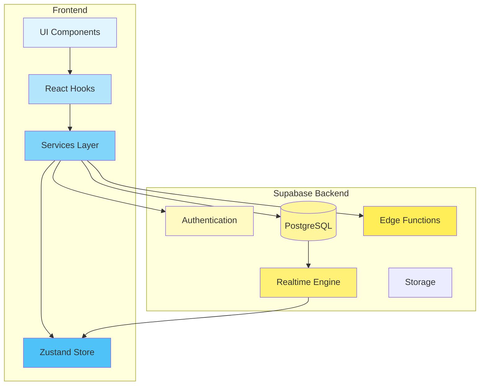

# Story 9.9.6: Architecture Diagrams (Mermaid)

**Epic:** [EPIC 9.9: Documentation & Developer Experience](../epics/EPIC_9.9_Documentation_DX.md)  
**Priority:** 🟡 Medium  
**Estimated Time:** 1 day  
**MCP Usage:** 🧠 Context7 MCP (Light)  
**Dependencies:** Stories 9.9.1-9.9.5  
**Status:** 📋 Planning

---

## 📋 Story Description

Create comprehensive architecture diagrams using Mermaid to visualize the Friends Module's system architecture, data flow, database schema, component hierarchy, and state management.

---

## ✅ Acceptance Criteria

### Diagram Coverage

- [ ] System architecture diagram
- [ ] Friend request flow (sequence diagram)
- [ ] Database schema (ERD)
- [ ] Component hierarchy diagram
- [ ] State management diagram
- [ ] Real-time data flow diagram
- [ ] Authentication flow diagram

### Quality

- [ ] All diagrams render correctly on GitHub
- [ ] Diagrams are mobile-responsive
- [ ] Clear labels and descriptions
- [ ] Consistent styling
- [ ] Interactive (where applicable)

### Documentation

- [ ] Diagrams embedded in README
- [ ] Separate architecture documentation
- [ ] Diagram source files maintained

---

## 🎨 Implementation

### Phase 1: System Architecture Diagram (2 hours)

**Create `docs/architecture/system-architecture.md`:**

````markdown
# System Architecture

## Overview


````

## Component Details

### Frontend Layer

- **UI Components:** React components for user interface
- **React Hooks:** Data fetching and state management hooks
- **Services:** Business logic and API calls
- **Zustand Store:** Global state management

### Backend Layer

- **Authentication:** Supabase Auth for user management
- **PostgreSQL:** Database for persistent storage
- **Realtime Engine:** WebSocket connections for live updates
- **Edge Functions:** Serverless functions for complex operations
- **Storage:** File storage for avatars and media

````

---

### Phase 2: Friend Request Flow Diagram (2 hours)

**Create `docs/architecture/friend-request-flow.md`:**
```markdown
# Friend Request Flow

## Sequence Diagram

```mermaid
sequenceDiagram
    participant UserA as User A
    participant UI as FriendsList UI
    participant Hook as useFriendActions
    participant Service as friendsService
    participant DB as Supabase DB
    participant Realtime as Realtime Channel
    participant UserB as User B

    UserA->>UI: Click "Send Request"
    UI->>Hook: sendRequest.mutate(userB_id)
    Hook->>Service: sendFriendRequest(userB_id)

    Service->>DB: Check if already friends
    DB-->>Service: Not friends

    Service->>DB: Check if blocked
    DB-->>Service: Not blocked

    Service->>DB: INSERT INTO friend_requests
    DB-->>Service: Request created

    Service->>DB: INSERT INTO notifications
    DB-->>Service: Notification created

    DB->>Realtime: Broadcast INSERT event
    Realtime->>UserB: New friend request notification

    Service-->>Hook: Success
    Hook-->>UI: Update UI optimistically
    UI-->>UserA: Show "Request sent" toast

    UserB->>UI: View friend requests
    UI->>Hook: useFriendRequests()
    Hook->>Service: getFriendRequests()
    Service->>DB: SELECT * FROM friend_requests
    DB-->>Service: Pending requests
    Service-->>Hook: Requests data
    Hook-->>UI: Display requests

    UserB->>UI: Click "Accept"
    UI->>Hook: acceptRequest.mutate(request_id)
    Hook->>Service: acceptFriendRequest(request_id)

    Service->>DB: BEGIN TRANSACTION
    Service->>DB: UPDATE friend_requests SET status='accepted'
    Service->>DB: INSERT INTO friendships (bidirectional)
    Service->>DB: COMMIT TRANSACTION
    DB-->>Service: Success

    DB->>Realtime: Broadcast friendship created
    Realtime->>UserA: Friend request accepted
    Realtime->>UserB: Friendship confirmed

    Service-->>Hook: Success
    Hook-->>UI: Update UI
    UI-->>UserB: Show "You are now friends" toast
````

## Flow Steps

1. **Send Request:** User A sends friend request to User B
2. **Validation:** Check if already friends or blocked
3. **Create Request:** Insert into friend_requests table
4. **Notify:** Create notification for User B
5. **Real-time:** Broadcast event to User B
6. **Accept:** User B accepts the request
7. **Create Friendship:** Create bidirectional friendship
8. **Update:** Both users see updated friends list

````

---

### Phase 3: Database Schema Diagram (2 hours)

**Create `docs/architecture/database-schema.md`:**
```markdown
# Database Schema

## Entity Relationship Diagram

```mermaid
erDiagram
    profiles ||--o{ friendships : has
    profiles ||--o{ friend_requests : sends
    profiles ||--o{ friend_requests : receives
    profiles ||--o{ blocks : blocks
    profiles ||--o{ follows : follows
    profiles ||--o{ notifications : receives

    profiles {
        uuid id PK
        string full_name
        string username UK
        string avatar_url
        text bio
        timestamp created_at
        timestamp updated_at
    }

    friendships {
        uuid id PK
        uuid user_id FK
        uuid friend_id FK
        string status
        timestamp created_at
        boolean is_test_data
    }

    friend_requests {
        uuid id PK
        uuid sender_id FK
        uuid receiver_id FK
        string status
        timestamp created_at
        timestamp updated_at
    }

    blocks {
        uuid id PK
        uuid user_id FK
        uuid blocked_user_id FK
        timestamp created_at
    }

    follows {
        uuid id PK
        uuid follower_id FK
        uuid following_id FK
        timestamp created_at
    }

    notifications {
        uuid id PK
        uuid user_id FK
        string type
        jsonb data
        boolean read
        timestamp created_at
    }
````

## Table Descriptions

### profiles

User profile information. Core table for user data.

### friendships

Bidirectional friendships. Each friendship has two rows (one for each direction).

### friend_requests

Pending, accepted, or rejected friend requests.

### blocks

Users who have been blocked. Prevents all interactions.

### follows

One-way follow relationships (for PYMK suggestions).

### notifications

User notifications for friend requests, accepts, etc.

## Indexes

```sql
-- friendships
CREATE INDEX idx_friendships_user_id ON friendships(user_id);
CREATE INDEX idx_friendships_friend_id ON friendships(friend_id);
CREATE INDEX idx_friendships_status ON friendships(status);

-- friend_requests
CREATE INDEX idx_friend_requests_sender ON friend_requests(sender_id);
CREATE INDEX idx_friend_requests_receiver ON friend_requests(receiver_id);
CREATE INDEX idx_friend_requests_status ON friend_requests(status);

-- blocks
CREATE INDEX idx_blocks_user_id ON blocks(user_id);
CREATE INDEX idx_blocks_blocked_user_id ON blocks(blocked_user_id);
```

````

---

### Phase 4: Component Hierarchy Diagram (1 hour)

**Create `docs/architecture/component-hierarchy.md`:**
```markdown
# Component Hierarchy

## Component Tree

```mermaid
graph TD
    App[App]
    App --> FriendsPage[FriendsPage]

    FriendsPage --> FriendsTabs[FriendsTabs]
    FriendsTabs --> AllFriendsTab[AllFriendsTab]
    FriendsTabs --> RequestsTab[RequestsTab]
    FriendsTabs --> SuggestionsTab[SuggestionsTab]

    AllFriendsTab --> FriendsList[FriendsList]
    FriendsList --> FriendCard[FriendCard]
    FriendCard --> OnlineStatusBadge[OnlineStatusBadge]
    FriendCard --> FriendActions[FriendActions]

    RequestsTab --> FriendRequestsList[FriendRequestsList]
    FriendRequestsList --> FriendRequestCard[FriendRequestCard]
    FriendRequestCard --> AcceptButton[AcceptButton]
    FriendRequestCard --> RejectButton[RejectButton]

    SuggestionsTab --> PYMKList[PYMKList]
    PYMKList --> PYMKCard[PYMKCard]
    PYMKCard --> SendRequestButton[SendRequestButton]

    FriendCard -.-> FriendProfileModal[FriendProfileModal]
    FriendActions -.-> ConfirmDialog[ConfirmDialog]

    style FriendsPage fill:#e3f2fd
    style FriendsList fill:#bbdefb
    style FriendCard fill:#90caf9
    style FriendRequestsList fill:#bbdefb
    style PYMKList fill:#bbdefb
````

## Component Descriptions

### Page Level

- **FriendsPage:** Main container for friends functionality

### Layout Level

- **FriendsTabs:** Tab navigation between All/Requests/Suggestions

### List Level

- **FriendsList:** Grid of friend cards
- **FriendRequestsList:** List of pending requests
- **PYMKList:** People You May Know suggestions

### Card Level

- **FriendCard:** Individual friend display
- **FriendRequestCard:** Friend request with actions
- **PYMKCard:** Suggested friend card

### Utility Level

- **OnlineStatusBadge:** Shows online/offline status
- **FriendActions:** Dropdown menu for actions
- **ConfirmDialog:** Confirmation dialogs
- **FriendProfileModal:** Full friend profile view

````

---

### Phase 5: State Management Diagram (1 hour)

**Create `docs/architecture/state-management.md`:**
```markdown
# State Management

## Data Flow

```mermaid
graph LR
    subgraph "React Query Cache"
        Friends[Friends List]
        Requests[Friend Requests]
        Blocked[Blocked Users]
    end

    subgraph "Zustand Store"
        Presence[Online Presence]
        UI[UI State]
    end

    subgraph "Local State"
        Forms[Form State]
        Modals[Modal State]
    end

    API[Supabase API] --> Friends
    API --> Requests
    API --> Blocked

    Realtime[Realtime] --> Presence

    Friends --> Component[Components]
    Requests --> Component
    Blocked --> Component
    Presence --> Component
    UI --> Component
    Forms --> Component
    Modals --> Component

    Component --> Mutations[Mutations]
    Mutations --> API

    style Friends fill:#c8e6c9
    style Requests fill:#c8e6c9
    style Blocked fill:#c8e6c9
    style Presence fill:#fff9c4
    style UI fill:#fff9c4
````

## State Categories

### Server State (React Query)

- Friends list
- Friend requests
- Blocked users
- Search results
- PYMK suggestions

**Why React Query?**

- Automatic caching
- Background refetching
- Optimistic updates
- Error handling

### Global State (Zustand)

- Online presence
- Real-time subscriptions
- UI preferences

**Why Zustand?**

- Simple API
- No boilerplate
- TypeScript support
- DevTools integration

### Local State (useState)

- Form inputs
- Modal visibility
- Temporary UI state

**Why Local State?**

- Component-specific
- No need for global access
- Simple and fast

````

---

### Phase 6: Real-time Data Flow (1 hour)

**Create `docs/architecture/realtime-flow.md`:**
```markdown
# Real-time Data Flow

## WebSocket Connection

```mermaid
sequenceDiagram
    participant Component
    participant Hook as useRealtimeFriends
    participant Supabase
    participant Channel as Realtime Channel
    participant DB as Database

    Component->>Hook: Mount component
    Hook->>Supabase: Create channel
    Supabase->>Channel: Subscribe to 'friendships'
    Channel-->>Hook: Connected

    Note over DB: User B accepts friend request

    DB->>Channel: INSERT event
    Channel->>Hook: Broadcast event
    Hook->>Hook: Update React Query cache
    Hook->>Component: Re-render with new data
    Component->>Component: Show new friend

    Component->>Hook: Unmount component
    Hook->>Channel: Unsubscribe
    Channel-->>Hook: Disconnected
````

## Event Types

### INSERT Events

- New friend request received
- Friend request accepted (new friendship)
- New follower

### UPDATE Events

- Friend request status changed
- Profile updated

### DELETE Events

- Friendship removed (unfriend)
- Friend request cancelled

## Subscription Setup

```typescript
const channel = supabase
  .channel("friendships")
  .on(
    "postgres_changes",
    {
      event: "INSERT",
      schema: "public",
      table: "friendships",
      filter: `user_id=eq.${userId}`,
    },
    (payload) => {
      // Handle new friendship
      queryClient.invalidateQueries(["friends"]);
    }
  )
  .subscribe();
```

````

---

## 🎯 MCP Integration

### Context7 MCP Commands

```bash
# Generate architecture diagram
warp mcp run context7 "create system architecture diagram for Friends Module"

# Analyze data flow
warp mcp run context7 "analyze data flow in src/hooks/friends/"

# Generate ERD
warp mcp run context7 "generate ERD from database schema"
````

---

## 📦 Deliverables

1. **Architecture Documentation:**
   - `docs/architecture/system-architecture.md`
   - `docs/architecture/friend-request-flow.md`
   - `docs/architecture/database-schema.md`
   - `docs/architecture/component-hierarchy.md`
   - `docs/architecture/state-management.md`
   - `docs/architecture/realtime-flow.md`

2. **README Integration:**
   - Embed key diagrams in main README
   - Link to detailed architecture docs

3. **Diagram Sources:**
   - All Mermaid source code maintained
   - Easy to update and version

---

## 📈 Success Metrics

- **Diagrams Created:** 6+
- **Render Success:** 100% on GitHub
- **Mobile Responsive:** Yes
- **Update Frequency:** Monthly review

---

**Next Story:** [STORY 9.9.7: Code Examples & Best Practices](./STORY_9.9.7_Code_Examples.md)
